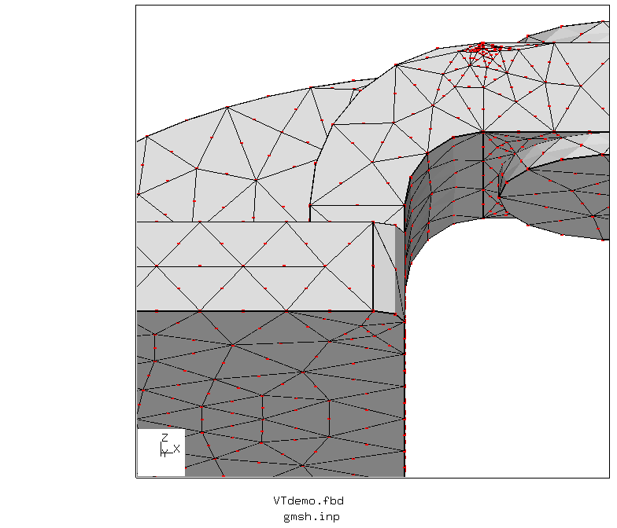
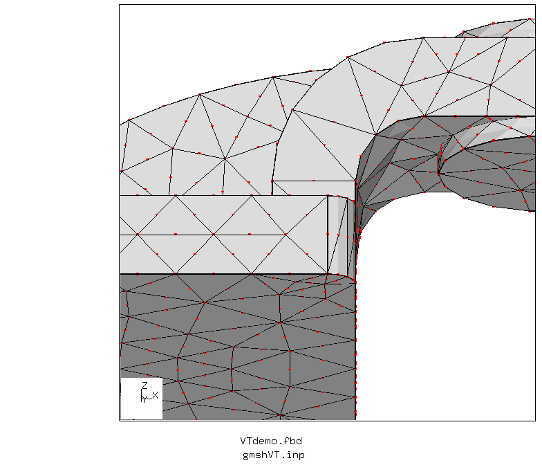
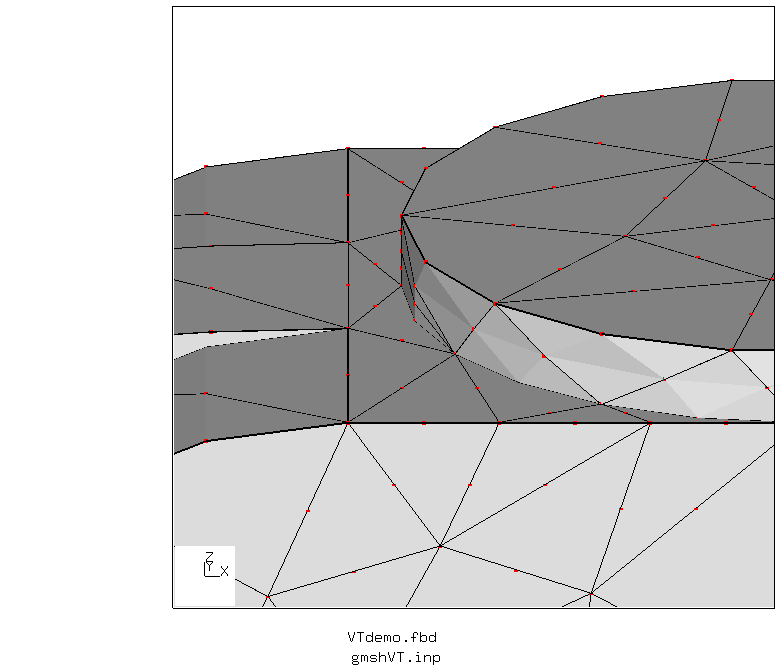

# Meshing a CAD Geometry with Gmsh
Tested with CGX/CCX 2.10, Gmsh 2.13.1

This demonstrates a possible workflow for a CalculiX analysis of a CAD
generated part.

* The workflow is fully automated using a CGX fbd file.
* The geometry is created in Onshape and exported as STEP file.
* Import and meshing in gmsh, export as .inp file with volume and surface meshes.
  In gmsh, define physical surfaces for boundary conditions and export the mesh
  with appropriate settings (to ensure that node sets are written)
* There are two versions for gmsh pre-processing:
  * `part.geo`: mesh the geometry as it is, leading to small elements at short edges and narrow surfaces
  * `partVT.geo`: Compounding lines and geometry before meshing.  
* Open the inp file in cgx and remove all surface elements. Eventually extend node sets to
  face sets for surface definition or pressure application.
* Write the mesh and required set definitions
* Write other FEA items
* Run the analysis
* Perform postprocessing

| File     | Contents       |
| :------- | :------------- |
| [part.step](part.step) | STEP geometry exported from Onshape |
| [part.geo](part.geo) | Gmsh control file for meshing and model display |
| [run.fbd](run.fbd) | CGX control file for preprocessing, solving and postprocessing |
| [partVT.geo](partVT.geo) | Gmsh control file with geometry cleaning (virtual topology)|
| [runVT.fbd](runVT.fbd) | CGX control file for the VT version|
| [VTdemo.fbd](VTdemo.fbd) | CGX file for the mesh plots (original and VT version) |
| [solve.inp](solve.inp) | CCX input file |

# Run the analysis

The part is fixed on the rectangular base surface and a uniform pressure of 1 MPa
is applied to the top circular surface.

The complete analysis is run from a single CGX script
```
> cgx -b run.fbd
```
First, the geometry is meshed and displayed in gmsh. In order to proceed with
the analysis you have to close the gmsh window.

The individual steps of the workflow are discussed below.

# Meshing
The STEP geometry is loaded into gmsh and meshed with second order tetrahedra. Gmsh
also meshes the surfaces with individual sets of second order triangles.

Then, the physical groups have to be defined.
+ a phyiscal volume, named "part", containing the part
+ a physical surface "support", defining the area to be fixed
+ a physical surface "load", defining the area for pressure application

Upon export to ABAQUS format (inp) node and element sets for the physical groups are written.

The gmsh geo file can be executed separately if you want to play around with the meshing details:
```
> gmsh part.geo
```
The result of the meshing is the file `gmsh.inp`

## Virtual Topology

The CAD model contains short edges and narrow faces, which locally enforce small elements.

Spurious edges and points can be removed by joining and re-parametrization of adjacent lines or surfaces using the commands
```
Compound Line(new#) = {old#1,old#2};
Compound Surface(new#) = {old#1,old#2};

```
The Gmsh command file `partVT.geo` uses these commands to produce a mesh without spurious refinement spots.

There is one limitation: The midside nodes of second order elements don't follow the geometry, the edges of such elements are always straight except at boundaries. In Gmsh 3.0 this is announced to be fixed.

Execute
```
> cgx -b VTdemo.fbd
```
to produce images for comparison of the meshes produced with the original geometry or with the cleaned geometry (virtual topology).

Original geometry (1856 nodes, 998 elements)




Virtual topology (1425 nodes, 665 elements):




# Application of Boundary Conditions
After closing the gmsh window, CGX takes over control again and reads `gmsh.inp`.

You could do that interactively using
```
> cgx -c gmsh.inp
```
Then you might issue `prnt se` in order to see what sets are defined and `plot e` or `plot n` to
display individual sets (browse the sets by PageUp and PageDown).

Some cleanup is required, because gmsh writes 2D elements for the physical surfaces, which are not needed in CalculiX.

Remove the 2D elements (we address them by type here):
```
(cgx window) zap +CPS6
```
Extend node sets to face sets if required (here we need the set `load` for
pressure application)
```
(cgx window) comp load do
```
The following image shows the nodes of the support surface and the faces of the pressure
application surface.


Once the sets are defined, there is no particular challenge any more with setting up the simulation.


# Results

von Mises stress, displaced geometry


