# Meshing a CAD Geometry

Tested with CGX 2.16 / CCX 2.15, Gmsh 4.4.1

This demonstrates possible workflows for a CalculiX analysis of a CAD
generated part.


* Starting point is a geometry created in Onshape and exported as STEP file.
* The FEA workflow is fully automated using CGX FBD files. There are three  versions:
 * Meshing in gmsh based on the original geometry
 * Meshing in gmsh using virtual topology
 * Meshing in CGX (using cad2fbd for CAD file conversion)
   * `run1.fbd` demonstrates various mesh settings
   * `run2.fbd` performs a full analysis with the best settings found

The virtual topology version of this example has been set up with the help of Christophe Geuzaine and has become [part of the gmsh test suite](https://gitlab.onelab.info/gmsh/gmsh/blob/master/benchmarks/step/part_compound_curved_mesh.geo).

| File                     | Contents                                                       |
| :-------                 | :-------------                                                 |
| [part.step](part.step)   | STEP geometry exported from Onshape                            |
| [part.geo](part.geo)     | Gmsh control file for meshing and model display                |
| [partVT.geo](partVT.geo) | Gmsh control file with geometry cleaning (virtual topology)    |
| [run.fbd](run.fbd)       | CGX control file for standard meshing with gmsh,  solving and postprocessing, |
| [runVT.fbd](runVT.fbd)       | CGX control file for virtual tppology meshing with gmsh,  solving and postprocessing, |
| [run1.fbd](run1.fbd)     | CGX control file import with `cad2fbd` and various meshing versions in CGX      |
| [run2.fbd](run2.fbd)     | CGX control file, import with `cad2fbd`, meshing, solving, postprocessing,    |
| [VTdemo.fbd](VTdemo.fbd) | CGX file for the mesh plots (original and VT version)          |
| [solve.inp](solve.inp)   | CCX input file                                                 |
| [test.py](test.py)       | python script to run the simulation                            |

# Run the analysis

The part is fixed on the rectangular base surface and a uniform pressure of 1 MPa
is applied to the top circular surface.

The complete analysis with gmsh-based meshing is run from a single CGX script. In order to proceed with
the analysis you have to close the gmsh window.
```
> cgx -b run.fbd
> cgx -b runVT.fbd
```
The individual steps of the workflow are discussed below.

A gmsh-independent workflow is based on STEP import with  `cad2fbd` and subsequent meshing in CGX.
```
> cgx -b run2.fbd
```


# Gmsh-Based Meshing

The STEP geometry is loaded into gmsh and meshed with second order tetrahedra. Gmsh
also meshes the surfaces with individual sets of second order triangles.

Then, the physical groups have to be defined.
+ a phyiscal volume, named "part", containing the part
+ a physical surface "support", defining the area to be fixed
+ a physical surface "load", defining the area for pressure application

Upon export to ABAQUS format (inp) node and element sets for the physical groups are written.

The gmsh GEO file can be executed separately if you want to play around with the meshing details:
```
> gmsh part.geo
```
The result of the meshing is the file `gmsh.inp`


## Virtual Topology in Gmsh

The CAD model contains short edges and narrow faces, which locally enforce small elements.

Spurious edges and points can be removed by joining and re-parametrization of adjacent lines or surfaces using the commands
```
Compound Curve {old#1,old#2};
Compound Surface {old#1,old#2};

```
The Gmsh command file `partVT.geo` uses these commands to produce a mesh without spurious refinement spots.
```
> gmsh partVT.geo
```
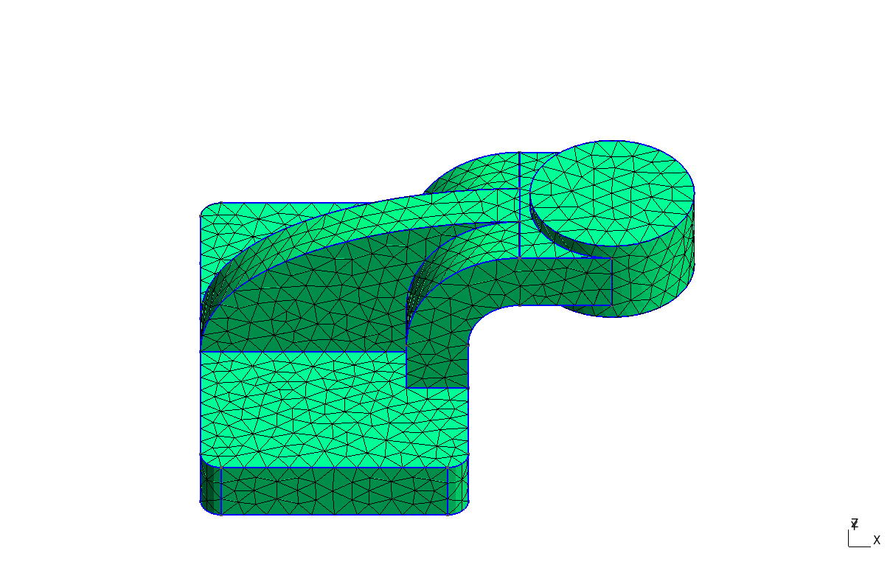
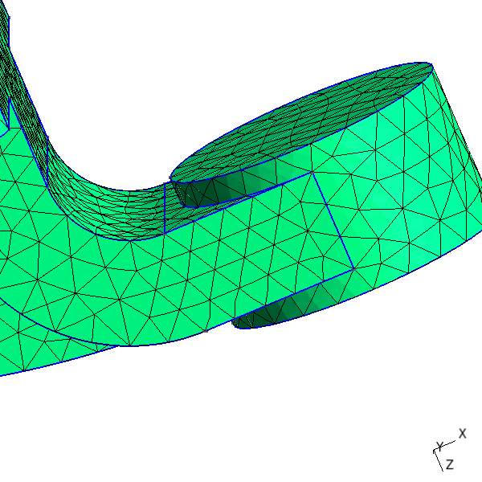

Execute
```
> cgx -b VTdemo.fbd
```
to produce images for comparison of the meshes produced with the original geometry or with the cleaned geometry (virtual topology).

Original geometry (characteristic length 11, 4473 nodes, 2263 elements)

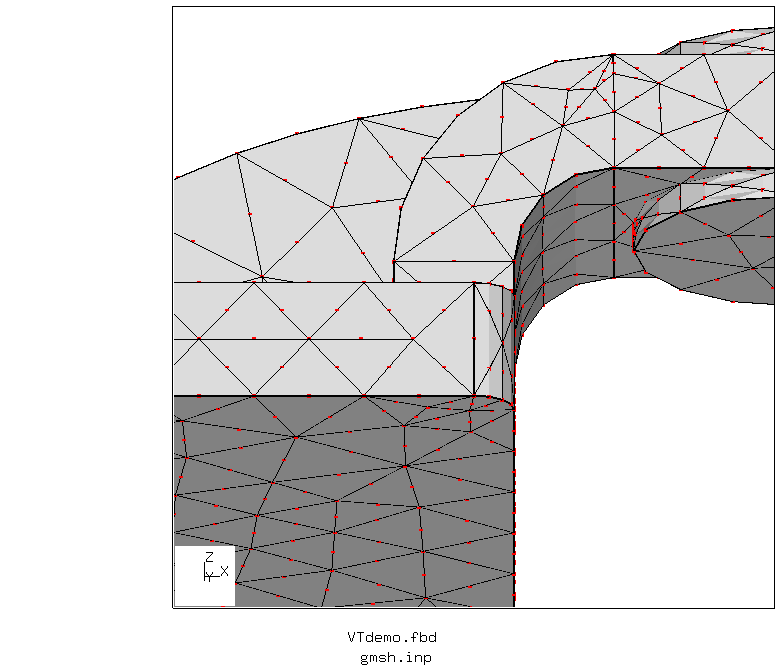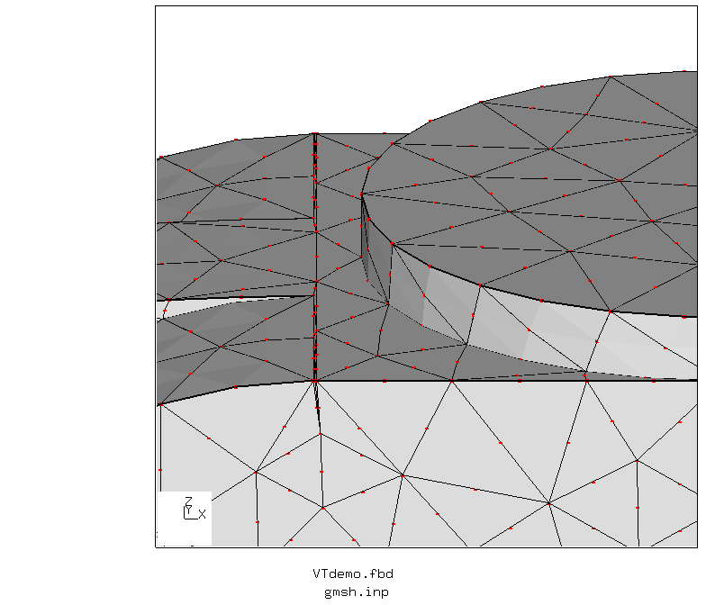

Virtual topology (characteristic length 7, 11394 nodes, 6289 elements):

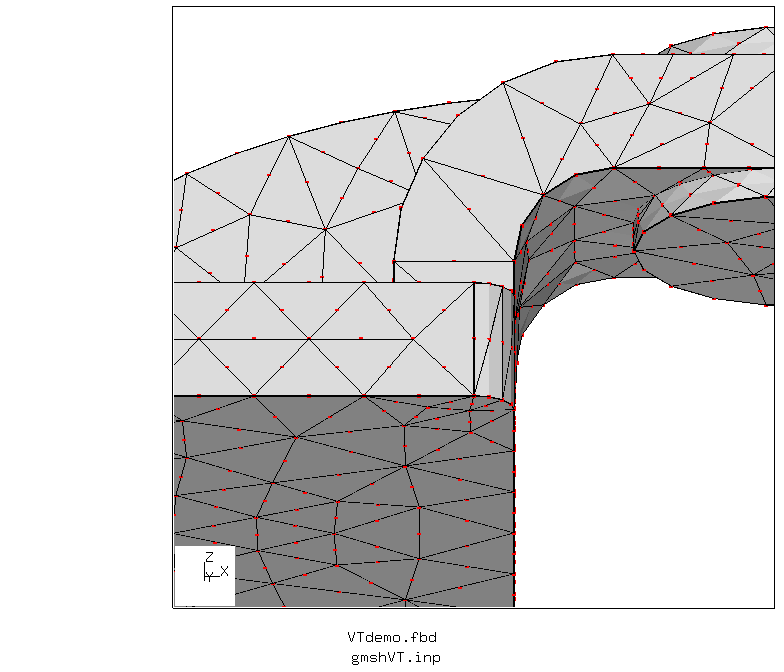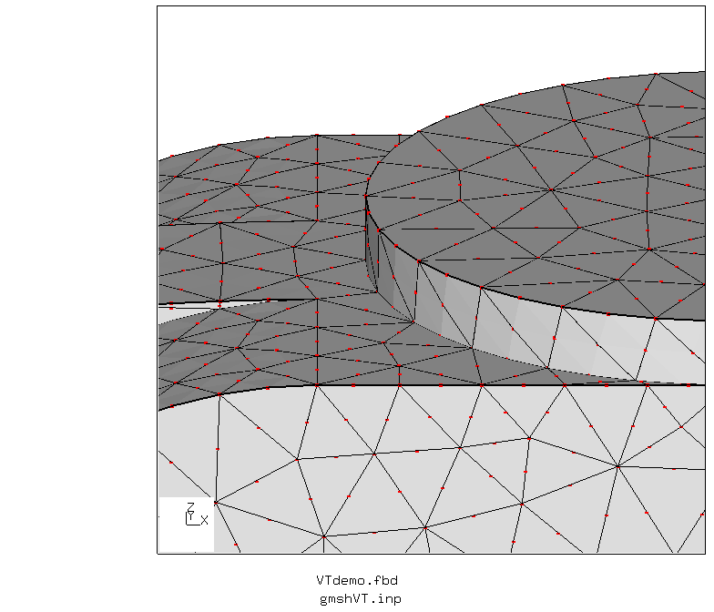

# Application of Boundary Conditions
After closing the gmsh window, CGX takes over control again and reads `gmsh.inp`.

You could do that interactively using
```
> cgx -c gmsh.inp
```
Then you might issue `prnt se` in order to see what sets are defined and `plot e` or `plot n` to
display individual sets (browse the sets by PageUp and PageDown).

Some cleanup is required, because gmsh writes 2D elements for the physical surfaces, which are not needed in CalculiX.

Remove the 2D elements (we address them by type here):
```
(cgx window) zap +CPS6
```
Extend node sets to face sets if required (here we need the set `load` for
pressure application)
```
(cgx window) comp load do
```
The following image shows the nodes of the support surface and the faces of the pressure
application surface.

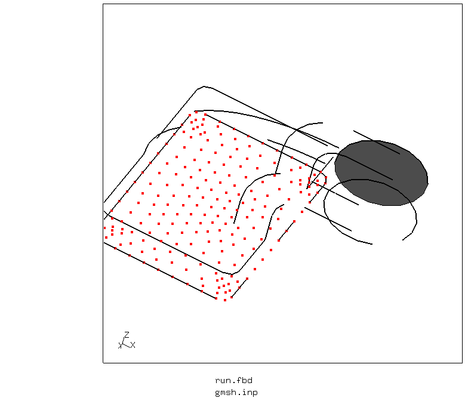

Once the sets are defined, there is no particular challenge any more with setting up the simulation.


# Results

von Mises stress, displaced geometry


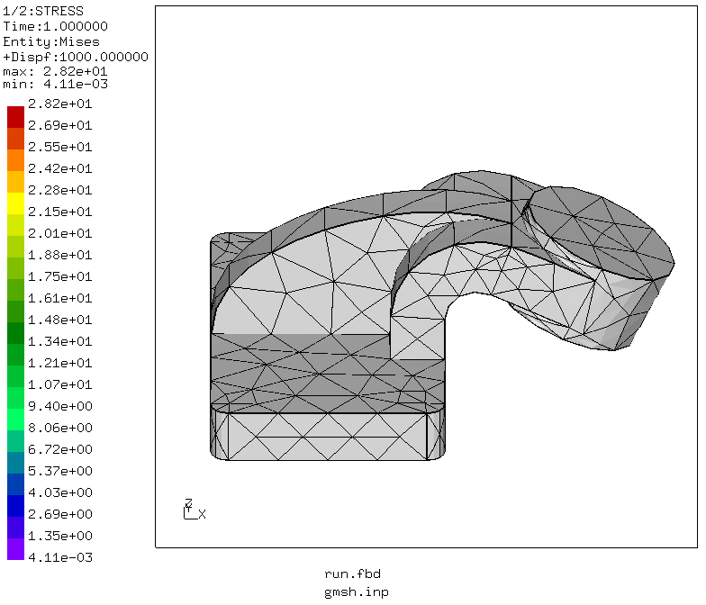
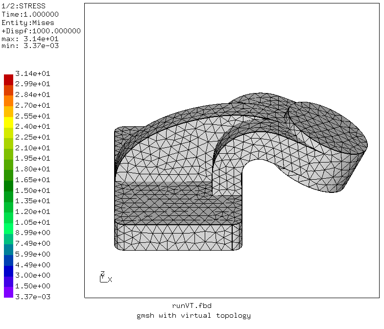

# Meshing with cad2fbd/cgx

CGX comes with the CAD converter cad2fbd, which can convert STEP and IGES files to CGX native FBD format.

The script `run1.fbd`
+ calls the converter
+ reads the resulting file `result.fbd`
+ tries to mesh the geometry with various settings.
```
cgx -b run1.fbd
```
Unfortunately, CGX can't mesh all surfaces with moderate mesh density.

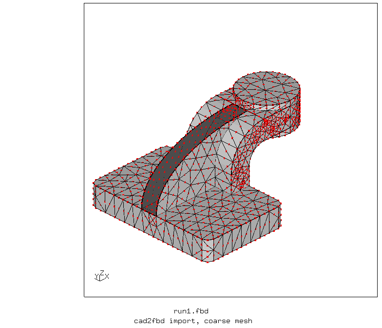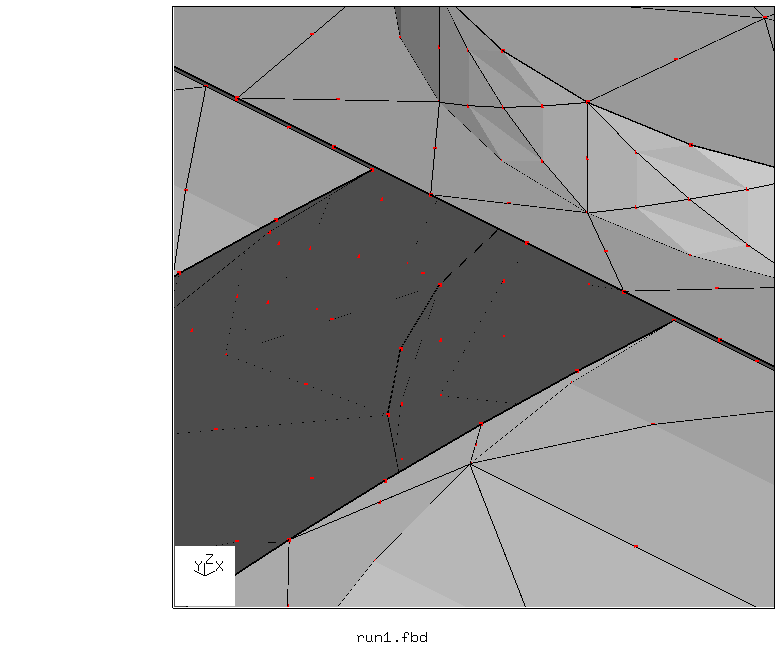

If the mesh density is increased (all divisions multiplied by four) then automatic meshing succeeds (with nearly 150000 nodes, left image). If the high density is restricted to the lines along the narrow strips of the failed surface, then meshing succeeds with just 6000 nodes (right).

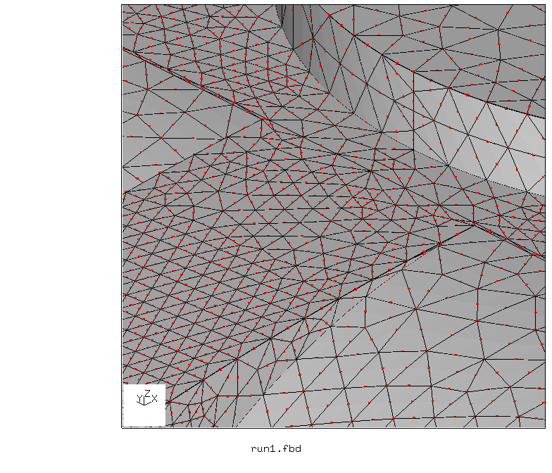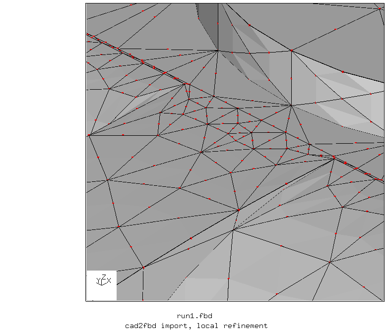

# Gmsh-Independent Analysis

Meshing is done in CGX as shown in the previous section.
The load and support surfaces are generated from the surface names in the imported geometry.
```
cgx -b run2.fbd
```
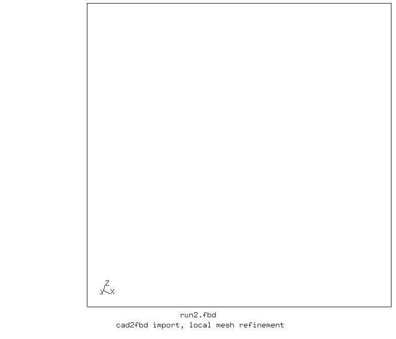

von Mises stress, displaced geometry

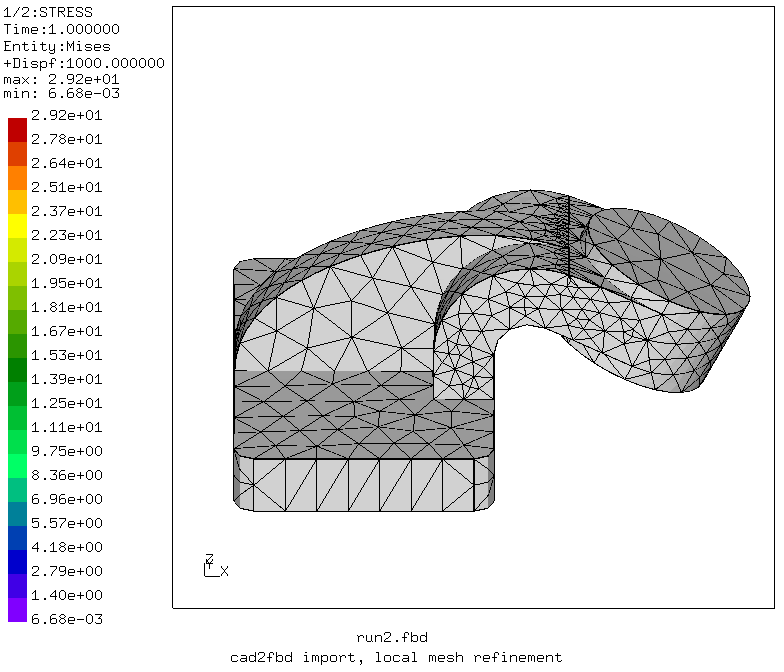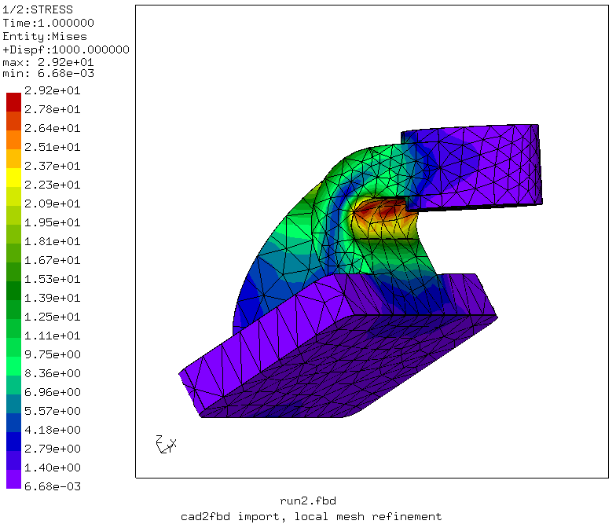
