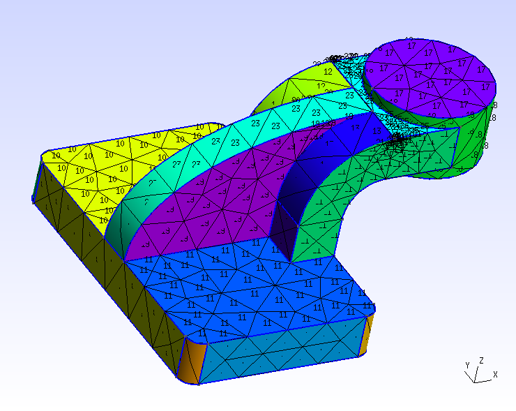

# Meshing a CAD Geometry with Gmsh
Tested with CGX/CCX 2.10, Gmsh 2.12

This demonstrates a possible workflow for a CalculiX analysis of a CAD
generated part.

* The workflow is controlled using a CGX fbd file.
* The geometry is created in Onshape and exported as STEP file.
* Import and meshing in gmsh, export as .inp file with volume and surface meshes.
  From within gmsh, display the surface numbers and note the required ones for
  loads and constraints application.
* Open the inp file in cgx and convert the surface element sets for boundary  
  conditions into node sets. Remove all surface elements.
* Write the mesh and required set definitions
* Write other FEA items
* Run the analysis
* Perform postprocessing

| File     | Contents       |
| :------- | :------------- |
| [part.step](part.step) | STEP geometry exported from Onshape |
| [part.geo](part.geo) | Gmsh control file for meshing and model display |
| [run.fbd](run.fbd) | CGX control file for preprocessing, solving and postprocessing |
| [solve.inp](solve.inp) | CCX input file |

# Run the analysis

The part is fixed on the rectangular base surface and a uniform pressure of 1 MPa
is applied to the top circular surface.

The complete analysis is run from a single CGX script
```
> cgx -b run.fbd
```
First, the geometry is meshed and displayed in gmsh. In order to proceed with
the analysis you have to close the gmsh window.

The individual steps of the workflow are discussed below.

# Meshing
The STEP geometry is loaded into gmsh and meshed with second order tetrahedra. Gmsh
also meshes the surfaces with individual sets of second order triangles.

Upon export in ABAQUS format (inp) the elements are stored in individual sets
of the name VolumeXX and SurfaceXX, where
XX are unique region numbers.

The regions for boundary conditions are referenced by their numbers. therefore,
gmsh offers a display of the meshed surfaces with region numbers.



By interactive inspection, the relevant surface numbers are found:
 + Surface5 for the support
 + Surface17 for pressure application

The only non-default meshing option is to use second order elements.

The whole process of STEP inport, mesh and display setting, meshing and export of the mesh
is controlled by a gmsh geo file. Alternatively, a set of command line
parameters for gmsh could have been used.

The gmsh geo file can be executed separately if you want to play around with the meshing details:
```
> gmsh part.geo
```
The result of the meshing is the file `gmsh.inp`
# Application of Boundary Conditions
After closing the gmsh window, CGX takes over control again and reads `gmsh.inp`.

You could do that interactively using
```
> cgx -c gmsh.inp
```
Then you might issue `prnt se` in order to see what sets are defined and `plot e <setname>` to
display individual element sets.

Gmsh provides the surfaces as sets of 2D elements. CalculiX needs sets of nodes
or sets of faces of solid elements for
boundary condition application.

CGX has a mechanism for doing this conversion.
1. Extend the relevant surface element set to include the nodes, e.g.
   ```
   comp SurfaceXX do
   ```
1. Remove all Surface elements. The extended sets now contain just the nodes. A generic way to do this is
```
seta tozap e all
setr tozap e +C3D10
zap tozap
del se0
```
1. Eventually extend the node sets to include the faces of the adjacent volume elements.
    ```
       comp SurfaceXX do
    ```

The following image shows the nodes of the support surface and the faces of the pressure
application surface.


Once the sets are defined, there is no particular challenge any more with setting up the simulation.

# Results

von Mises stress, displaced geometry


