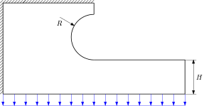
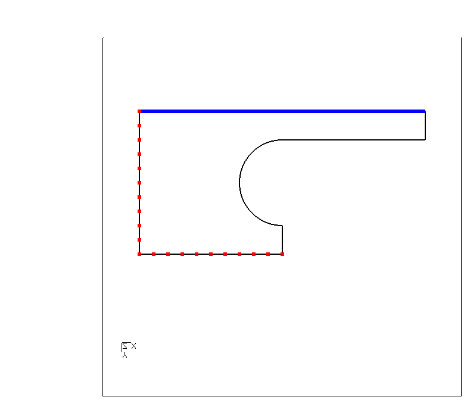

# Model for Parametric Optimization

Tested with CGX 2.16 / CCX 2.15

This is a test model for optimization with various optimization software tools like Optimax or Dakota.

* Modify the parameters in `Run.fbd`
* Execute Run.fbd in CGX
* Access the maximum stress and the area (mass) from `results.txt`

The mesh divisions are adapted based on the parameter values in order to ensure a reasonable mesh.

| File                     | Contents                                                       |
| :-------                 | :-------------                                                 |
| [Run.fbd](Run.fbd)       | Top level CGX script                                           |
| [Solve.inp](Solve.inp)   | CCX input file                                                 |
| [test.py](test.py)       | python script to run the simulation                            |

# Geometry

A planar L-shaped part is clamped at the upper and left edges and uniformly loaded at the lower edge.
The dimensions to be driven by the optimization are the radius of the notch and the height of the horizontal beam.
A free mesh with second order plane stress triangles is generated.




Parameter | Value | Unit | Description
:--       | :--   | :--  | :--
`R`       | 30    | mm   | Radius
`H`      | 20    | mm   | Height of the beam


## Meshing and sets
The mesh is controlled by
* a global node distance,
+ the number of nodes along the hemicircle
+ the node distance along the beam as a fraction of H

Node set `fix` and surface `load` are created for application of the boundary conditions.




## Solution

The simulation is run from within the top level CGX script:
```
> cgx -b Run.fbd
```
Separate run of the simulation:
```
> ccx Solve
```
The simulation is a linear static analysis.

## Post-processing

The stack is activated in order to extract result values and write them to a text file

A plot of the equivalent stress is generated and the maximum value is read from the stack.


The `area` command computes the surface properties and writes them to the stack.
Thus the surface area can be determined and also be written to the results file.

The results file contains the maximum equivalent stress and the surface area. It is meant to be read by some external optimization software like Optimax or Dakota.

```
Stress 9.405108e+01
Surface 1.069340e+04
```
