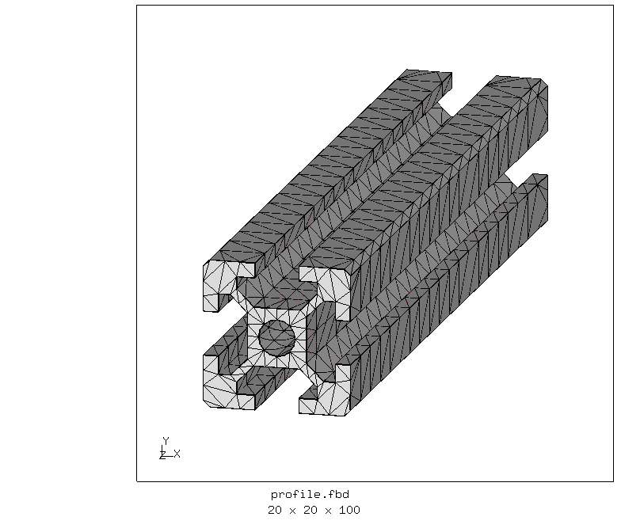
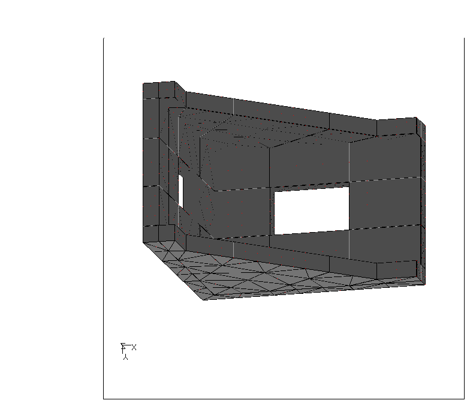
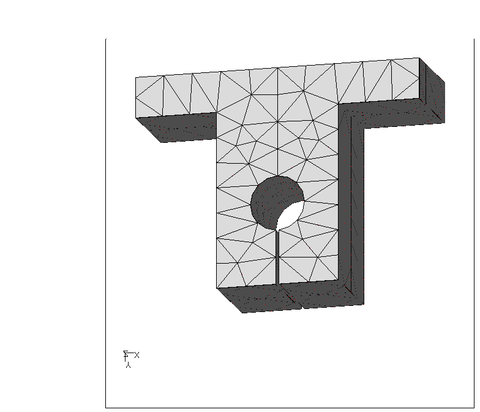
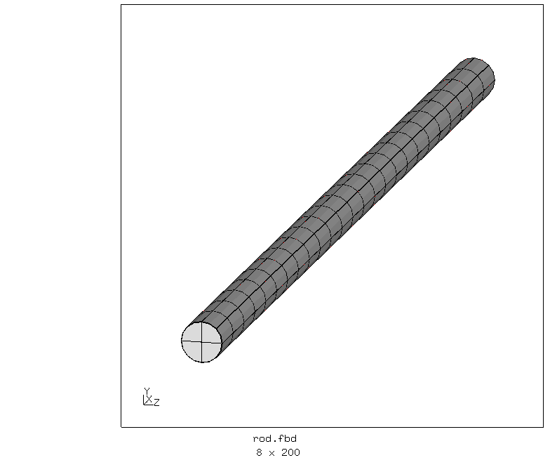
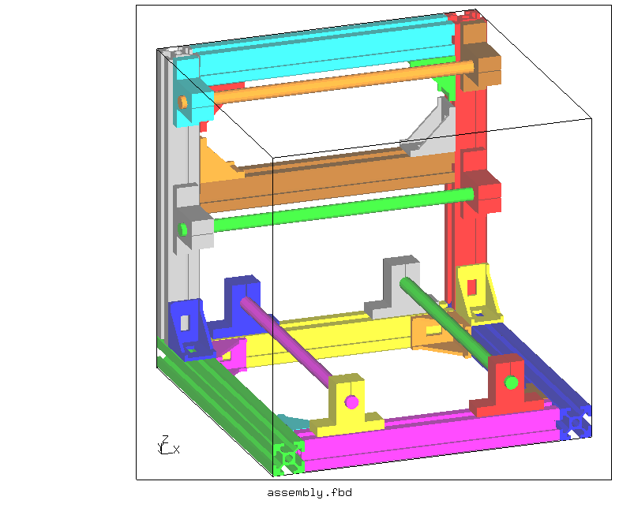
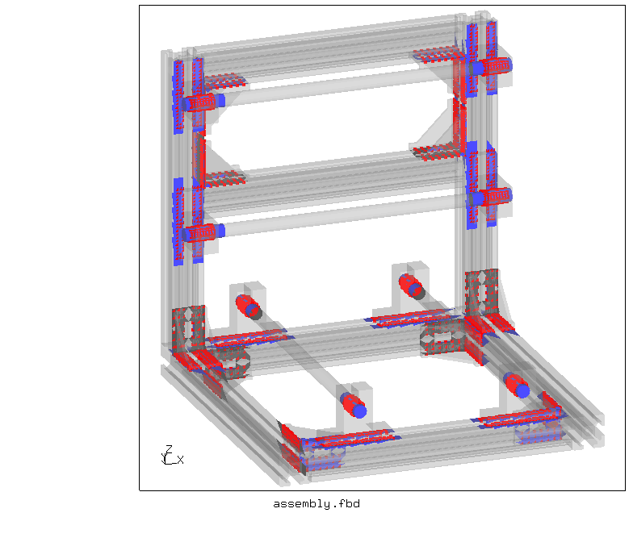
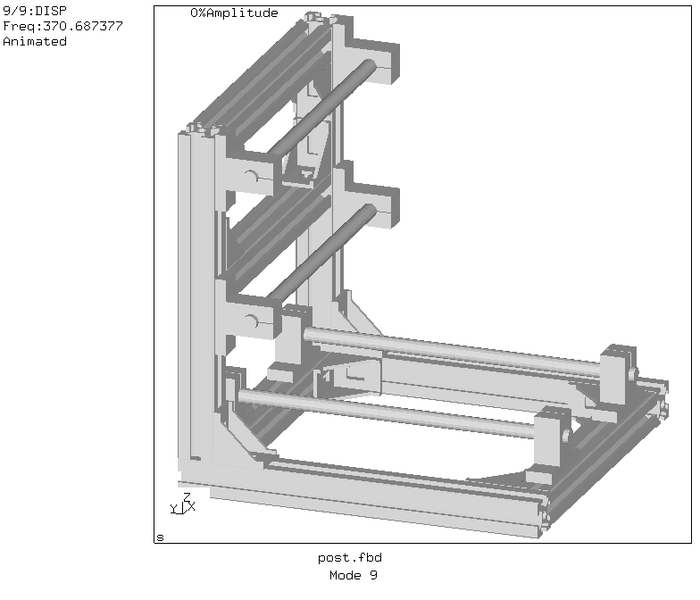

# Multipart Assembly

Tested with CGX 2.19 / CCX 2.19

+ Assembly of mesh parts
+ Parametric parts generated in CGX
+ Assembly is non-parametric
+ Automatic contact detection (ACD)

File                          | Contents                                      
:-------------                | :-------------                                
[assembly.fbd](assembly.fbd)  | Top level CGX script                 
[profile.fbd](profile.fbd)    | CGX script for slot profile                 
[winkel.fbd](winkel.fbd)      | CGX script for angle bracket                 
[SK.fbd](SK.fbd)              | CGX script for SK bracket                
[rod.fbd](rod.fbd)            | CGX script for 8mm rod                
[post.fbd](post.fbd)          | CGX script postprocessing             
[solve.inp](solve.inp)        | CCX input   
[test.py](test.py)            | Python script to run the complete simulation  

# Parts

Generate the parts:
```
> cgx -b profile.fbd
> cgx -b winkel.fbd
> cgx -b SK.fbd
> cgx -b rod.fbd
```

                                     
                              

# Assembly

```
> cgx -b assembly.fbd
```

The part meshes are read, copied, translated, rotated and sometimes scaled. If contact is required, the parts touch each other without gap.



The CGX command `neigh` generates the contact surfaces and the contact definitions for CCX based on face-to-face proximity. `*tie` MPC contact is used.



In order to verify correct bonding of the parts, a modal analysis is performed. No displacement constraints (supports) are applied.

```
> ccx solve
```
The postprocessing script shows the eigenmodes:

```
> cgx -b post.fbd
```


