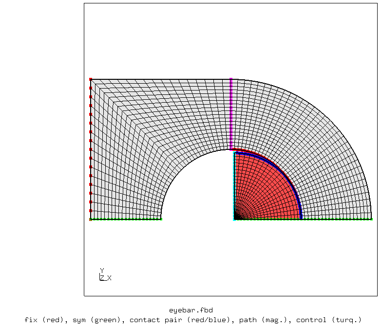
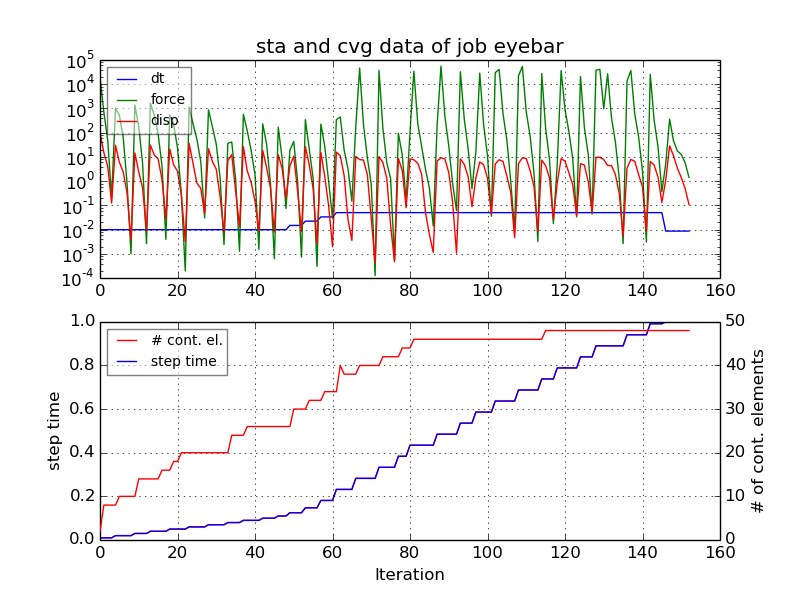
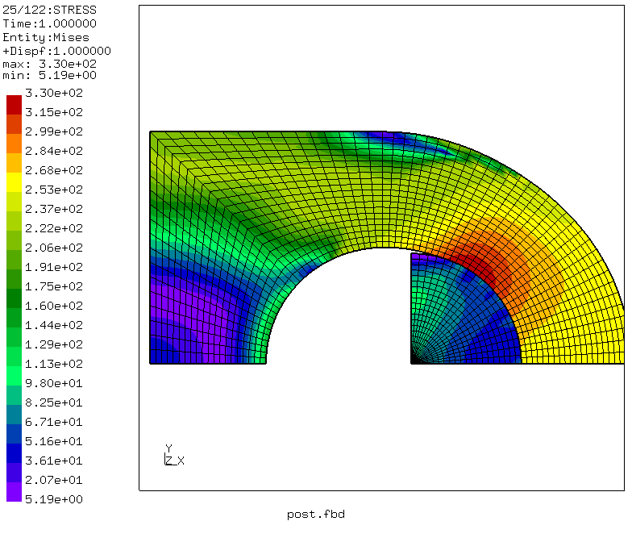
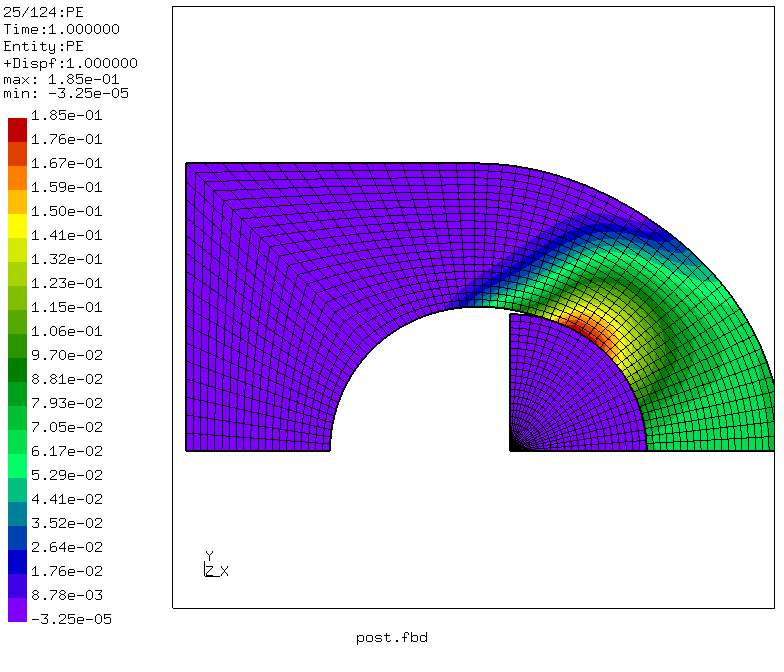
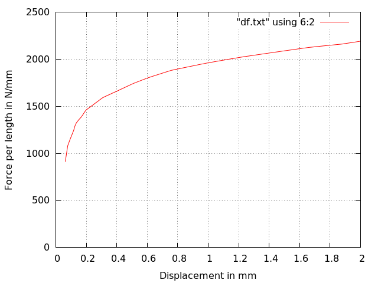
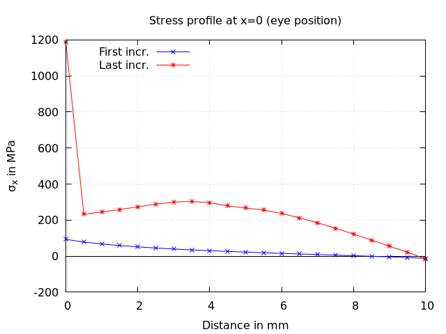

# Eye/Pin Contact 2D
Tested with CGX 2.16 / CCX 2.15

+ Plane strain model (can be switched to plane stress)
+ Linear elastic pin, elasto-plastic eye
+ Node-to-surface Penalty contact
+ Prescribed displacement of the pin
+ Force-displacement-plot, stress profiles

The model was inspired by a  [model ](https://groups.yahoo.com/neo/groups/calculix/files/examples/eyebar%20with%20contact%20and%20nonlinear%20material/) by user dichtstoff in the CalculiX user forum. Here, essentially, parametrization with the script `param.py` was added.


 File                             | Contents                                    
 :-------------                   | :-------------                                
 [par.eyebar.fbd](par.eyebar.fbd) | Pre-processing script for CGX  (parametrized with `param.py`)  
 [eyebar.inp](eyebar.inp)         | CCX input
 [post.fbd](post.fbd)             | CGX post-processing script                 
 [df.gnu](df.gnu)                 | Gnuplot script for the force-displacement plot   
 [path.gnu](path.gnu)             | Gnuplot script for the stress profiles      
 [test.py](test.py)               | Python script to run the full simulation

## Preprocessing
Two separate parts are generated and meshed with plane strain elements.
The prescribed displacement is applied to the flat equatorial surface of the pin.

Parameter | Value  | Description
:--       | :--    | :---
`wi`      | 10     | Width of the material around the hole (eye) in mm
`re`      | 10     | Radius of the hole in mm
`rp`      | 9.5    | Radius of the pin in mm
`etyp`    | "qu4e" | Element type

You can change the model type using the parameter `etyp` in `par.eyebar.fbd`.
Default is 4 node plane strain.
```
> param.py par.eyebar.fbd
> cgx -b eyebar.fbd
```


## Solving
```
> ccx eyebar
> monitor.py eyebar
```


## Postprocess

```
> cgx -b post.fbd
```


The force-displacement curve is valid for the half model and is created from the .dat-file-output
of the total reaction forces and the displacement of the monitor node.



Stress profiles in cross sections at the support (left) and at the eye (right, light blue in the mesh plot). The diagrams show the profiles at the first increment (still elastic) and at the end of the load step.


