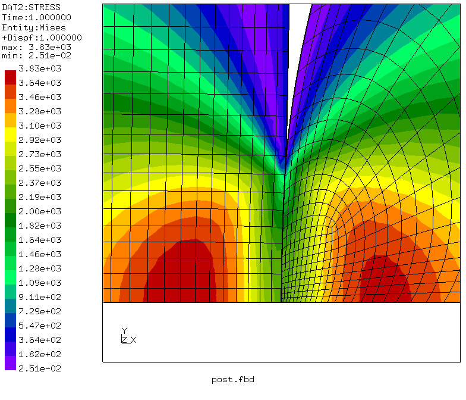

# Hertz Contact 2D
Tested with CGX/CCX 2.9

+ Plane strain model
+ Linear elasticity
+ Surface-to-surface Penalty contact

The model was inspired by  [this post](https://groups.yahoo.com/neo/groups/calculix/conversations/topics/11564) by user dichtstoff in the CalculiX user forum. Here, essentially, parametrization with the CGX `valu` command and mesh bias were added.


| File                   | Contents                                      |
| :-------------         | :-------------                                |
| [pre.fbd](pre.fbd)     | Pre-processing script for CGX  (parametrized with `valu`)                |
| [Hertz.inp](Hertz.inp) | CCX input, surface-to-surface penalty contact |
| [post.fbd](post.fbd)   | CGX post-processing script                    |

## Preprocessing
Two separate parts are generated and meshed with plane strain elements.
```
> cgx -b pre.fbd
```


## Solving
```
> ccx Hertz
> ../../Scripts/monitor.py Hertz
```


## Postprocessing

```
> cgx -b post.frd
```
The solution shows the expected feature of Hertz contact with the maximum of the equivalent stress somewhat below the contact surface.



