# Hertz Contact 2D
Tested with CGX 2.16 / CCX 2.15

+ Plane strain model
+ Linear elasticity
+ Surface-to-surface Penalty contact
+ 2 steps:
  1. displacement control,
  2. force (pressure) control

The model was inspired by  [this post](https://groups.yahoo.com/neo/groups/calculix/conversations/topics/11564) by user dichtstoff in the CalculiX user forum. Here, essentially, parametrization with the CGX `valu` command and mesh bias were added.


File                   | Contents                                      
:-------------         | :-------------                                
[pre.fbd](pre.fbd)     | Pre-processing script for CGX  (parametrized with `valu`)                
[Hertz.inp](Hertz.inp) | CCX input, surface-to-surface penalty contact
[post.fbd](post.fbd)   | CGX post-processing script                    
[plots.fbd](plots.fbd) | CGX post-processing script (path plots)       
[plots.gnu](plots.gnu) | Gnuplot script for path plots                 
[test.py](test.py)     | Python script to run the example        

## Preprocessing


| Parameter      | Value   | Description                  |
| :------------- |  :----  | :-------------               |
| `radius`       | 50      | radius in mm                 |
| `height`       | 60      | thickness of the block in mm |
| `width`        | 120     | width of the block in mm     |

The prescribed displacement (first step) or the pressure (second step) are applied to the flat equatorial surface of the cylinder.

The values for both variants are chosen independently, thus they can't be compared directly.
```
> cgx -b pre.fbd
```
Two separate parts are generated and meshed with plane strain elements.

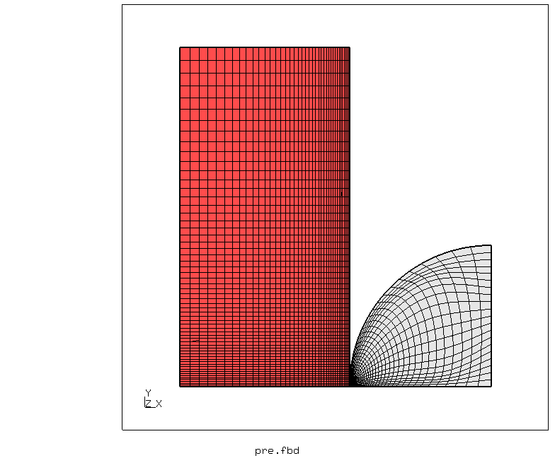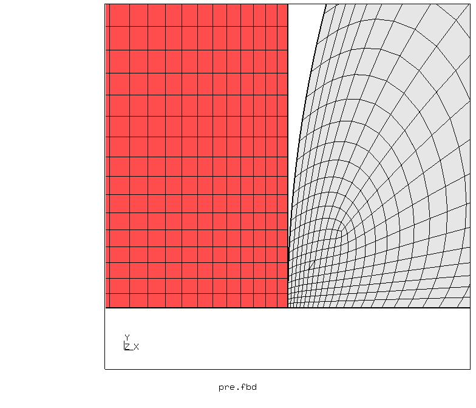

Sets and Contact surfaces:

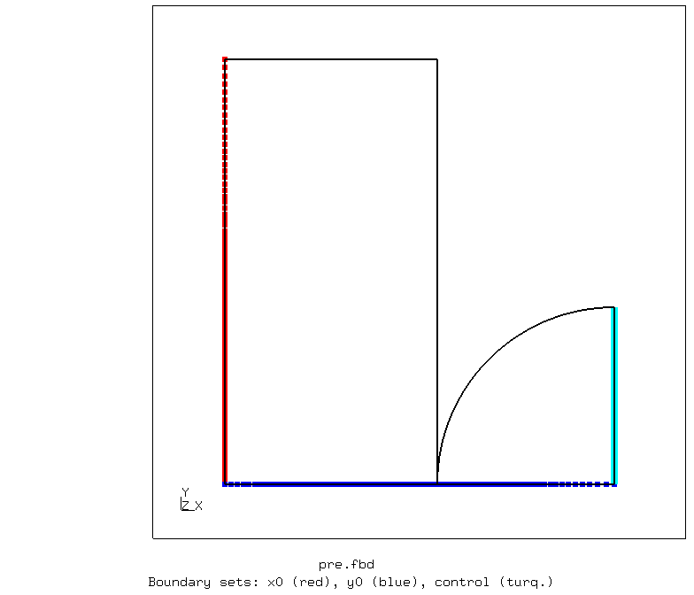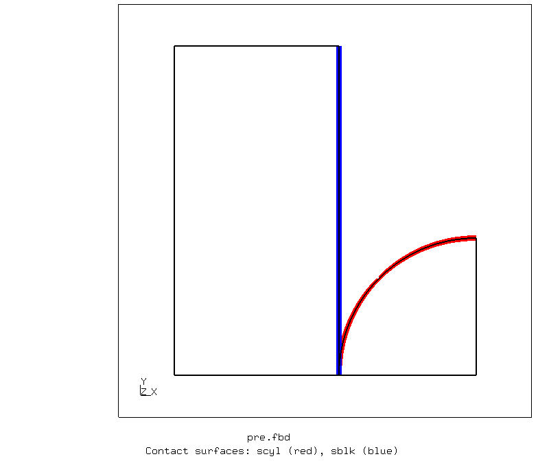


## Solving
```
> ccx Hertz
> monitor.py Hertz
```
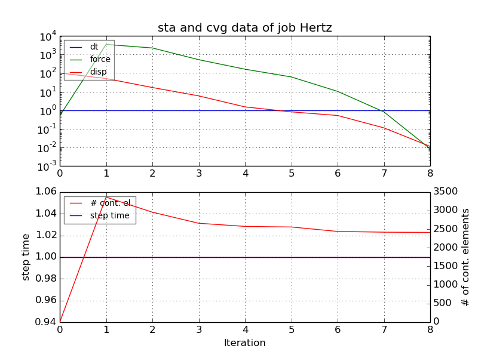

## Postprocess

```
> cgx -b post.fbd
```
The solution shows the expected feature of Hertz contact with the maximum of the equivalent stress somewhat below the contact surface.

Results with displacement control (first step)

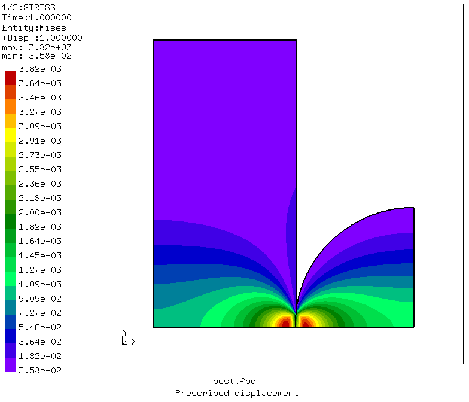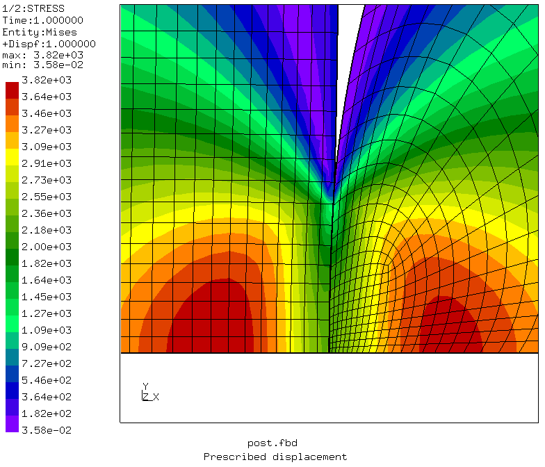

Results with pressure control (second step)

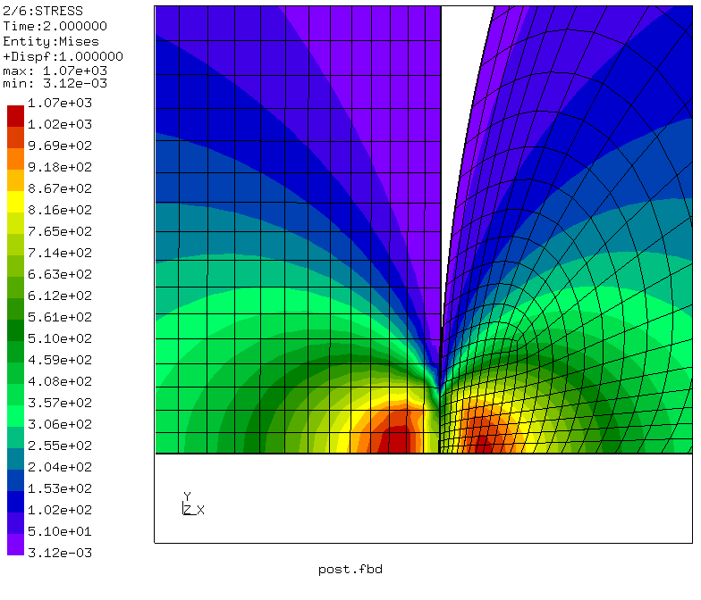

```
> cgx -b plots.fbd
```
Stress plots along the symmetry line with x=0 at the contact location:

Results with displacement control (first step)

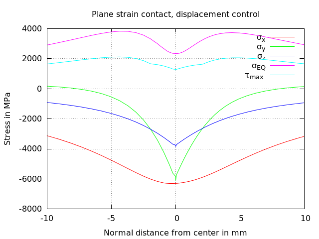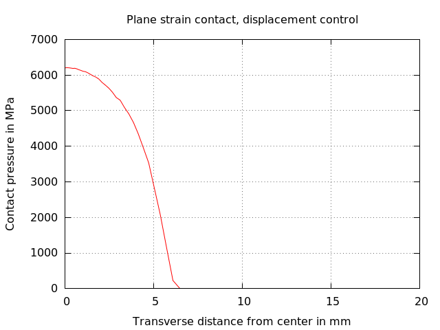

Results with pressure control (second step)

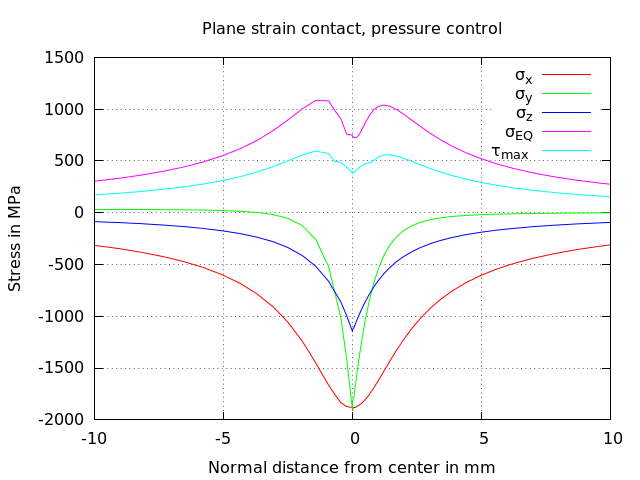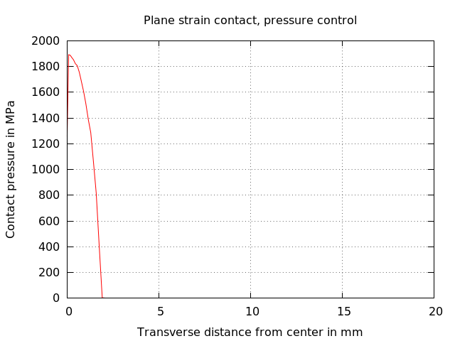


```
