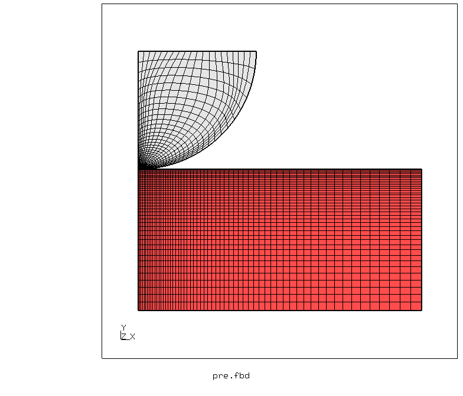
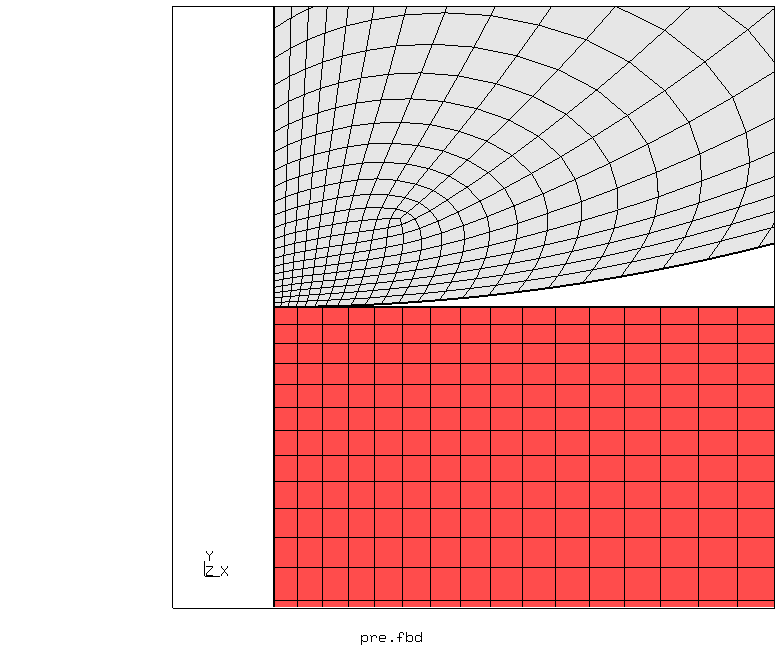
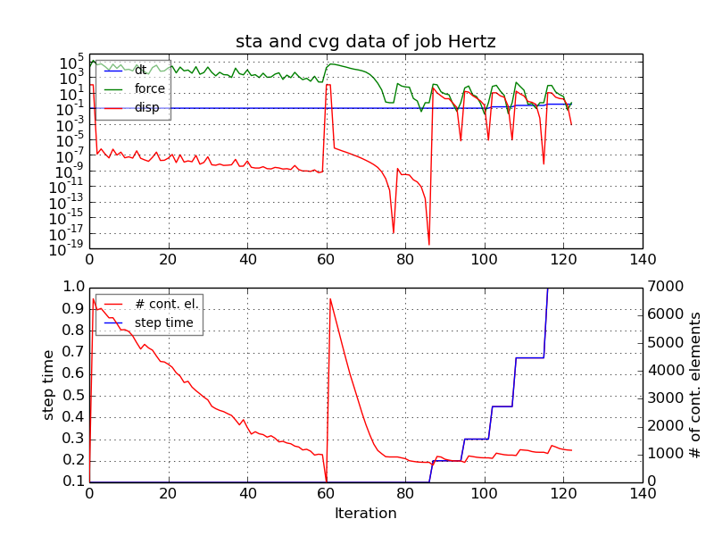
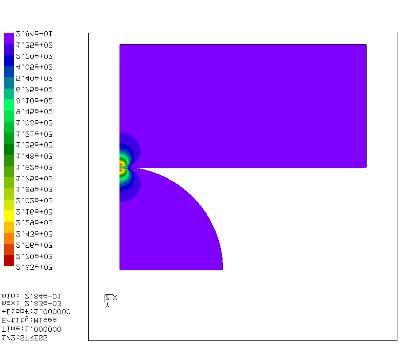
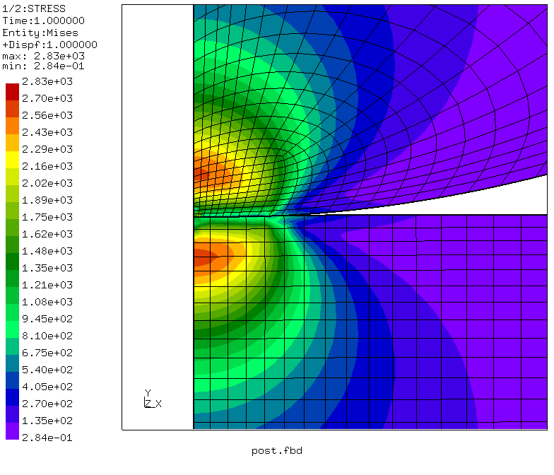
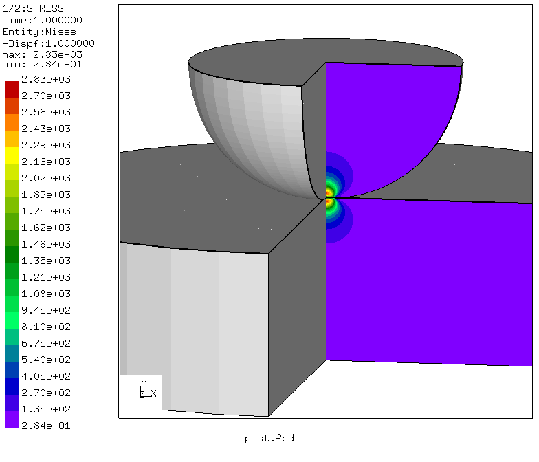
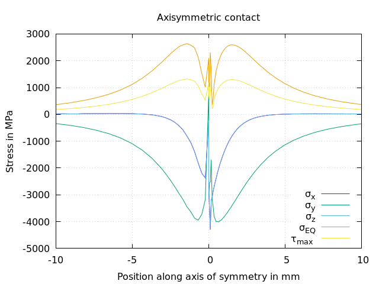
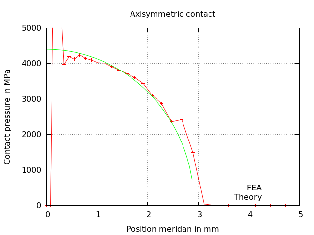

# Hertz contact axisymmetric (sphere to plane)
Tested with CGX/CCX 2.11

+ Axisymmetric model
+ Linear elasticity
+ Surface-to-surface Penalty contact
+ Force (pressure) control

| File                   | Contents                                      |
| :-------------         | :-------------                                |
| [pre.fbd](pre.fbd)     | Pre-processing script for CGX  (parametrized with `valu`)                |
| [Hertz.inp](Hertz.inp) | CCX input, surface-to-surface penalty contact |
| [post.fbd](post.fbd)   | CGX post-processing script                    |
| [plots.fbd](plots.fbd) | CGX post-processing script (path plots)       |
| [plots.gnu](plots.gnu) | Gnuplot script for path plots                 |

## Preprocessing
Two separate parts are generated and meshed with axisymmetric elements (CAX8).
The load is applied as pressure to the flat equatorial surface of the hemisphere.
The lower surface of the flat disk is constrained in axial (y) direction.
```
> cgx -b pre.fbd
```



## Solving
```
> ccx Hertz
> monitor.py Hertz
```


## Postprocess

```
> cgx -b post.fbd
```
The solution shows the expected feature of Hertz contact with the maximum of the equivalent stress somewhat below the contact surface. However, there is evidence of contact finding problems near the axis of symmetry.






```
> cgx -b plots.fbd
```
Stress plot along the axis of symmetry (x=0) at the contact location:



Contact pressure along



```
