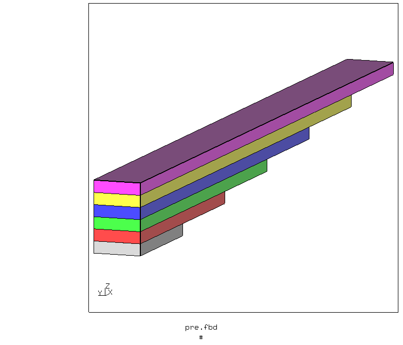
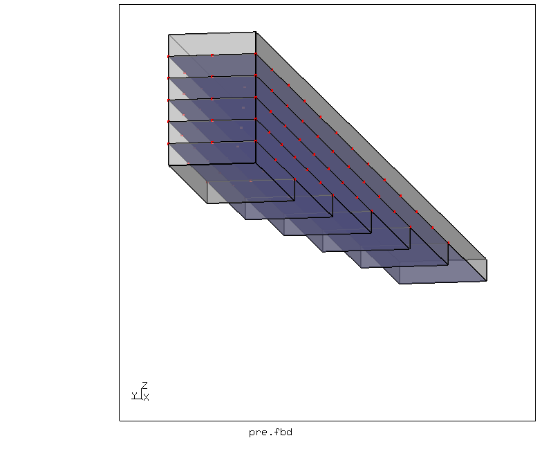
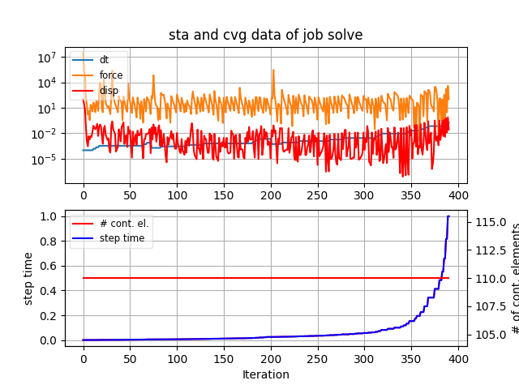
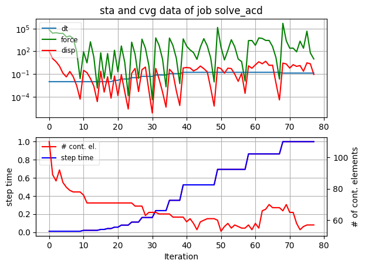
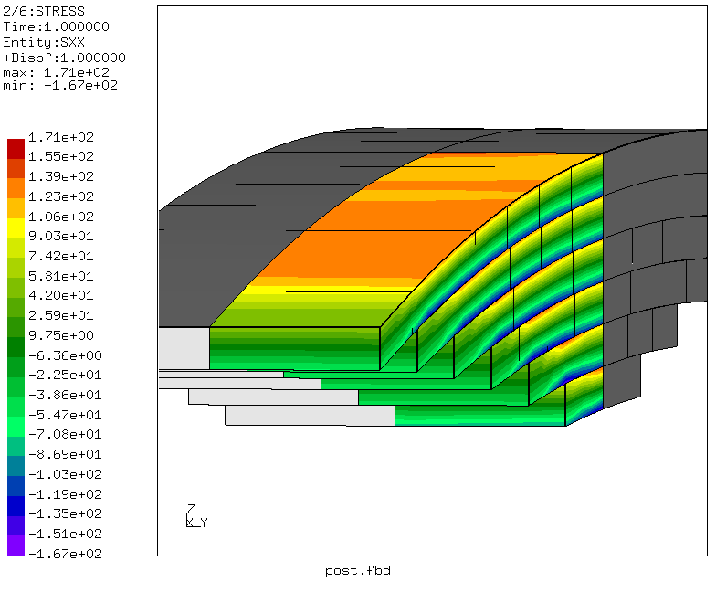

# Leaf Spring
Tested with CGX 2.16 / CCX 2.15

+ Parametric model with variable number of leafs
+ completely automatic generation of the solver input using a loop in CGX with and without automatic contact detection (ACD)
+ Penalty contact (node-to-surface)
+ Static analysis
+ Analysis of a quarter model, expanded in postprocessing


File                   | Contents                                      
:-------------         | :-------------                                
[pre.fbd](pre.fbd)     | Pre-processing script for CGX                 
[pre_acd.fbd](pre_acd.fbd) | Pre-processing script for CGX (automatic contact detection)                
[solve.inp](solve.inp) | CCX input                                     
[solve_acd.inp](solve_acd.inp) | CCX input (automatic contact detection)                                    
[post.fbd](post.fbd)   | Post-processing                               
[post_acd.fbd](post_acd.fbd)   | Post-processing (automatic contact detection)                             
[test.py](test.py)     | python script to run the simulation  

The main feature of this model is the automatic generation of a given number of
spring leafs along with the required contact definitions.
In CGX < 2.16 the contact surfaces had to be explicitly organized in the main loop.
In CGX 2.16, contact detection is used. This leads to a much simpler script (with suffix `_acd`)

In the file `pre.fbd` (or `pre_acd.fbd`) you can set the following parameters:

| Parameter | Value | Description           | Unit
| :------   | :---- | :---                  | :--
| `L`       | 300   | Half-span             | mm
| `W`       | 20    | Half-width            | mm                       |
| `T`       | 5     | Tickness of the leafs | mm
| `num`     | 6     | Number of leafs       |

## Preprocessing

Run
```
> cgx -b pre.fbd
```
or
```
> cgx -b pre_acd.fbd
```


Boundary conditions:
* ux=0 at x=0 (symmetry)
* uy=0 at y=0 (symmetry)
* uz=10 at x=0 (displacement-controlled load)
* uz=0 at x=L and z=(num-1) * W (support at the end of the upper leaf)

Between the leafs, node-to-surface penalty contact is used. The contact parameters
were basically just guessed, thus there is plenty of room for systematic studies.

The original parameters (non-ACD) did not work for the ACD version. Therefore, the contact stiffness
has been reduced. Then no convergence controls were required any more.



## Solving

```
> ccx solve
> monitor.py solve
```


```
> ccx solve_acd
> monitor.py solve_acd
```



## Postprocessing

```
> cgx -b post.fbd
> cgx -b post_acd.fbd
```
Display of the bending stress in the model domain and symmetry expansion.


