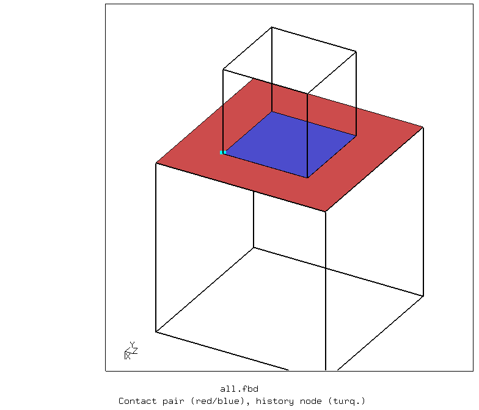
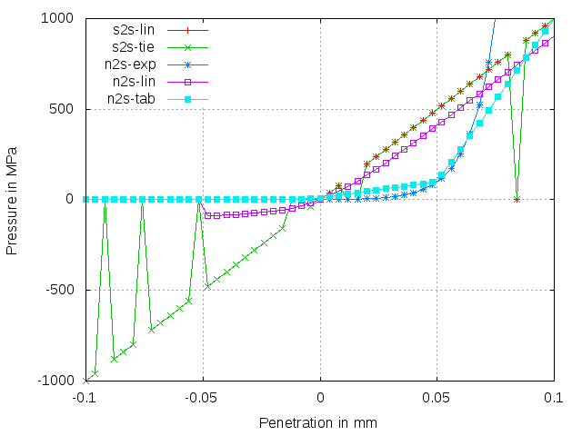
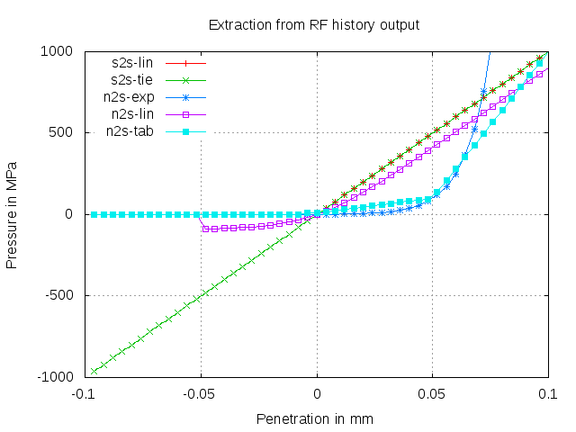

# Basic Tests of Penalty Contact
Tested with CGX 2.16 / CCX 2.15

+ Completely displacement controlled model (no dofs)
+ Objective: extract pressure-penetration characteristic for various contact options

 File                       | Contents                                             
:-------------              | :-------------                                 
 [all.fbd](all.fbd)         | Top level control script for CGX            
 [one.fbd](one.fbd)         | CGX script for a single test                
 [s2s-lin.inc](s2s-lin.inc) | CCX contact definition (surface-to-surface, linear)     
 [s2s-tie.inc](s2s-tie.inc) | CCX contact definition (surface-to-surface, tied)      
 [n2s-lin.inc](n2s-lin.inc) | CCX contact definition (node-to-surface, linear)       
 [n2s-exp.inc](n2s-exp.inc) | CCX contact definition (node-to-surface, exponential)       
 [n2s-tab.inc](n2s-tab.inc) | CCX contact definition (node-to-surface, tabular)       
 [solve.inp](solve.inp)     | CCX input (generic)      
 [pd.gnu](pd.gnu)           | Gnuplot script for the pressure-penetration diagram    
 [test.py](test.py)         | Python script to run the full simulation

Run the complete example using
```
> cgx -b all.fbd
```
## Preprocessing

A cube is generated by three successive sweep operations and then duplicated,
scaled and re-positioned.
Two contact surfaces are defined.

Each cube is meshed with a single element.

Parameter | Value | Description
:--       | :--   | :---
`le`      | 20    | Edge length of the cube in mm
`off`     | 5     | Offset of the smaller cube in mm



## Solving
In the first step, the starting gap for the second step is created. Full displacement control is applied.

In the second step, the small cube is displaced towards the big cube, such that a sweep from initial gap
to final penetration is made. The results are sampled in 50 increments.

To run the analysis separately, copy one of the contact definitions to `contact.inc`:
```
> cp s2s-lin.inc contact.inc
> ccx solve
> monitor.py solve
```
You can use the CGX script `one.fbd` to run a single analysis including the post-processing
```
> cgx -b one.fbd
```

## Postprocessing

The contact pressure versus penetration curve is extracted in two ways:
1. The field results (FRD) are read and time history plots of the contact pressure are created. Note that for surface-to-surface contact, there are problems (spurious zero values) with the output or display of the
pressure at some increments.
2. The reaction forces are extracted for plotting from the selected results file (DAT) using the helper script dat2txt.py



