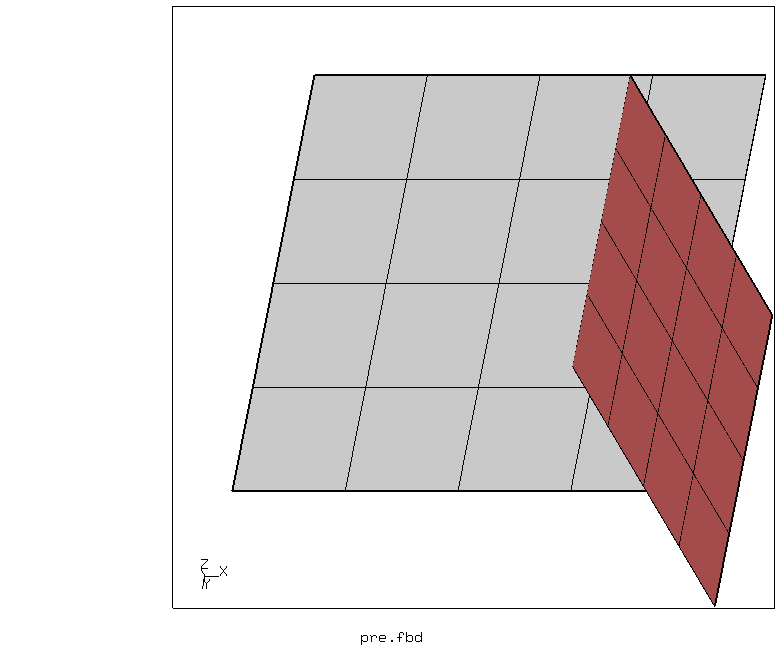

# Shell Assembly
Tested with CGX/CCX 2.10

+ Shell edge to shell face connection
+ Various contact versions
+ Modal analysis


| File                   | Contents                                      |
| :-------------         | :-------------                                |
| [pre.fbd](pre.fbd)     | Pre-processing script for CGX                 |
| [pc-ss.inp](pc-ss.inp) | CCX input, surface-to-surface penalty contact |
| [tie.inp](tie.inp)     | CCX input, MPC contact with `*tie`            |
| [equ.inp](equ.inp)     | CCX input, MPC contact with `*equation`       |

The only reliable contact version to connect face to edge of shell elements seems to be MPC contact with `*tie`.

MPC contact with `*equation` leads to a hinged connection at shell edge to face contact (7 rigid body modes).

Surface-to-surface penalty contact does not at all connect the parts.

| Mode | tie | equ | pc-ss |
| :--   | :-- | :-- | :--   |
| 1     | 0    | 0   | 0     |
| 2    | 0    | 0   | 0     |  
| 3     | 0    | 0.047   | 0     |  
| 4     | 0.0065    | 0.088   | 0     |
| 5     | 0.084   | 0.102   | 0     |
| 6     | 0.090    | 0.103   | 0     |
| 7     | 1530    | 0.110   | 0.050     |
| 8     | 2846    | 2544   | 0.067     |
| 9     | 5543    | 3087   | 0.089    |
| 10     | 5648    | 4306   | 0.092    | 
|
## Preprocessing
Two separate parts are generated and meshed with shell elements.
```
> cgx -b pre.fbd
```


## Solving
Use the appropriate input file  for the contact version you want to test:
```
> ccx tie
```

## Postprocessing

Load the results file in CGX
```
> cgx tie.frd
```
Display animated mode shapes coloured with the displacement magnitude. Show the elements and increase the default scaling of the mode shapes.
```
view elem
scal d 2
ds 1 a 4
```
Browse through the individual mode shapes using the PageDown and PageUp keys.


