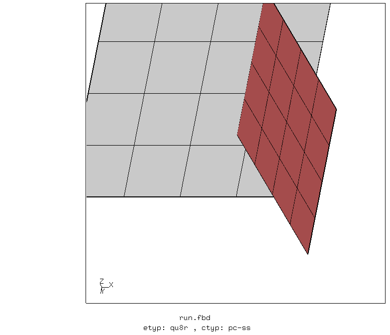
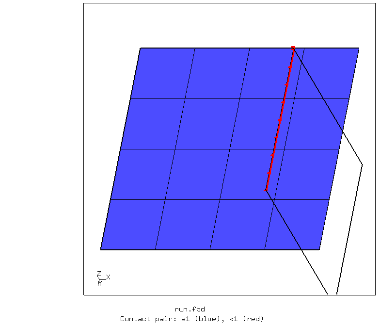
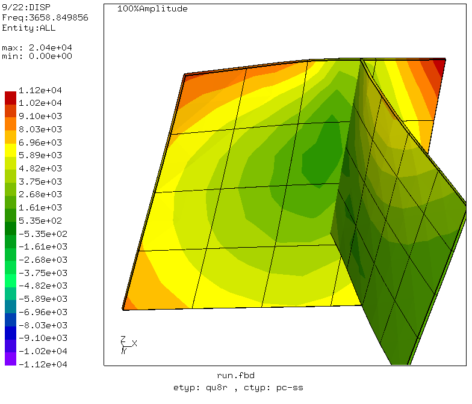

# Shell Assembly
Tested with CGX 2.15 / CCX 2.15

+ Investigation of shell edge to shell face connection using modal analysis
+ Various contact versions
+ Various element types

File                   | Contents                                      
:-------------         | :-------------                                
[run.fbd](run.fbd)     | Simulation control script for CGX             
[values.fbd](run.fbd)  | Parameter values           
[pc-ns.inp](pc-ns.inp) | CCX input, node-to-surface penalty contact    
[pc-ss.inp](pc-ss.inp) | CCX input, surface-to-surface penalty contact
[tie.inp](tie.inp)     | CCX input, MPC contact with `*tie`            
[equ.inp](equ.inp)     | CCX input, MPC contact with `*equation`       
[test.py](test.py)     | Python script for automatic parameter sweep   

## Results

The complete test is run using
```
> ./test.py
```
This generates a table with the frequency results for the various contact types and element types:

[Results.md](Results.md)

MPC contact with  `*tie` and penalty contact lead to a stiff connection between shell edge to shell face. Node-to-surface penalty contact and MPC contact with `*tie` show similar behaviour. The frequencies for penalty contact are usually slightly lower than with MPC contact, which is plausible, as the penalty contact has added compliance.

Surface-to-surface contact gives frequencies which differ severely from the reference MPC contact. Also, for S8R elements, there are only 5 frequencies close to zero (should be 6 rigid body modes).

Penalty contact (both surface-to-surface and node-to-surface) requires the modal analysis being performed as a perturbation step with a preceding static step (in the given case with no load applied). Note that the first result increment in a perturbation analysis is not a mode shape. For uniform test conditions, all simulations use a dummy static step and a subsequent frequency perturbation step.

MPC contact with `*equation` leads to a hinged connection at shell edge to face contact (7 rigid body modes).


## Simulation

A single simulation is run using
```
> cgx -b run.fbd
```
Two separate parts are generated and meshed with shell elements. Specify element type and contact
version using the parameters in `values.fbd`.

Parameter | Value | Description
:--       | :--   | :---
etyp      | qu4   | Element type (qu4, qu8, qu8r)
ctyp      | tie   | Contact version (tie, equ, pc-ns, pc-ss)



When the simulation is done, the script displays an animation of the first mode.

Browse through the individual mode shapes using the PageDown and PageUp keys.


