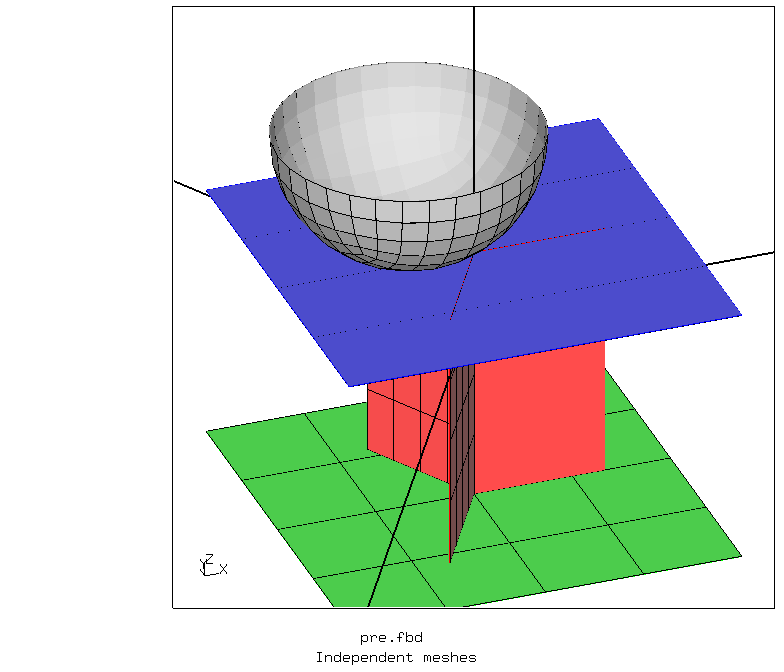
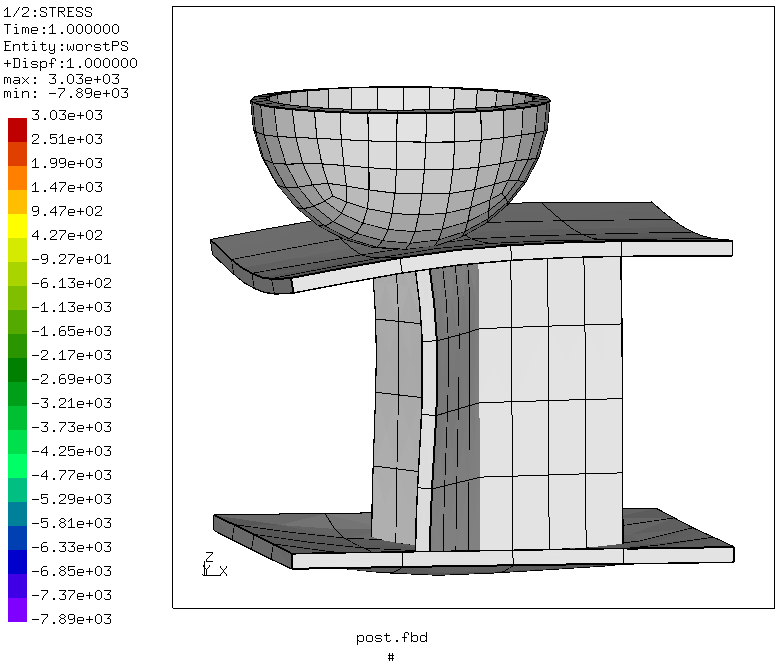
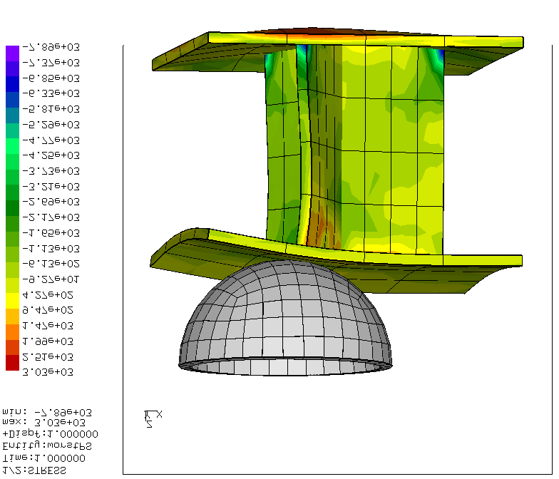
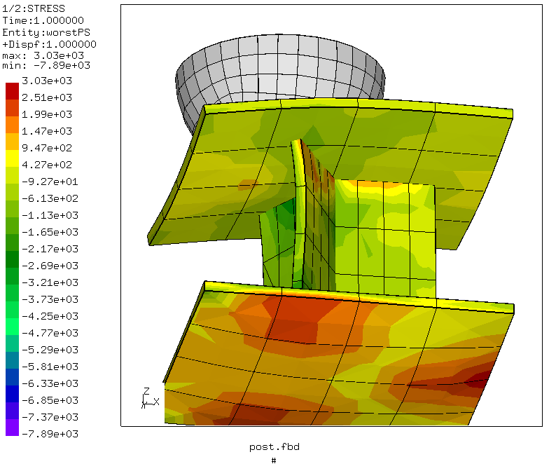

# Shell Assembly
Tested with CGX 2.16 / CCX 2.15

+ Shell assembly with edge to face tied Lagrange contact
+ Indenter with surface-to surface penalty contact
+ Indenter generated with nurbs based sweep, this generates a more precise hemisphere

File                   | Contents                                      
:-------------         | :-------------                                
[pre.fbd](pre.fbd)     | Pre-processing script for CGX                 
[post.fbd](post.fbd)   | Post-processing script for cgx                
[tie.inp](tie.inp)     | CCX input, MPC contact with `*tie`            
[test.py](test.py)     | python script to run the simulation           

## Preprocessing
A minimal sandwich structure is built with two skin sheets and a honeycomb core.
The structure is supported at the edges of the bottom skin.
The spherical indenter is pressed against the upper skin.

Parameter | Value | Description
:---      | :---  | :--
`rc`      | 10    | Width of the core sheets in mm
`tc`      | 1     | Thickness of the core sheets in mm (inactive)
`hc`      | 10    | Thickness of the core in mm
`ls`      | 30    | Edge length of the face sheets in mm
`ts`      | 1     | Thickness of the face sheets in mm
`ri`      | 10    | Radius of the indenter in mm
`xi`      | -5    | Displacement in x-direction (eccentricity) of the indenter in mm


```
> cgx -b pre.fbd
```


## Solving
All nodes of the indenter are moved downwards in a static step with default solution controls.
```
> ccx tie
> monitor.py tie
```


## Postprocessing

Create a shaded image of the deformed structure
```
> cgx -b post.fbd
```



