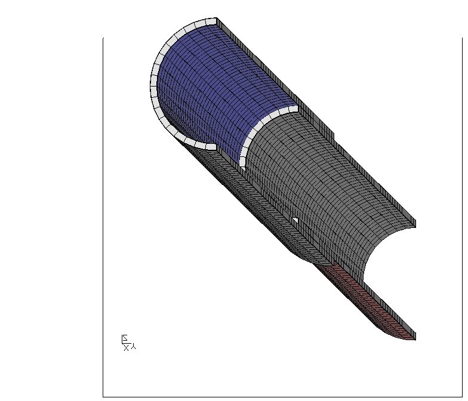
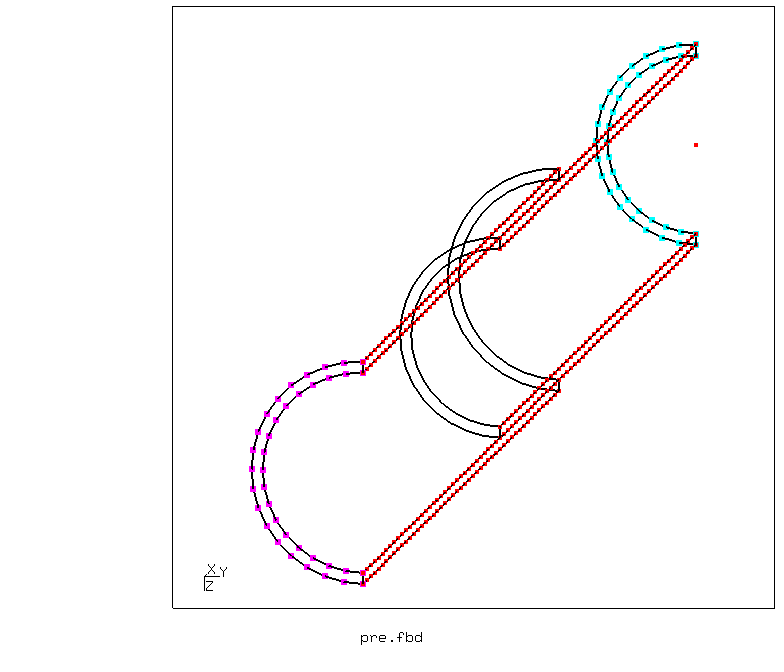
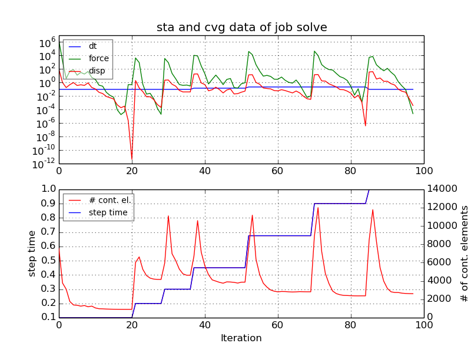
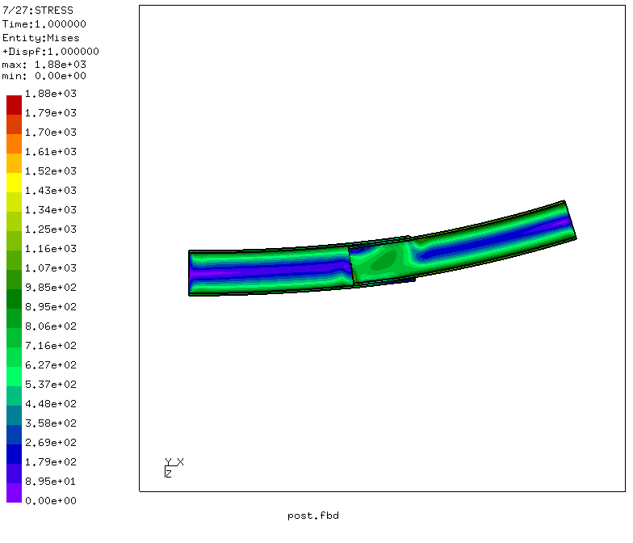
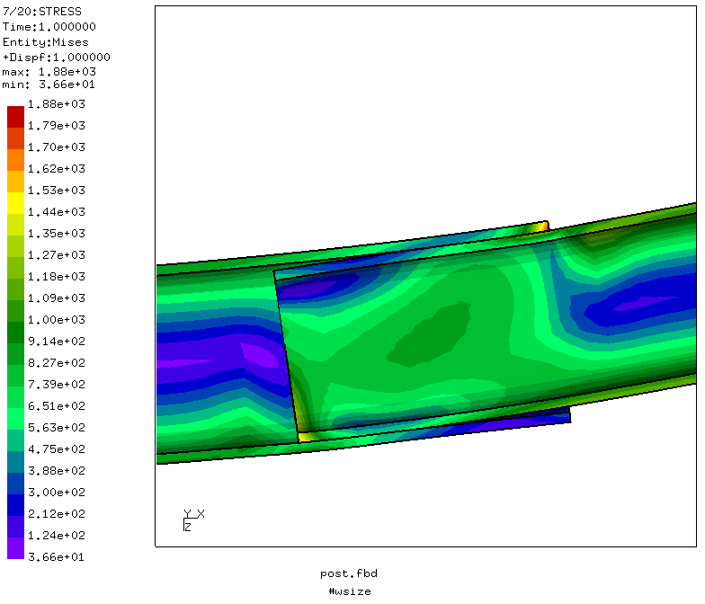
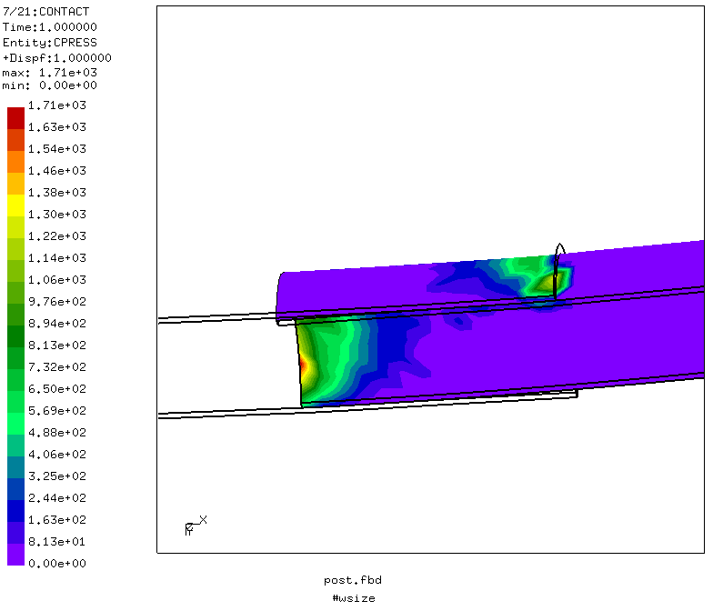
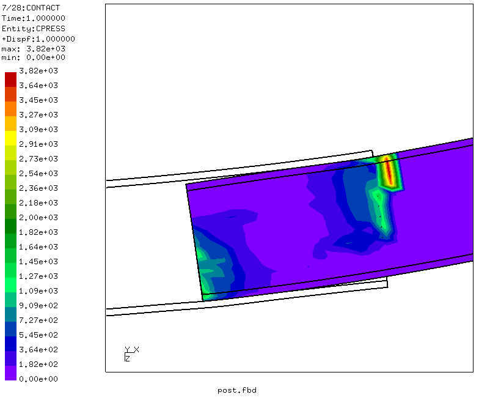
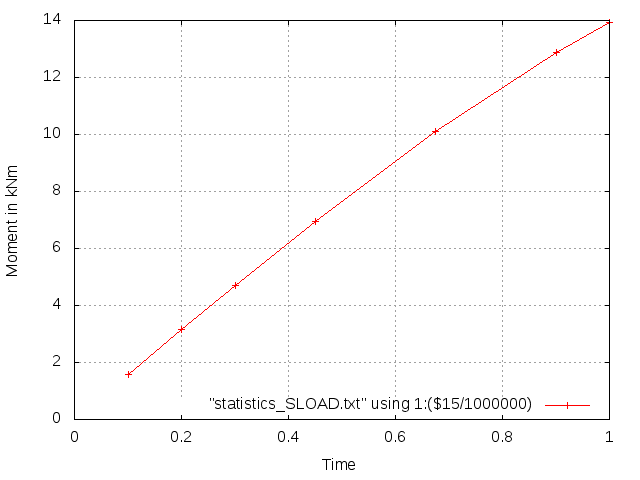

# Telescoping Tubes Under Bending Load
Tested with CGX 2.16 / CCX 2.15

+ Telescopic structure of linear elastic tubes
+ Loaded in pure bending (no shear)
+ Surface-to-surface contact

File                     | Contents                                      
:-------------           | :-------------                                
[pre.fbd](pre.fbd)       | Pre-processing script for CGX                 
[post.fbd](post.fbd)     | Post-processing script for cgx                
[solve.inp](solve.inp)   | CCX input                                     
[moment.plt](moment.plt) | Gnuplot input for the moment-time-curve     
[test.py](test.py)       | Python script to run the full simulation

## Preprocessing

The tube axis goes along x. The outer tube is fixed at x = 0, the inner tube
overlaps with the outer tube by OVL and is loaded with a prescribed rotation at the free end.

The parameters can be changed in `pre.fbd`.

| Parameter | Value | Meaning |
| :------------- |  :------------- | :------------- |
| `R1` | 50 | radius of the outer tube in mm |
| `T1` | 5  | wall thickness of the outer tube in mm |
| `L1` | 500 | length of the outer tube in mm |
| `R2` | 45 | radius of the inner tube in mm |
| `T2` | 5 | wall thickness of the inner tube in mm |
| `TL` | 500 | length of the inner tube in mm |
| `OVL` | 150 | overlap in mm |
| `divt` | 2 | mesh division in thickness direction |
| `divrot` | 18 | mesh division in hoop direction |
| `divl` | 100 | mesh division in longitudinal direction |

```
> cgx -b pre.fbd
```


The outer end of the inner tube (turquoise) is coupled in x and z direction to the rigid body motion controlled by node 1. This node is constrained in x direction to prevent rigid body motion of the tube and in y direction to prevent free translation of the node in y direction. The load is applied as prescribed rotation about the y axis.

The outer end of the outer tube is fixed (magenta). The nodes in the plane of symmetry (red) are constrained in y-direction.

## Solving
A non-linear static step with initial increment of 10% is used.
```
> ccx solve
> monitor.py solve
```


## Postprocessing

```
> cgx -b post.fbd
```
Equivalent stress



Contact pressure



Moment versus time. Time is proportional to the prescribed rotation. This curve is generated in `post.fbd` using the commands
```
> dat2txt.py
> gnuplot moment.plt
```


