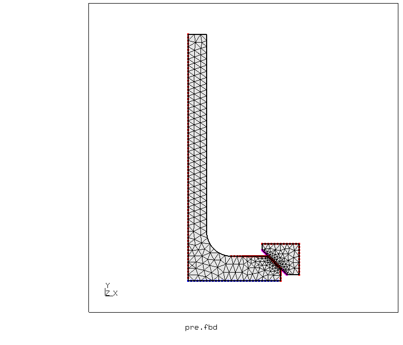
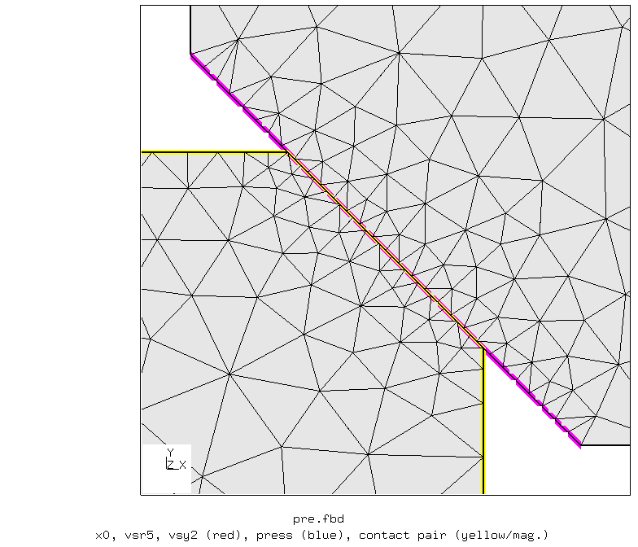
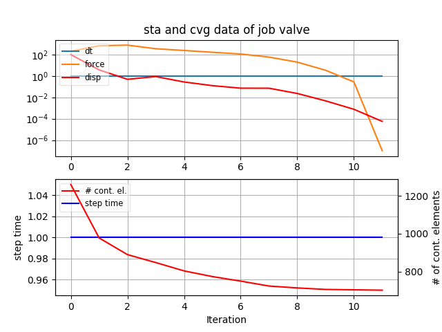
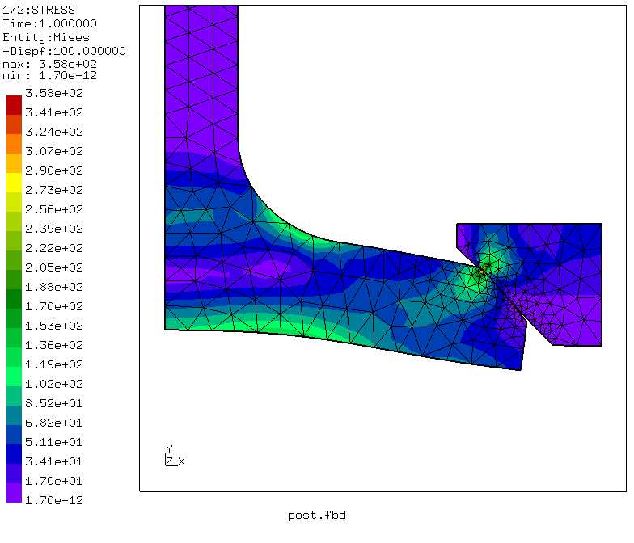
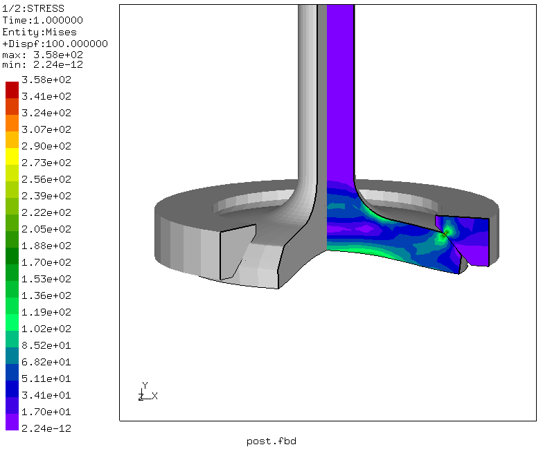
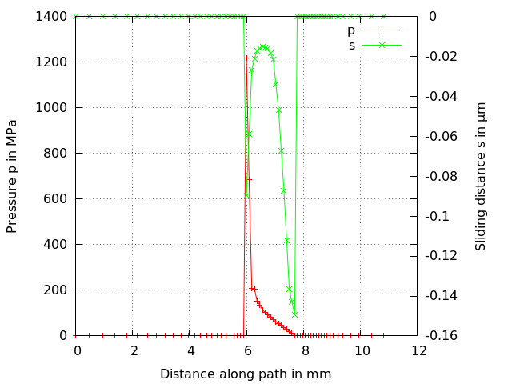

# Engine Valve
Tested with CGX 2.16 / CCX 2.15

+ Axisymmetric model of a valve with valve seat
+ Linear elastic material
+ Penalty contact with friction (surface to surface)
+ Path plot of contact pressure and slip
+ Pressure load


File                       | Contents                                     
:-------------             | :-------------                                
[par.pre.fbd](par.pre.fbd) | Pre-processing script for CGX  (parametrized with `param.py`)                
[valve.inp](valve.inp)     | CCX input
[post.fbd](post.fbd)       | CGX post-processing script                    
[path.gnu](df.gnu)         | Gnuplot script for the contact plot    
[test.py](test.py)         | Python script to run the full simulation

## Preprocessing
The valve and the valve seat ring are meshed with axisymmetric second order triangular elements. This allows for free meshing,

The mesh is controlled by a global size (parameter `esize`) and the refinement factor at the contact zone (parameter `refine`).

Parameter | Value | Unit | Description
:--       | :--   | :--  | :--
`r1`      | 3     | mm   |
`r2`      | 4     | mm   |
`r3`      | 15    | mm   |
`h1`      | 4     | mm   |
`h2`      | 3     | mm   |
`fase`    | 2     | mm   |
`esize`   | 0.5   | mm   | Element size
`refine`  | 5     |      | Refinement factor in the contact zone
`d1`      | 1     | mm   |
`d2`      | fase  | mm   |
`d3`      | 1     | mm   |
`d4`      | 2     | mm   |
`dy1`     | 1     | mm   |
`dy2`     | 1     | mm   |
`dy3`     | fase  | mm   |
`dy4`     | 1     | mm   |


```
> param.py par.pre.fbd
> cgx -b pre.fbd
```


## Solving
```
> ccx valve
> monitor.py valve
```


## Postprocessing

The postprocessing script generates plots of the equivalent stress of the 2D base and of the expanded model. Also, path plots of the contact pressure and slip are generated.

```
> cgx -b post.fbd
```


For wear prediction, contact pressure and slip are relevant.


