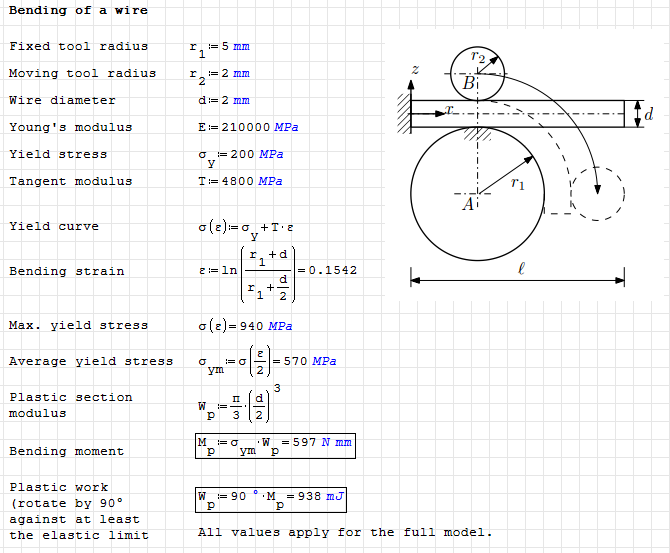

# Wire Bending
Tested with CGX/CCX 2.11

Click the image to see the animation


+ Large displacements
+ Plasticity
+ Contact (smoothed bi-linear node-to-surface)
+ Rigid body with prescribed rotation

| File     | Contents    |
| :------------- | :------------- |
| [pre.fbd](pre.fbd)     | Pre-processing script for CGX     |
| [post.fbd](post.fbd) | Post-processing script for CGX |
| [Biegung.inp](Biegung.inp) | CCX input |
| [Biegung.py](Biegung.py) | Python script for history plot |
| [Animation.fbd](Animation.fbd) | CGX script to produce the animation |

## Reference Estimates
Click the image below to open a life SMath worksheet

[](http://smath.info/cloud/worksheet/34vUp7hs)

## Preprocessing
```
> cgx -b pre.fbd
```


## Solving

Extraction of the time history of the reaction moment and the internal energy from the dat file
```
> ccx Biegung
> Monitor.py Biegung
```


## Postprocessing

Extraction of the time history of the reaction moment and the internal energy from the dat file and generation of the corresponding plot
```
> dat2txt.py Biegung
> Biegung.py
```


When comparing to the reference solution take care that the FEA model is just half of the wire (symmetry).

| Quantity       | Reference          | 2xFEA     |
| :------------- | :-------------     |:---       |
| Moment in N mm | 980                | 800...920 |
| Energy in mJ   | 1290               | 1040      |

The matching is reasonable, given the crude approach for the reference estimates and the coarse mesh.

Create the animation (see on the top of this page)
```
cgx -b Animation.fbd
```
Open the results in CGX and create some plots
```
cgx -b post.fbd
```

