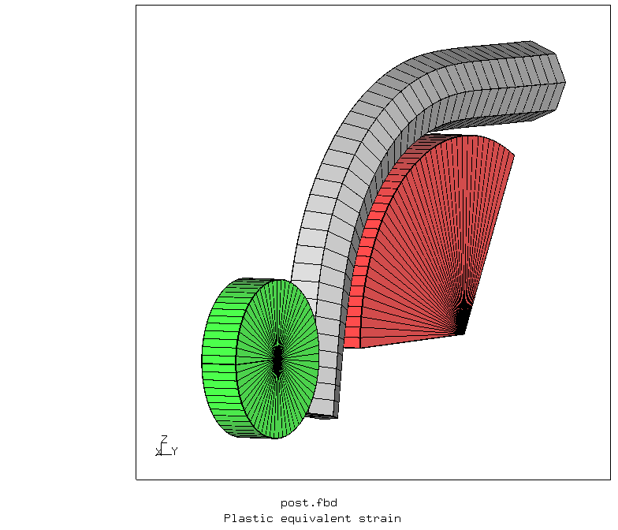

# Wire Bending
Click the image to see the animation


+ Large displacements
+ Plasticity
+ Contact
+ Rigid body with prescribed rotation

| File     | Contents    |
| :------------- | :------------- |
| [pre.fbd](pre.fbd)     | Pre-processing script for CGX     |
| [post.fbd](post.fbd) | Post-processing script for CGX |
| [Biegung.inp](Biegung.inp) | CCX input |
| [Biegung.py](Biegung.py) | Python script for history plot |
| [Animation.fbd](Animation.fbd) | CGX script to produce the animation |
## Preprocessing
```
cgx -b pre.fbd
```


## Solving

Extraction of the time history of the reaction moment and the internal energy from the dat file
```
ccx Biegung
python ../../Scripts/Monitor.py Biegung
```


## Postprocessing

Extraction of the time history of the reaction moment and the internal energy from the dat file and generation of the corresponding plot
```
python ../../Scripts/dat2txt.py Biegung
python Biegung.py
```


Create the animation (see on the top of this page)
```
cgx -b Animation.fbd
```
Open the results in CGX and create some plots
```
cgx -b post.fbd
```


If you issue the command `seta ! all` in interactive mode, then you get the shading right:


