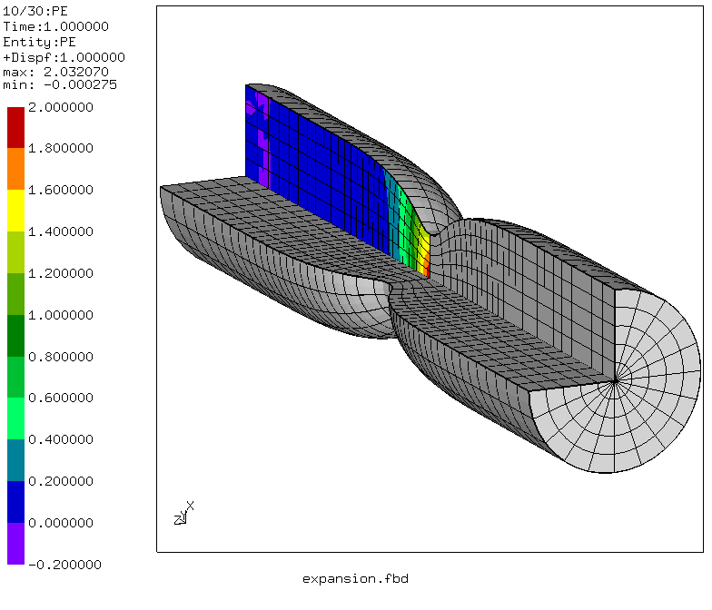
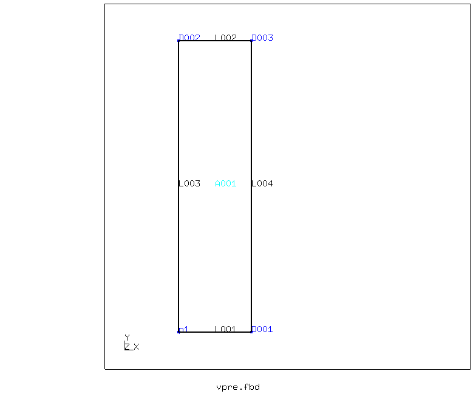
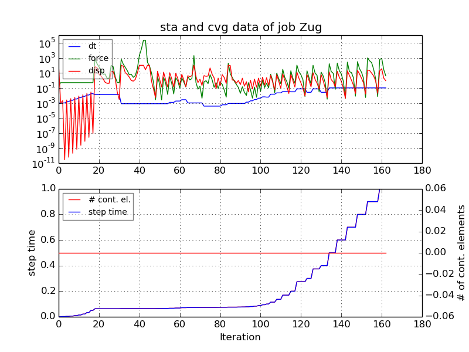
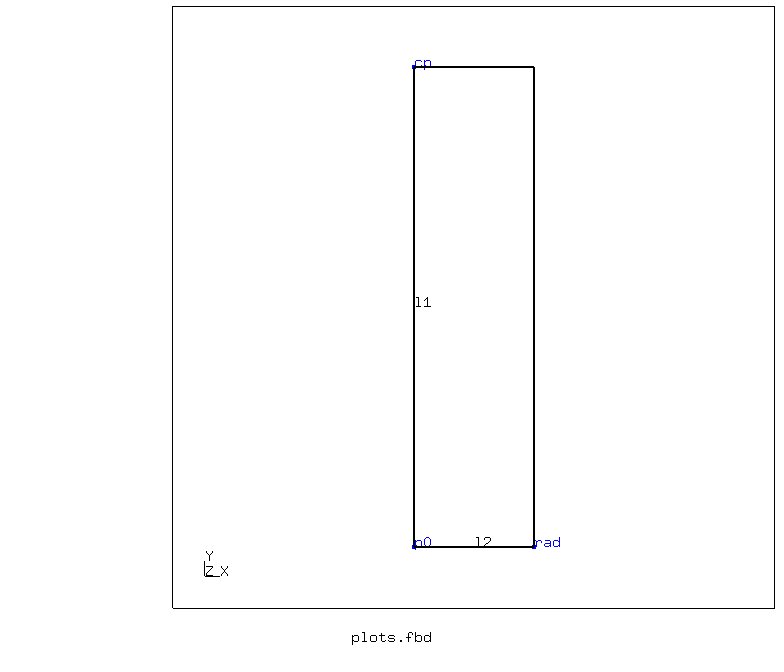
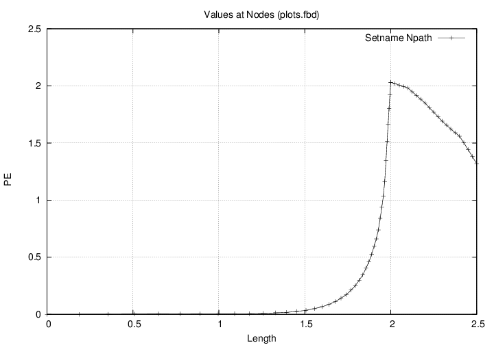
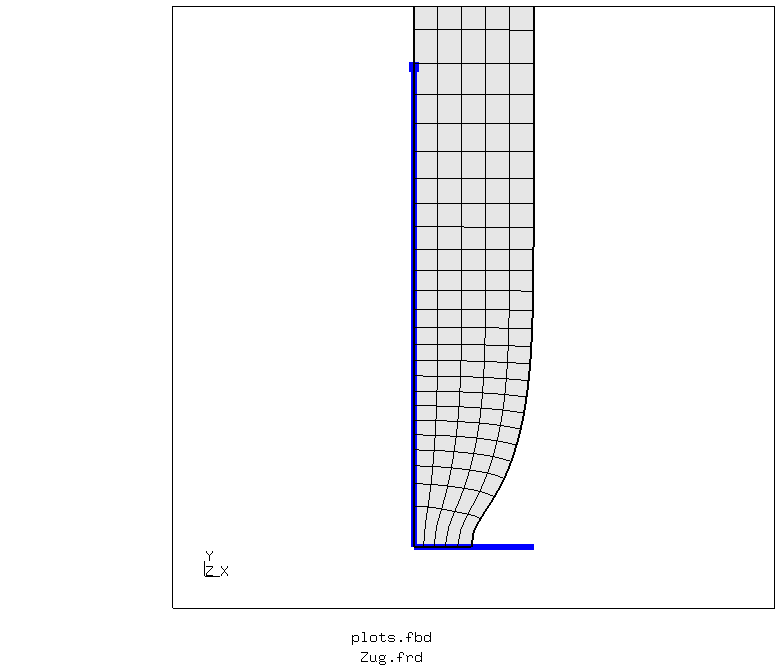
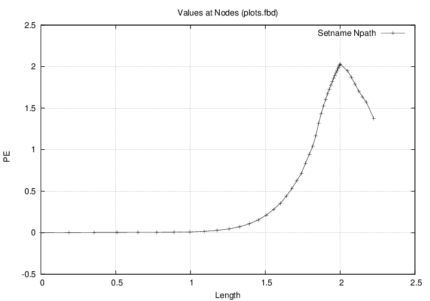
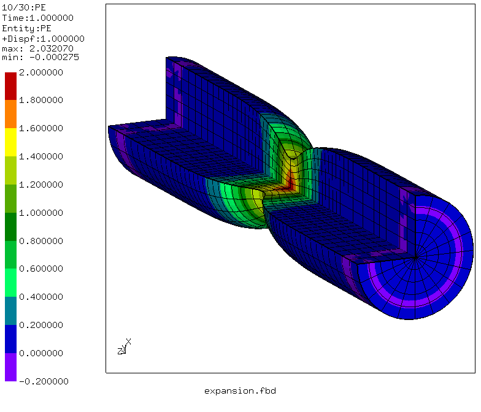
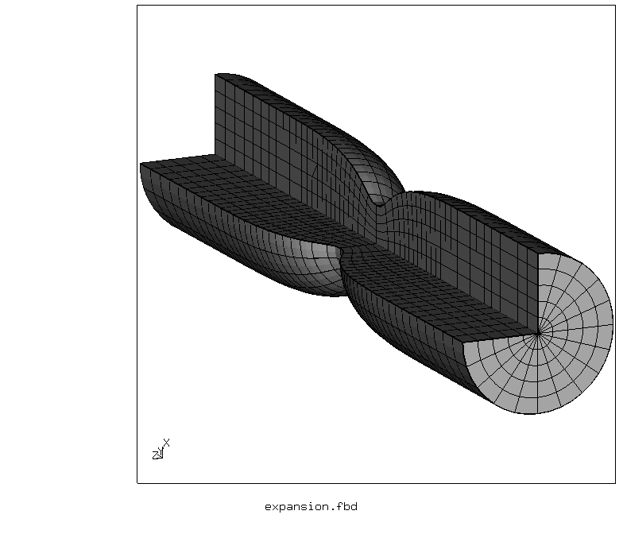
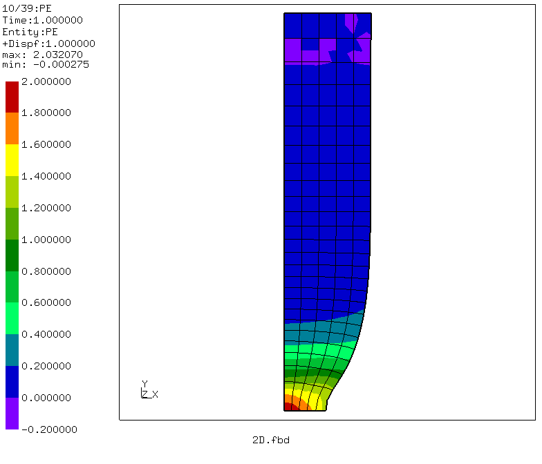

# Tensile Test
Tested with CGX 2.10/CCX 2.10

Tensile test of a wire of 1 mm diameter made of 1.4301 stainless steel. This steel has a high yield strength but nearly no work hardening, thus the uniform strain is very low and necking occures early and very localized.




The model is axisymmetric and represents a 2 mm piece of the wire with full displacement constraint at one end and symmetry at the other end. Necking occures in the symmetry plane.

+ Large displacements
+ Plasticity
+ Parametrization alternatives (param.py or CGX valu)

| File     | Contents    |
| :------------- | :------------- |
| [vpre.fbd](vpre.fbd)     | Pre-processing script for CGX (parametrized with valu commands)     |
| [pre.fbd.par](pre.fbd.par)     | Pre-processing script for CGX (parametrized with param.py)  |
| [plots.fbd](plots.fbd) | Post-processing script for CGX (history and path plots) |
| [expansion.fbd](expansion.fbd) | Post-processing script for CGX (axisymmetric expansion) |
| [2D.fbd](2D.fbd) | Post-processing script for CGX (2D display) |
| [Zug.inp](Zug.inp) | CCX input |

## Preprocessing
This example is designed with two alternative ways for parametrization. Both produce equivalent results.

The mesh is biased as to account for the localized deformation.



Boundary conditions:
* uy = 0 at y = 0 (symmetry boundary)
* uy = 2 at y = 0.3 (displacement controlled extension at the upper edge)
* ux = 0 at x = 0 (restrict nodes to the symmetry axis)

#### Parametrization with param.py
See [../../Scripts/](../../Scripts/) for details
```
> ../../Scripts/param.py pre.fbd.par
> cgx -b pre.fbd
```
#### Parametrization with CGX valu
```
> cgx -b vpre.fbd
```
## Solving
```
> ccx Zug
> ../../Scripts/monitor.py Zug
```
The second command generates a convergence history plot of the solution.


## Postprocessing
#### Path plot
```
> cgx -b plots.fbd
```
This creates path plots of the plastic equivalent strain along the symmetry axis (ine `l1` from point `cp` to point `c0`) and then in radial direction (line `l2` from point `c0` to point `rad`).

The first plot is based on the **undeformed** geometry:




The second plot is based on the **deformed** geometry:




#### Symmetry expansion
Beginning with version 2.10, CGX can sweep 2D elements with results attached. This is used for symmetry expansion of the axisymmetric 2D output.
```
> cgx -b expansion.fbd
```




To see just the non-expanded model, use this command:
```
> cgx -b 2D.fbd
```

