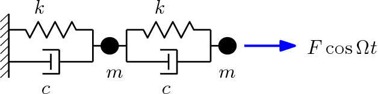
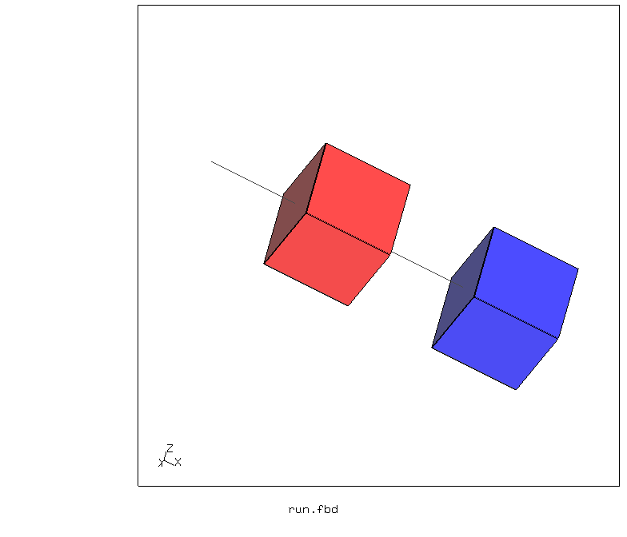
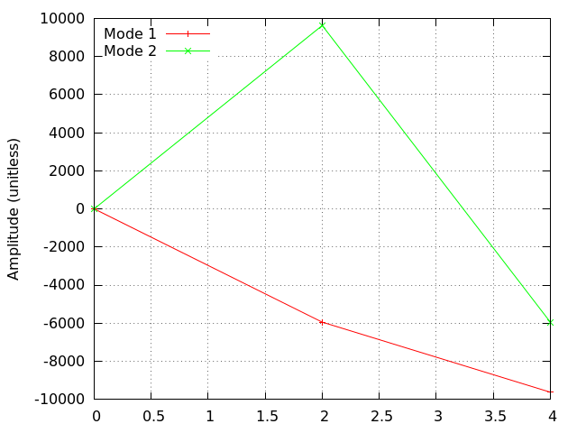
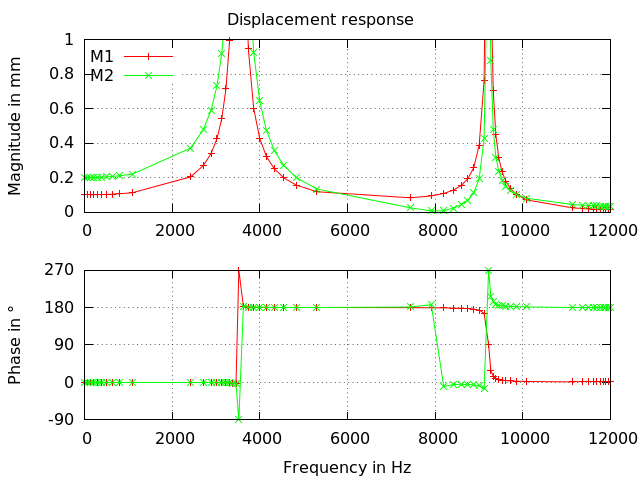
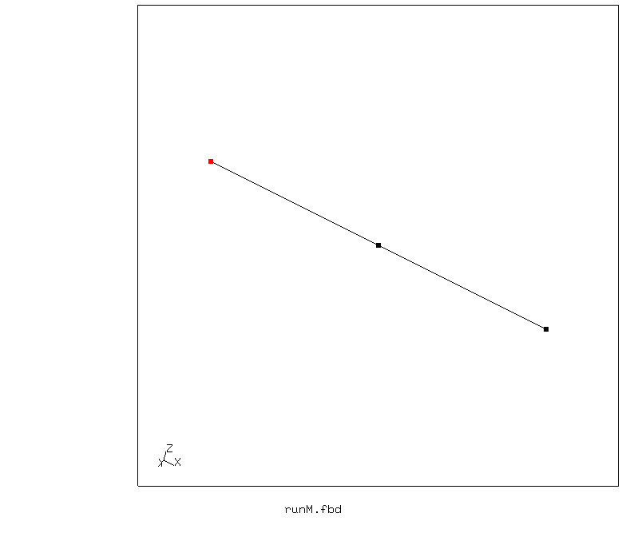

# Spring/Mass Oscillator
Tested with CGX 2.16 / CCX 2.15

+ Frequency response analysis
+ 2-Mass oscillator
+ Mass element faked using beam element and appropriate constraints.
+ Simulation with real mass elements fails because the eigenvalue solver can't handle small systems.

 File                     | Contents                        
 :-------------           | :-------------                  
 [run.fbd](run.fbd)       | Top level control script for CGX
 [MS.inp](MS.inp)         | Input for CCX                   
 [runM.fbd](runM.fbd)     | Top level control script for CGX, discrete mass
 [MSM.inp](MSM.inp)       | Input for CCX, discrete mass                  
 [V.gnu](V.gnu)           | Gnuplot script for the response function  
 [test.py](test.py)       | Python script to run the full simulation

The system consists of two rigid bodies connected by springs and dashpots.



| Parameter                | Value           |
| :-------------           | :-------------  |
| k                        | 10 N/mm         |
| m                        | 7.8 mg          |
| c                        | 0.000001 N/(m/s)|

Run the analysis:
```
> cgx -b run.fbd
```

## Preprocessing

There is no cgx-based preprocessing. The model is entirely defined within the input file `MS.inp`.
Springs and dashpots are represented by the appropriate discrete elements,
the masses are represented by beam elements which are rigidized by an equation linking their nodes.



## Solving

First, a `*frequency` step is performed and then a `*steady state dynamics` step.
```
> ccx MS
```
## Postprocessing

Mode shapes




Magnitude and phase plot of the response (displacement of the masses)



## Version with mass elements

There is no cgx-based preprocessing. The model is entirely defined within the input file `MSM.inp`.
Springs and dashpots are represented by the appropriate discrete elements,
the masses are represented by mass elements (new in 2.12).



```
> cgx -b runM.fbd
```

The simulation runs but the results are unreliable, because the eigensolver Arpack is not suited for small systems.
