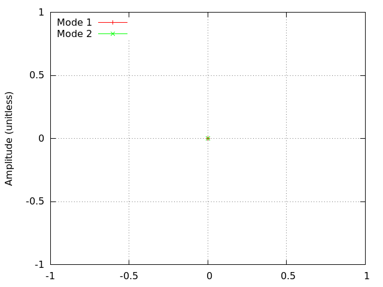
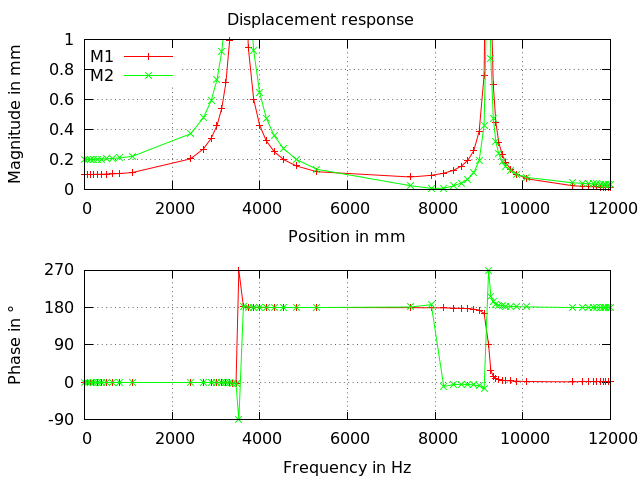

# Spring/Mass Oscillator
Tested with CGX/CCX 2.11

+ Frequency response analysis
+ 2-Mass oszillator
+ Mass element faked using beam element and appropriate constraints.

| File                     | Contents                        |
| :-------------           | :-------------                  |
| [run.fbd](pre.fbd)       | Top level control script for CGX|
| [MS.inp](MS.inp)         | Input for CCX                   |
| [V.gnu](V.gnu)           | Gnuplot script for the response function  |

The system consists of two rigid bodies connected by springs and dashpots.


| Parameter                | Value           |
| :-------------           | :-------------  |
| k                        | 10 N/mm         |
| m                        | 7.8 mg          |
| c                        | 0.000001 N/(m/s)|

Run the analysis:
```
> cgx -b run.fbd
```

## Preprocessing

There is no cgx-based preprocessing. The model is entirely defined within the input file `MS.inp`.
Springs and dashpots are represented by the appropriate discrete elements,
the masses are represented by beam elements which are rigidized by an equation linking their nodes.


## Solving

First, a `*frequency` step is performed and then a `*steady state dynamics` step.
```
> ccx MS
```
## Postprocessing

Mode shapes




Magnitude and phase plot of the response (displacement of the masses)


