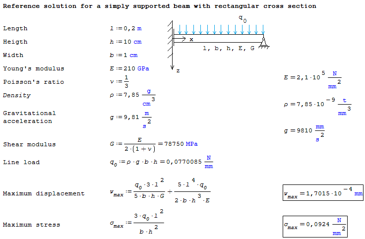

# Convergence Study For Various Element Types

Parametric model of a simply supported beam, mainly used for convergence tests.

Sub-directories contain models with various element types

Click the image below to open a life SMath worksheet

