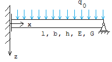

# Convergence Study For Various Element Types

Parametric model of a simply supported beam, mainly used for convergence tests.

Sub-directories contain models with various element types

## Reference Solution

$$w_{\max}=\dfrac{5}{24}\dfrac{q_{0}\ell^{4}}{EI}+\dfrac{3}{5}\dfrac{q_{0}\ell^{2}}{GA}$$

$$\sigma_{\max}=3\dfrac{q_{0}\ell^{2}}{bh^{2}}$$

