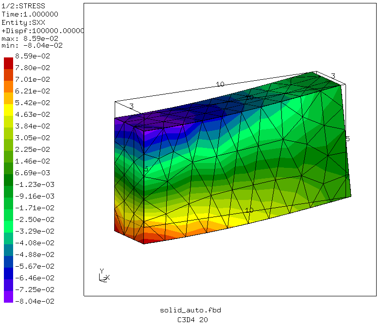
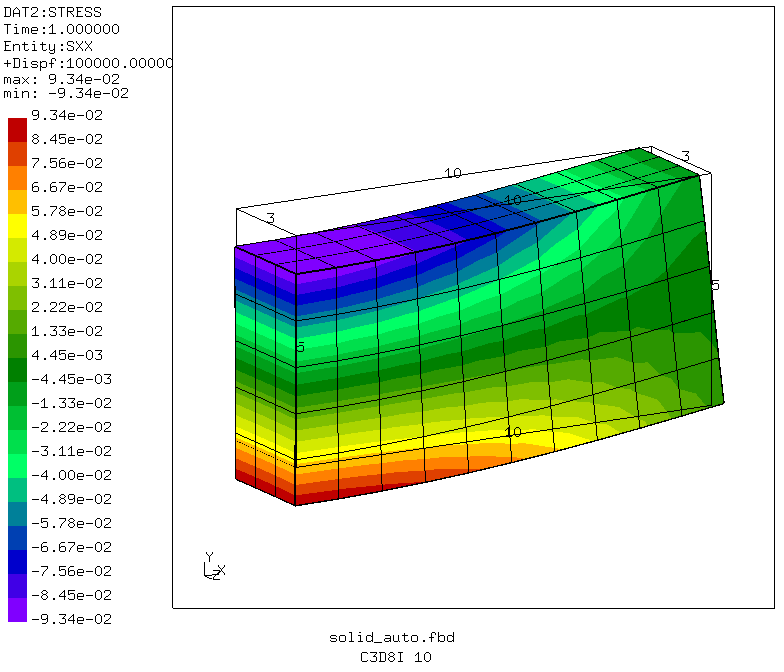

## Simply Supported Beam Model With Solid Elements
Tested with CGX 2.15 / CCX 2.15

+ tetrahedral and hexahedral elements
+ linear or quadratic elements
+ full or reduced integration, incompatible shape functions

File                           | Contents    
:-------------                 | :------------- |
[solid.fbd](solid.fbd)         | Parametric pre- and postprocessing script for CGX   
[solid.inp](solid.inp)         | CCX input
[solid-conv.py](solid-conv.py) | Python script for the convergence study
[solid-plot.py](solid-plot.py) | Python script for the convergence plot
[test.py](test.py)             | Python script to run the full example

| Unstructured tet mesh    | structured hex mesh    |
| :------------- | :------------- |
|  |

For the reference solution go to the [parent directory](https://github.com/mkraska/CalculiX-Examples/tree/master/Elements) of this example.

## Mesh Convergence of the Normalized Results


Running
```
python solid-conv.py
```
creates a data file for each element type with the mesh density parameter setting, the number of nodes and the maximum displacement and stress values. An example (C3D8I.txt):
```
# size NoN smax umax
200 8 0.046205 0.000108
100 12 0.077162 0.000151
50 30 0.089084 0.000164
20 264 0.093441 0.00017
10 1386 0.094022 0.000171
```
Then, running
```
python solid-plot.py
```
generates the following plot of the results normalized by the analytical reference values.


