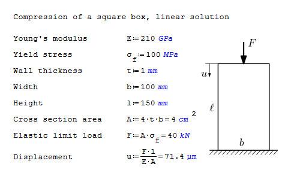
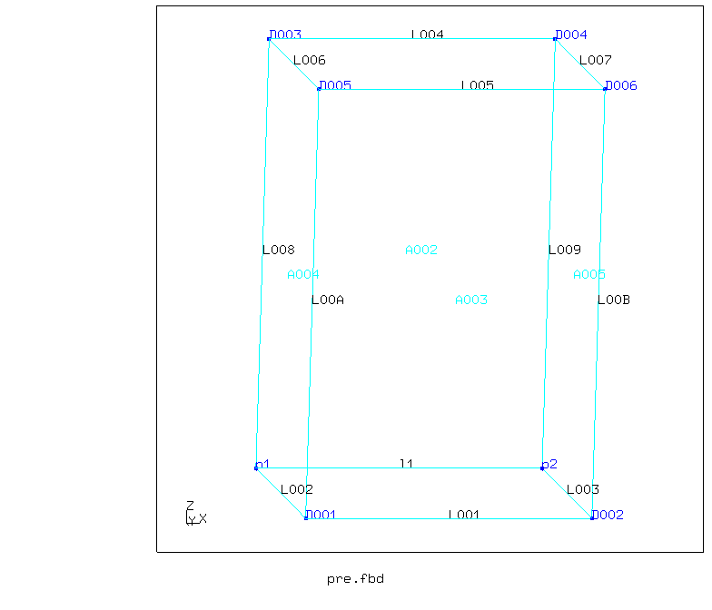
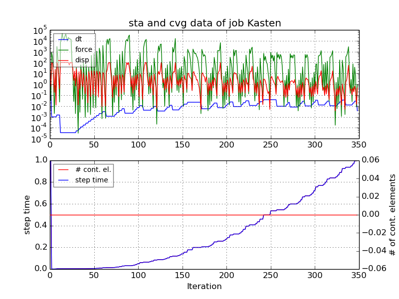
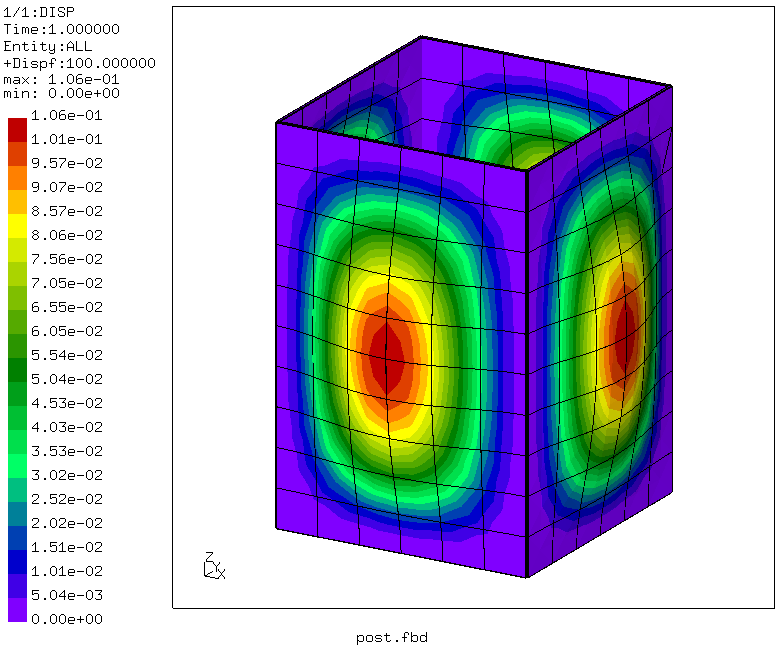
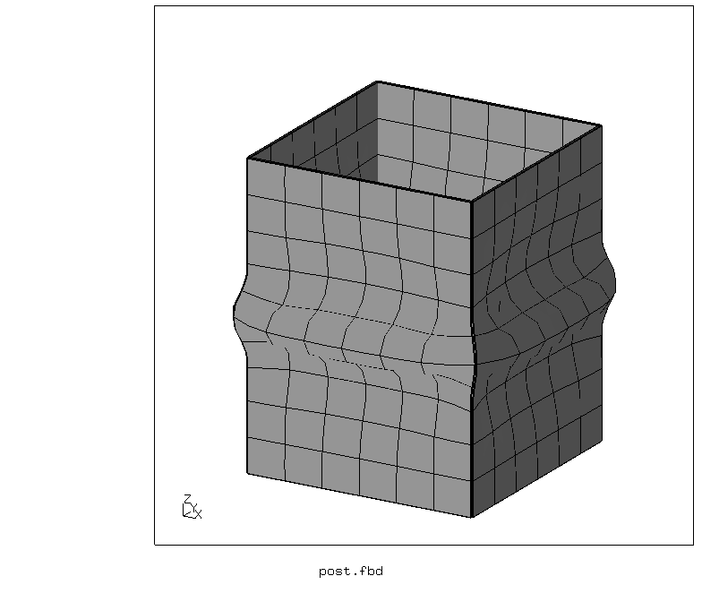
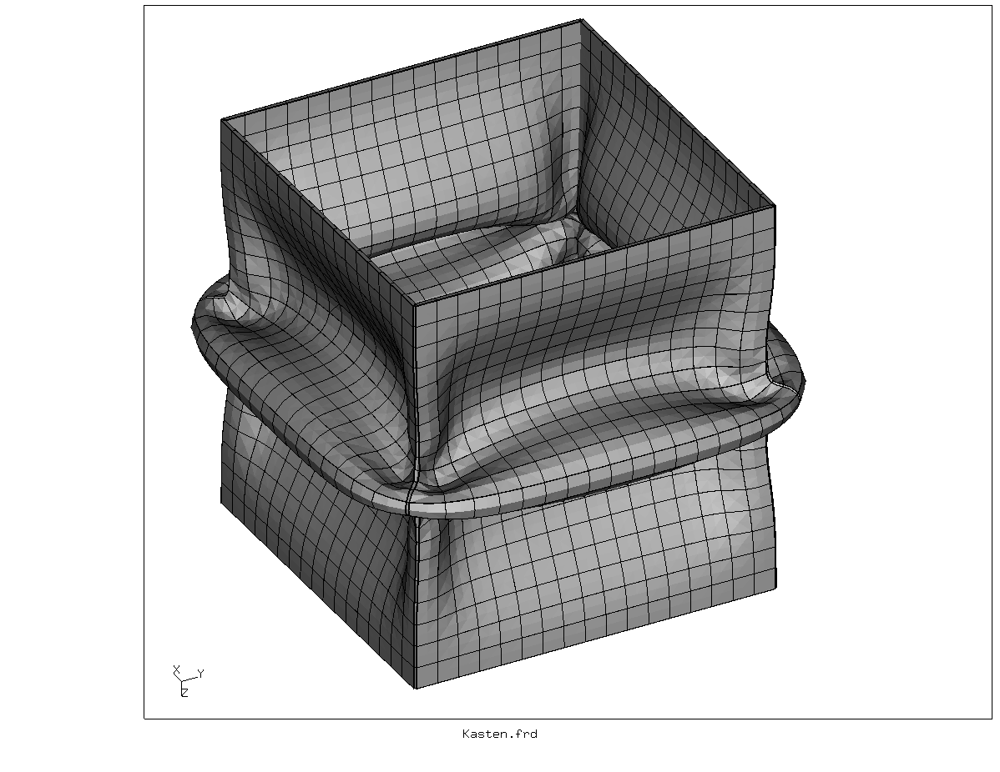
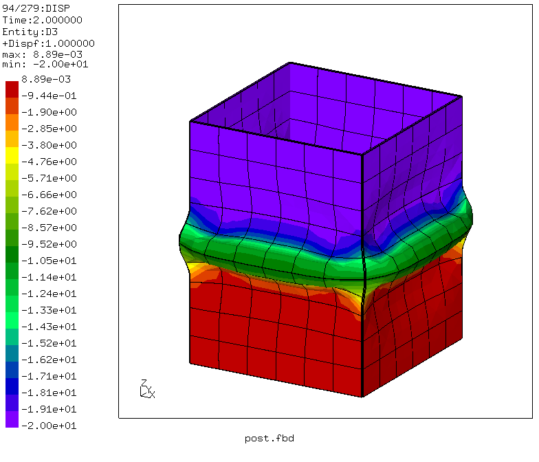
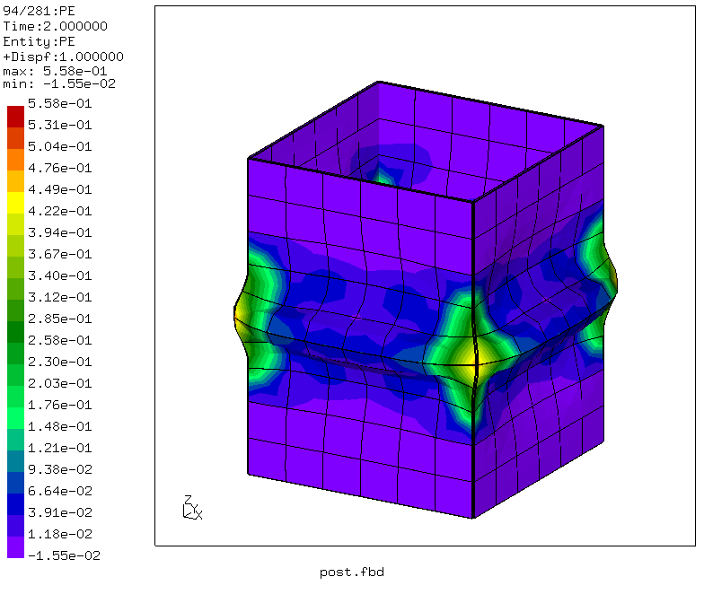
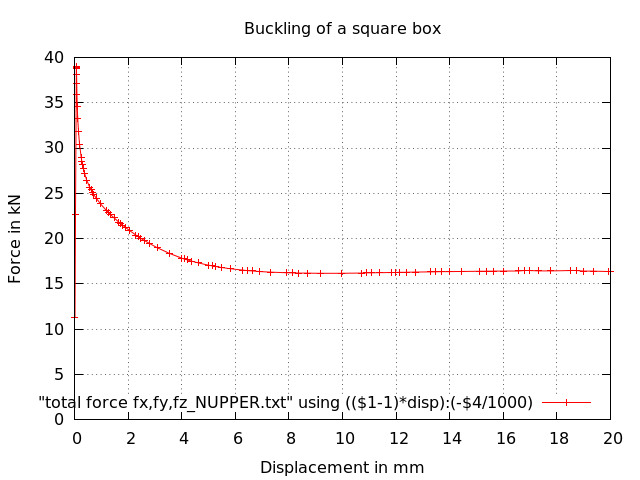

# Non-linear Buckling
Tested with CGX 2.16 / CCX 2.15

+ Large displacements
+ Plasticity
+ Buckling with imperfection (a small internal pressure)
+ Shell elements

File                     | Contents    
:-------------           | :-------------
[pre.fbd](pre.fbd)       | Pre-processing script for CGX     
[post.fbd](post.fbd)     | Post-processing script for CGX
[Kasten.inp](Kasten.inp) | CCX input
[df.gpl](df.gpl)         | Gnuplot input for force-displacement curve

Reference solution for elastic limit (without buckling)

[](http://en.smath.info/cloud/worksheet/bd5YCePV)

## Preprocessing

The parameters can be changed in `pre.fbd`

| Parameter | Value | Meaning |
| :------------- |  :------------- | :------------- |
| `lx`   | 100 | width in x-direction in mm |
| `ly`   | 100 | width in y-direction in mm |
| `lz`   | 150 | height in mm |
| `nd`   | 7.8 | target node distance in mm |
| `disp` | 20  | displacement in mm |


```
> cgx -b pre.fbd
```
Geometry and sets



## Solving
```
> ccx Kasten
> monitor.py Kasten
```


### Kasten.inp
Mesh and set definitions
```
*include,input=all.msh
*include,input=lower.nam
*include,input=upper.nam
```
Clamping of the upper and lower edge
```
*boundary
Nlower,1,6
Nupper,1,6
```
Material definition (elasto-plastic)
```
*MATERIAL,NAME=Steel
*ELASTIC
210000,.3
*plastic
100,0
200,0.3
300,1
*DENSITY
7.8E-9
```
Material and shell thickness assignment
```
*SHELL SECTION,ELSET=Eall,MATERIAL=Steel,offset=0
1
```
Step 1: Internal pressure (imperfection)
```
*STEP,nlgeom
*STATIC
*dload
*include,input=all.dlo
*el file
S
*node file
U
*end step
```
Step 2: Axial compression (prescribed displacement)
```
*step,nlgeom
*static
0.05,1,,0.05
*boundary
*include, input=disp.inc
*el file
S,PEEQ
*node file
U
*node print,totals=only,nset=Nupper
U,RF
*end step
```

## Postprocessing

```
> cgx -b post.fbd
```
Magnitude of the displacement due to pressure application (imperfection). Max. deflection is approximately 10% of the sheet thickness.




Deformed geometry after collapse. The left image shows the result for the parameters as in the files. The right image has double the displacement and a target element size of 3 mm.



Vertical displacement and plastic equivalent strain:



Force-displacement plots. Left: full history, right: detail of transition to collapse.


