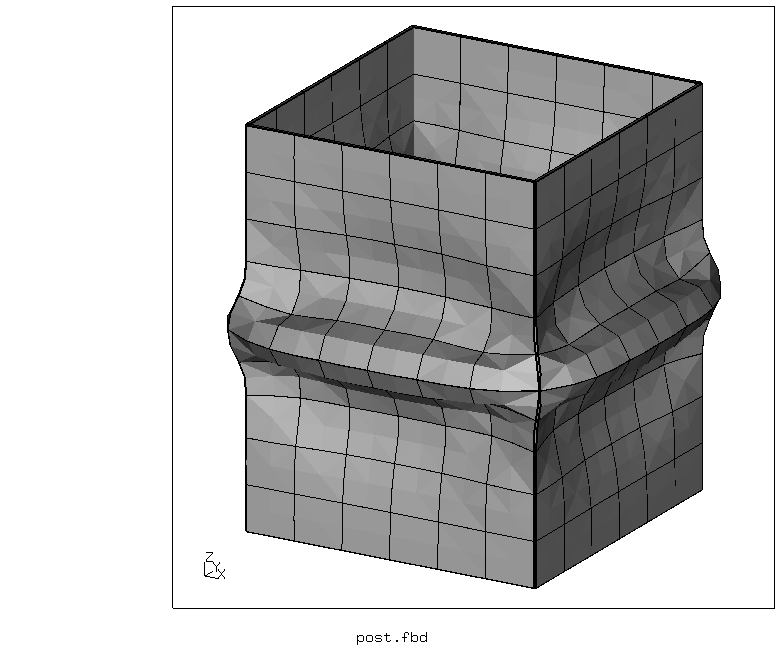

# Non-linear Buckling
+ Large displacements
+ Plasticity
+ Buckling with imperfection (a small internal pressure)
+ Shell elements

| File     | Contents    |
| :------------- | :------------- |
| [pre.fbd](pre.fbd)     | Pre-processing script for CGX     |
| [post.fbd](post.fbd) | Post-processing script for CGX |
| [Kasten.inp](Kasten.inp) | CCX input |

## Preprocessing
```
cgx -b pre.fbd
```


## Solving
```
ccx Kasten
```

### Kasten.inp
Mesh and set definitions
```
*include,input=all.msh
*include,input=lower.nam
*include,input=upper.nam
```
Clamping of the upper and lower edge
```
*boundary
Nlower,1,6
Nupper,1,6
```
Material definition (elasto-plastic)
```
*MATERIAL,NAME=Steel
*ELASTIC
210000,.3
*plastic
100,0
200,0.3
300,1
*DENSITY
7.8E-9
```
Material and shell thickness assignment
```
*SHELL SECTION,ELSET=Eall,MATERIAL=Steel,offset=0
1
```
Step 1: Internal pressure (imperfection)
```
*STEP,nlgeom
*STATIC
*dload
*include,input=all.dlo
*el file
S
*node file
U
*end step
```
Step 2: Axial compression (prescribed displacement)
```
*step,nlgeom
*static
0.05,1,,0.05
*boundary
Nupper,3,3,-20
*el file
S,PEEQ
*node file
U
*node print,totals=only,nset=Nupper
U,RF
*end step
```

## Postprocessing
```
cgx -b post.fbd
```
Note that you have to create the screenshot in the interactive mode of CGX. Otherwise the shading is taken in the undeformed state.


