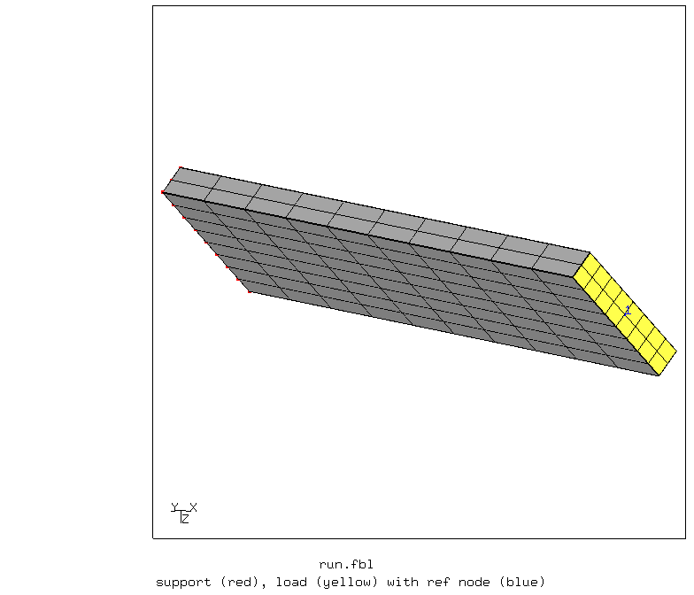
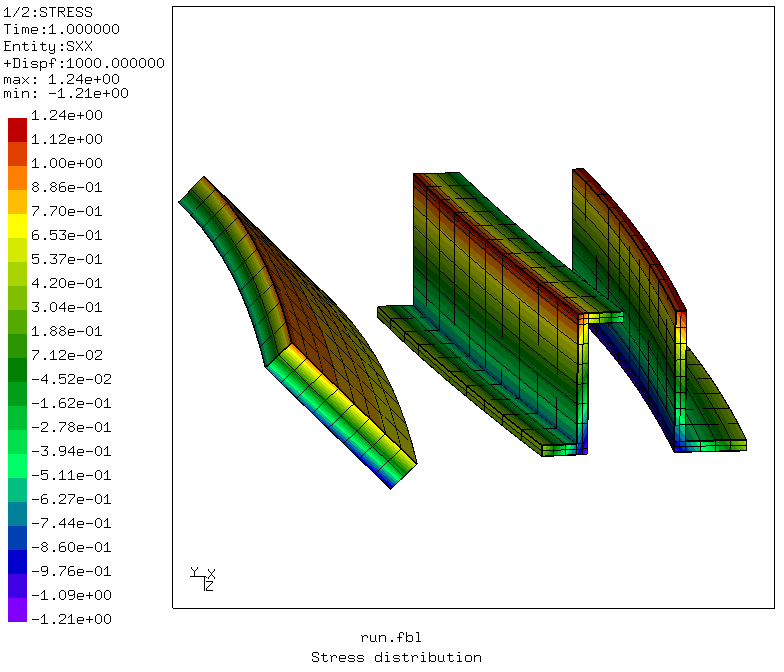
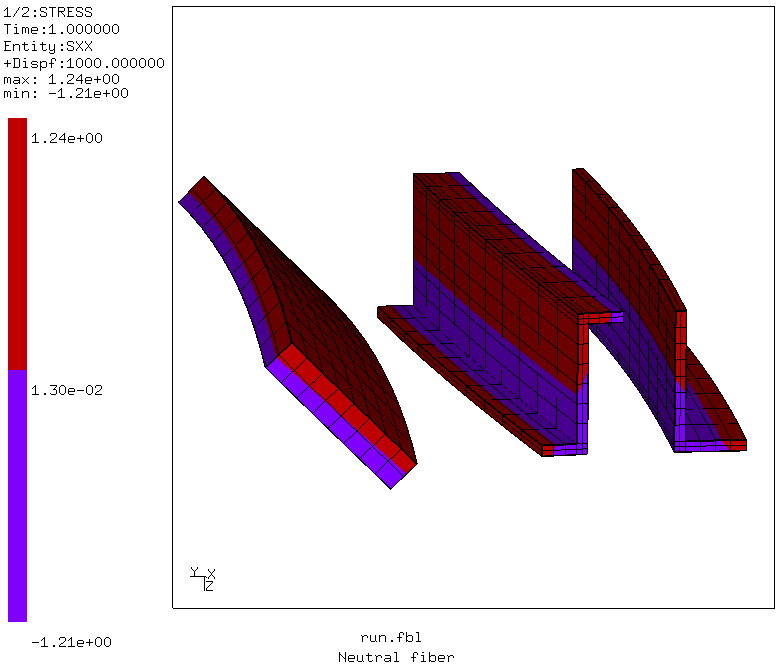
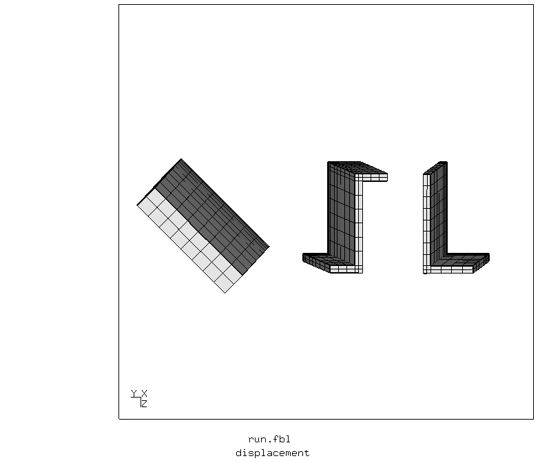

# Unsymmetric Bending
Tested with CGX 2.16 / CCX 2.15

+ Application of bending moment via kinematic coupling without transverse constraints
+ Display of the neutral fiber

File                           | Contents    
:-------------                | :-------------
[par.run.fbl](par.run.fbl)    | CGX script top level script, parametrized with param.py
[Biegung.inp](Biegung.inp)    | CCX input
[test.py](test.py)            | Python script to run the full simulation

## Model

Parameter | Value | Description
:--       | :--   |:--
lx        | 100   | Length in mm
Rotated Flat |        |
th        | 10    | Thickness in mm
he        | 50    | Height in mm
Z profile          |       |
y0z       | -45   | y reference location in mm
z0z       | 20    | z reference location in mm
la        | 40    |
lb        | 10    |
th        | 3     |
L profile          |       |
y0a       | -90   | y reference location in mm
z0a       | 20    | z reference location in mm
la        | 40    |
lb        | 20    |
tha       | 3     |


The model contains three cantilever beams of different cross sections with non-zero deviatoric moment of inertia. Each one is subjected to a bending moment about the transverse horizontal axis (y).
The bending moment is applied to the ref node of a kinematic coupling constraint of the free end surface.



In order to not induce transverse stresses by the coupling constraint, the constraint is restricted to dof 1 (longitudinal direction) of the surface nodes.
```
*coupling, ref node=1, surface=Sload, constraint name=c1
*kinematic
1
```
This only couples the x displacement and the rotation about y and z of the reference node to the surface. Thus, dofs 2,3 and 4 of the ref nodes have to be constrained separately.

## Results

The images show the axial stress distribution and the neutral fiber (with color bar steps set to 2).
```
> param.py par.run.fbl
> cgx -b run.fbl
```


