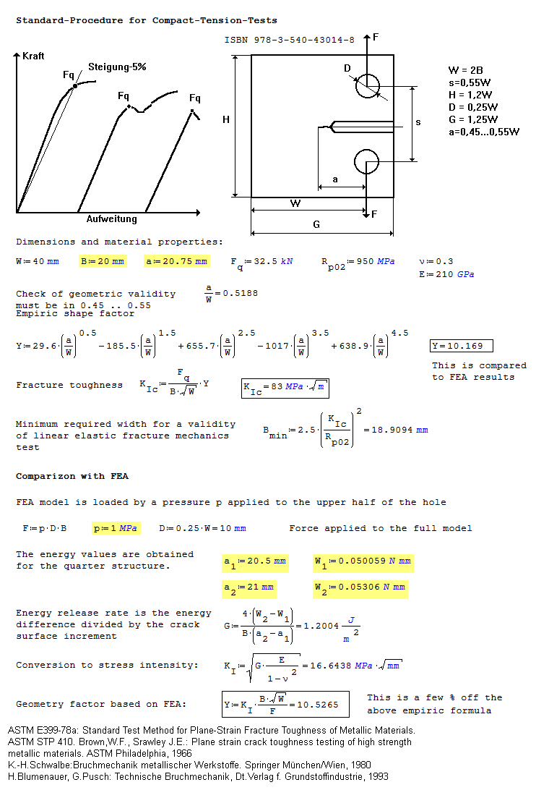
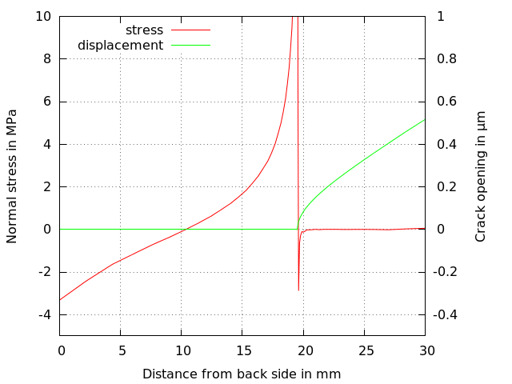

# Energy Release Rate (Global Energy Method)
Tested with CGX/CCX 2.12, Gmsh 2.16.0

+ Linear static solution
+ Symmetric model
+ Parametric modeling and meshing with Gmsh
+ Evaluation of the total strain energy

File                    | Contents    
 :-------------         | :-------------
 [ct.fbd](ct.fbd)       | Full analysis control script for CGX     
 [ct.geo](ct.geo)       | Parametric geometry and meshing script for Gmsh
 [solve.inp](solve.inp) | CCX input
 [path.fbd](path.fbd)   | CGX script for the path plot
 [path.plt](path.plt)   | Gnuplot script for the path plot


## Reference Solution and Evaluation

The energy release rate is determined from two simulation runs with the present model. This is used to determine the shape factor Y, which is compared to an empirical estimate from the standard.

a in mm | Strain energy of the quarter model in Nmm
:---    | :---
20.5    | 0.050053
21.0    | 0.053080

[](http://smath.info/cloud/worksheet/he7wmRTF)

## Model Description
The model is a CT (compact tension) specimen with the simulation domain reduced
to one quarter of the part due to symmetry.

The specimen is loaded by a force and the total strain energy is determined. The
force is generated by a uniform pressure to the upper half of the pin hole.

From the difference of the strain energy for two different crack lengths the energy
release rate can be calculated.

In order to determine the energy release rate, run the model twice with
different settings of the crack length `a` in `ct.geo`

For each run, record the crack length a and the strain energy from the file `solve.dat`.

Run the analysis using
```
> cgx -b ct.fbd
```
To update the gmsh mesh plot, export it from within gmsh, otherwise the the image is not framed appropriately.

## Preprocessing
Run the mesh generation using
```
> gmsh ct.geo
```
The script `ct.geo` creates a quarter model of the ct specimen using the gmsh bottom-up
procedure to produce the cross section shape and then extruding it into the thickness.

The geometry is driven by the parameters `B` (width of the specimen) and the crack length `a`. You might also
wish to adjust the half width of the initial cut of the specimen `t` for cosmetic reasons.

The mesh density is controlled by the global maximum for the element size and by
the element size at the three points in the crack plane.


The faces for symmetry constraints and load application are defined as so called physical groups in Gmsh.
This has the advantage that properly named node sets are written to the output `gmsh.inp`.

The mesh then is read into CGX, the surface elements from Gmsh are deleted and the node set for the load is extended into a face set.


In the solver input file `solve.inp`, a uniform pressure is applied to set `Load` and appropriate constraints are
applied to the sets `Ysym` (at y=0) and `Zsym` (at z=0). A single node at the origin is constrained in x-direction.

A linear static analysis is performed with material values for steel. The displacements and stresses are written to `solve.frd` and the total strain energy is written to `solve.dat`.

## Postprocessing

The quarter model is expanded with the base region colored by the equivalent stress.
A custom max value has been set for the color bar in order to prevent the non-blue
colors being restricted to the vicinity of the crack tip.


Once the analysis is finished, the contents of `solve.dat` is displayed for convenient access.

### Path Plot
Run
```
> cgx -b path.fbd
```
to create a path plot of the normal stress (normal to the crack plane) and of the
crack opening (displacement in load direction) along the centerline of the specimen (x-axis).
The path plots are created separately in CGX and then combined using a gnuplot script.



The negative stress values to the right of the crack tip are artifacts due to the extrapolation from the integration points to the nodes.
