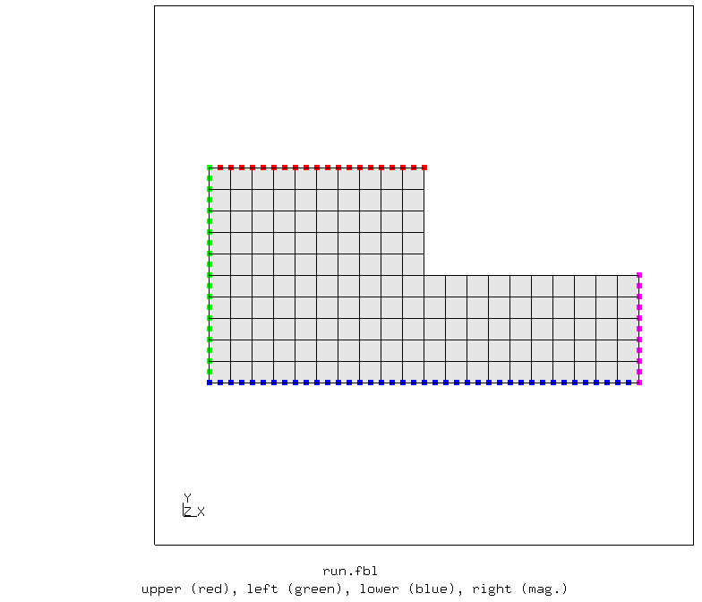
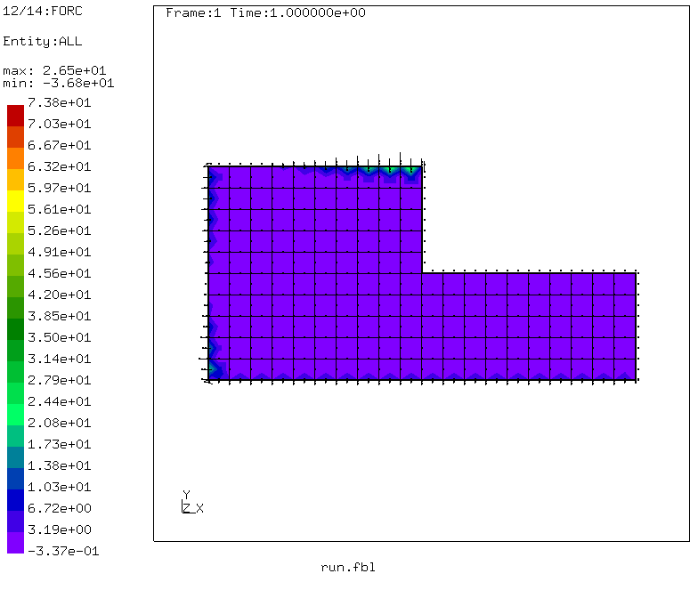
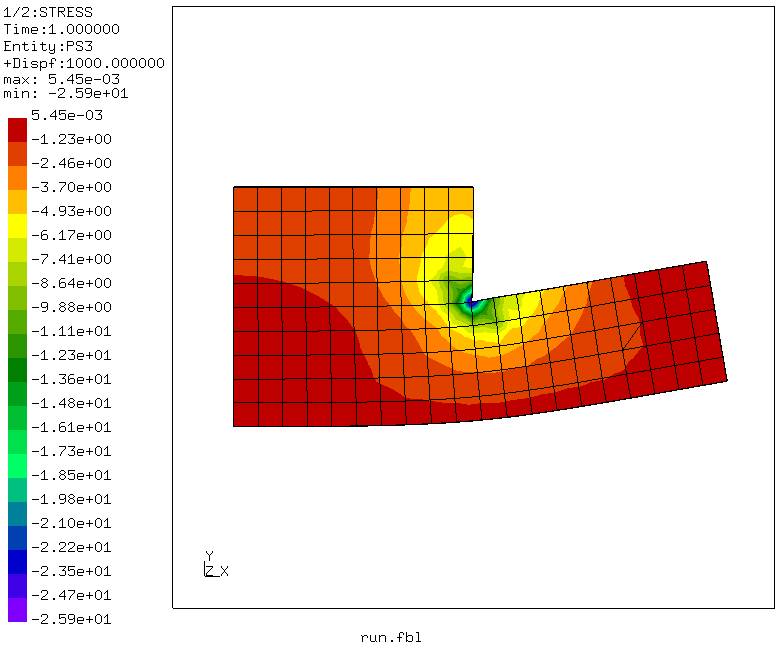
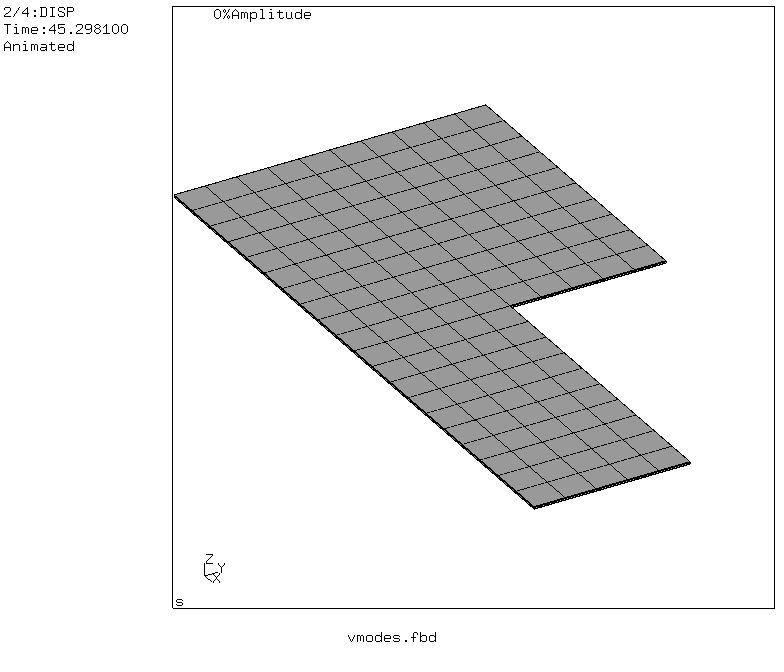
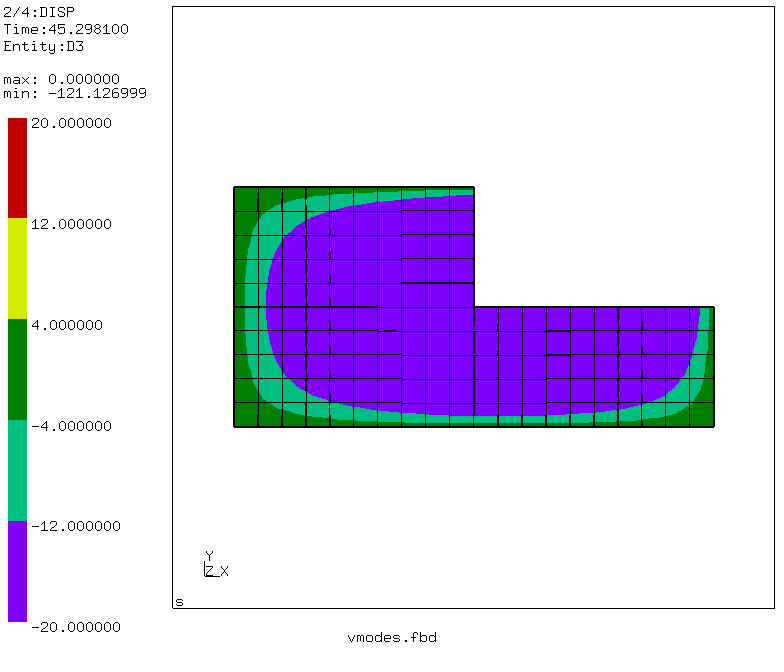
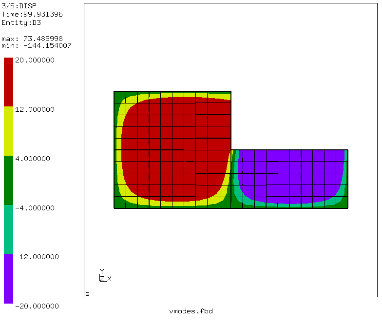
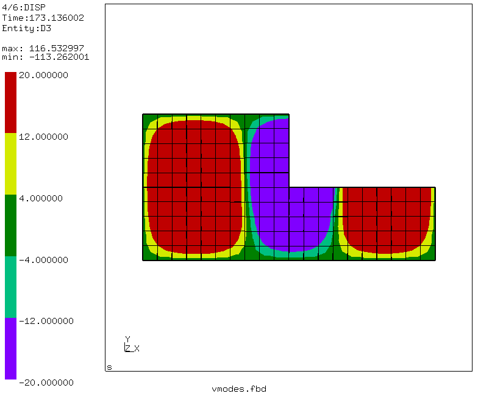
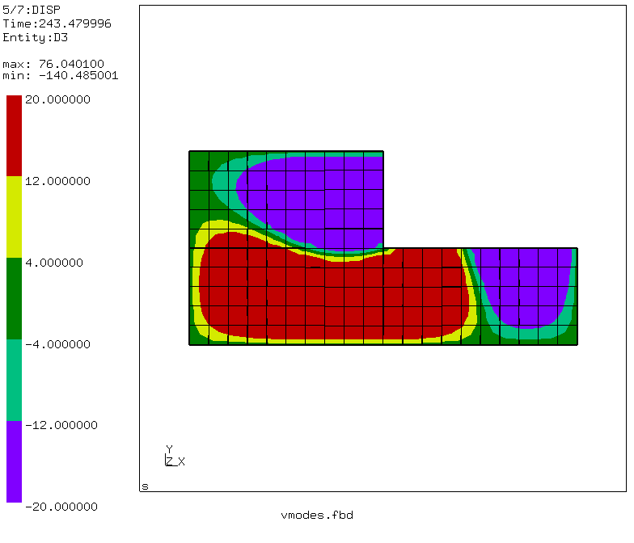
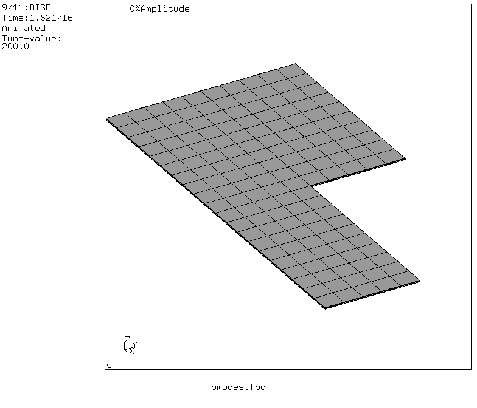

# Buckling and modal analysis with preload
Tested with CGX 2.16 / CCX 2.15

+ Modal analysis with preload
+ Eigenvalue buckling analysis
+ Shell edge load


File                        | Contents    
 :-------------             | :-------------
 [par.run.fbl](par.run.fbl) | Control script for CGX     
 [solve.inp](solve.inp)     | CCX input
 [vmodes.fbd](vmodes.fbd)   | CGX script, vibration mode movies)
 [bmodes.fbd](bmodes.fbd)   | CGX script, buckling mode movies)
 [test.py](test.py)         | Python script to run the full simulation

## Model Description
The model is a flat L-shaped plate.

| Parameter | Value | Meaning |
| :-------- |  :----| :------------- |
| `h`       | 100   | edge length parameter in mm |
| `p`       | 1     | pressure in MPa |



Boundary conditions
+ UY=0, UZ=0 at the upper edge (red)
+ UX=0, UZ=0 at the left edge (green)
+ UZ=0 at the lower (blue) and right (magenta) edges
+ Line load in y-direction (1 N/mm), applied as pressure to surface `Slower`




Set the appropriate values for the parameters in `par.run.fbd` and run the simulation using
```
> param.py par.run.fbl
> cgx -b run.fbl
```
## Solution

If you want to run the analysis separately:
```
> ccx solve
```
The analysis consists of 3 steps:
+ Static step, application of preload for the modal analysis
+ Frequency step, modal analysis with preload
+ Buckle step.

## Postprocessing

### Vibration mode shapes
These are displayed using `ds <n> a` to get a sinusoidal animation
```
> cgx -b vmodes.fbd
```




### Buckling mode shapes:
These are displayed with
```
anim real
scal d 200
ds <n> a
```
to get a single-sided animation:
```
> cgx -b bmodes.fbd
```

