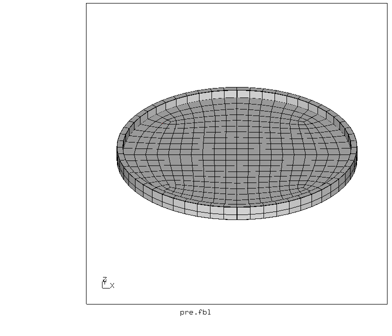
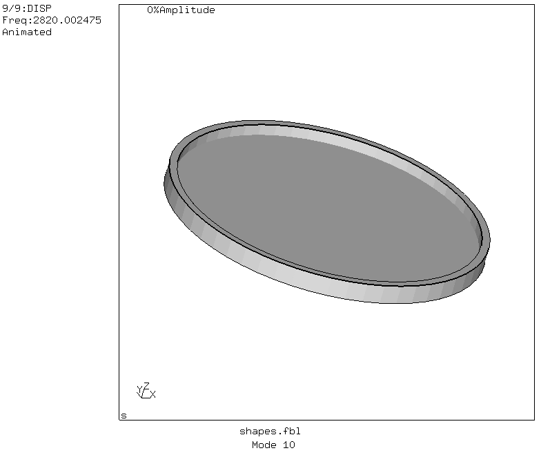

# Modal analysis
Tested with CGX 2.16 / CCX 2.15

+ Modal analysis with automatic generation of mode shape animations
+ Parametric model
+ Inspired by a [CalculiX forum post](https://groups.yahoo.com/neo/groups/CALCULIX/conversations/topics/12441)

File                      | Contents    
 :-------------           | :-------------
 [pre.fbl](pre.fbl)       | Preprocessing script for CGX     
 [modal.inp](modal.inp)   | CCX input
 [shapes.fbl](shapes.fbl) | CGX script for postprocessing (mode shape movies)
 [test.py](test.py)       | Python script to run the full simulation



## Model Description
The model is a disk with reinforced rim (revolution of an L shaped section). It
could be created in exactly this way but here the focus was on getting a mesh
with limited element distortion.  

The sequence of geometry generation is as follows:
+ Top-down build of the inner quarter circle surface with radius `ri`
+ Axial extrusion into thickness `t1` of the plate
+ Radial extrusion of the perimeter surface by the radial thickness of the rim `dr`
+ Axial extrusion by the axial thickness of the rim `t2`

As non-symmetric mode shapes are to be expected, the quarter model is expanded
by mirror copy and merge.

It is meshed with C3D8I elements (8 node hexaeder with incompatible shape
  functions).

## Preprocessing

Parameter | Value | Description
:--       | :--   | :---
`ri`      | 40    | Inner radius of the rim in mm
`dr`      | 2     | Radial thickness of the rim in mm
`t1`      | 2     | Thickness of the disk in mm
`t2`      | 3     | Thickness of the rim in mm

Set the appropriate values for the parameters in `pre.fbd`
Generate the model using
```
> cgx -b pre.fbl
```


## Solution

Run the analysis using
```
> ccx modal
```
12 mode shapes are calculated, 6 of them are rigid body motions due to the fully
unconstrained model.

## Postprocessing

Running
```
> cgx -b shapes.fbl
```
creates animated gifs for the individual mode shapes. Here we only show the non-rigid modes.




