# Illustration of Plane Stress and Plane Strain
Tested with CGX 2.16 /CCX 2.15

+ Parametric geometry
+ 4 simply supported beams with different width (one of them in fact a plate) and one of them with lateral constraints (plane strain)

File                           | Contents    
 :-------------                | :-------------
 [par.run.fbl](par.run.fbl)    | CGX script, complete analysis, parametrized with param.py
 [solve.inp](solve.inp)        | CCX input
 [test.py](test.py)            | Python script to run the full simulation

To run the complete analysis, edit parameter values in [par.run.fbl](par.run.fbl)
and run

Parameter | Value  | Description
:--       | :--    | :---
`b0`      | 1      | Width of the plane models in mm
`b1`      | 10     | Width of the beam in mm
`b2`      | 150    | Width of the plate in mm
`le`      | 50     | Half span in mm
`dist`    | 30     | Distance of the models

```
> param.py
> cgx -b run.fbl
```

## Pre-Processing

The problem is parametrized using [param.py](../../Scripts/param.py). The geometry is
built by first defining the edges at x,z=0 and then extruding them in z and x direction.  Symmetry is used to provide a convenient section view.

The model consists of the following parts (listed in increasing y direction) with identical length and height but different width:

+ Thin beam with transverse constraints (uy=0), representing plane strain.
+ Thin beam without transverse constraints, representing plane stress state.
+ Square section beam, still behaving like a plane stress structure.
+ Wide plate, showing plane strain conditions in the center and plane stress conditions at the sides.

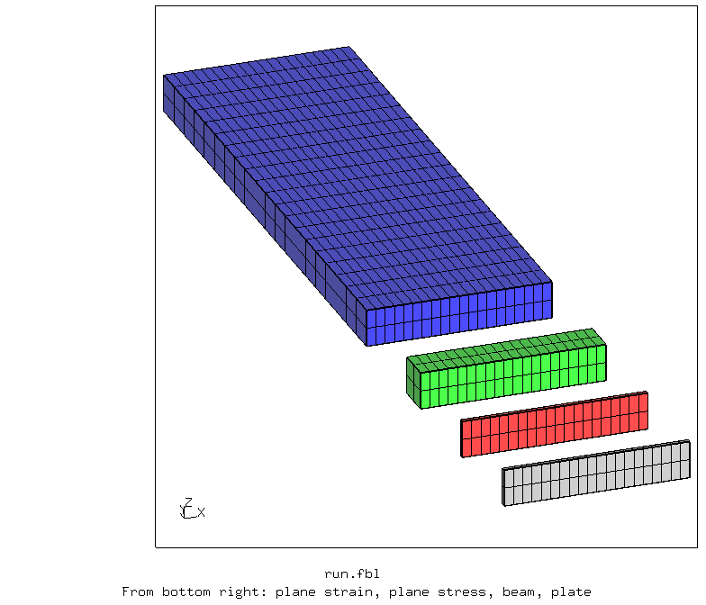

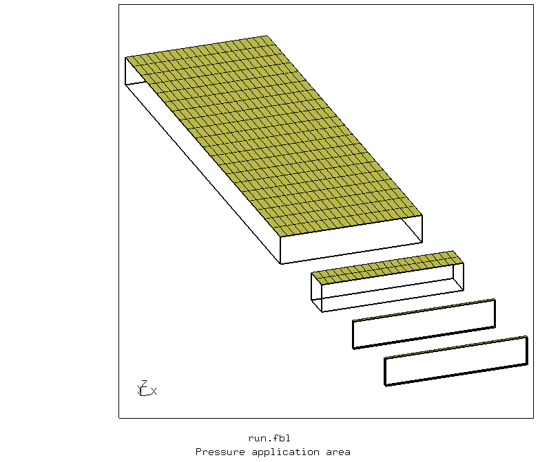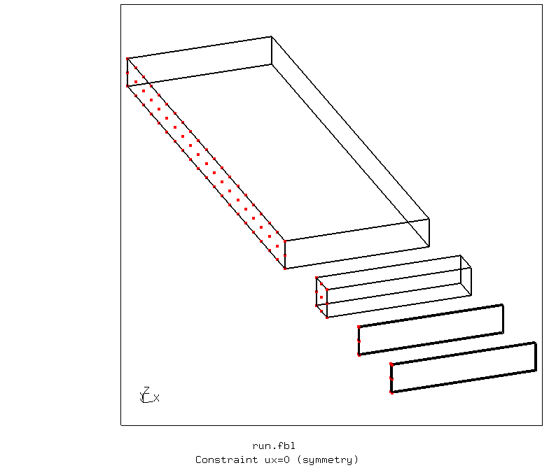

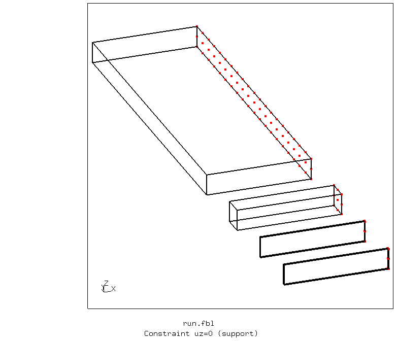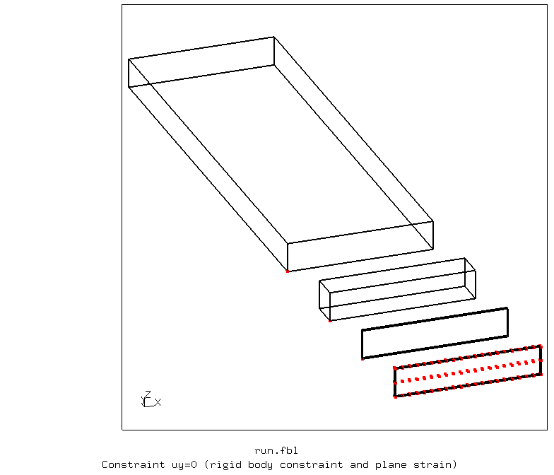

## Solving

Linear static analysis without any particular challenge.

## Post-Processing


The displacement plot shows the increased stiffness due to lateral constraints (suppressed transversal strain) in the center of the plate and in the plane strain model.


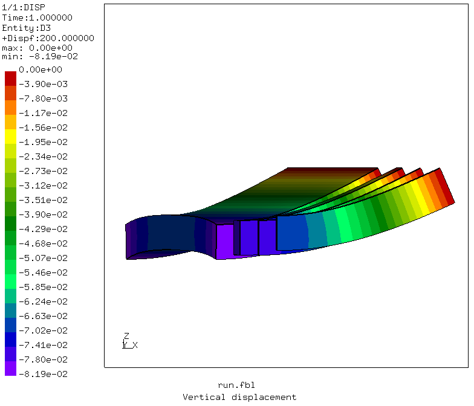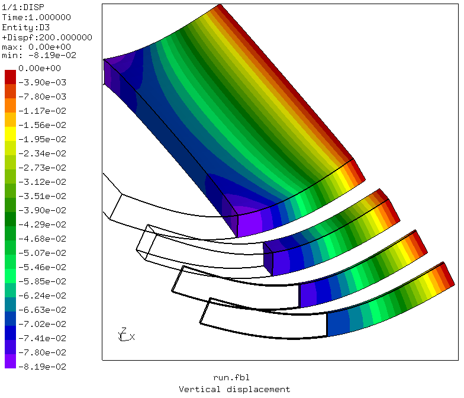

In plane strain, the normal strain in lateral (y) direction is zero (center of the plate, constrained thin beam).

In plane stress, the normal stress in lateral direction is zero (lateral boundaries of the plate, unconstrained beams).

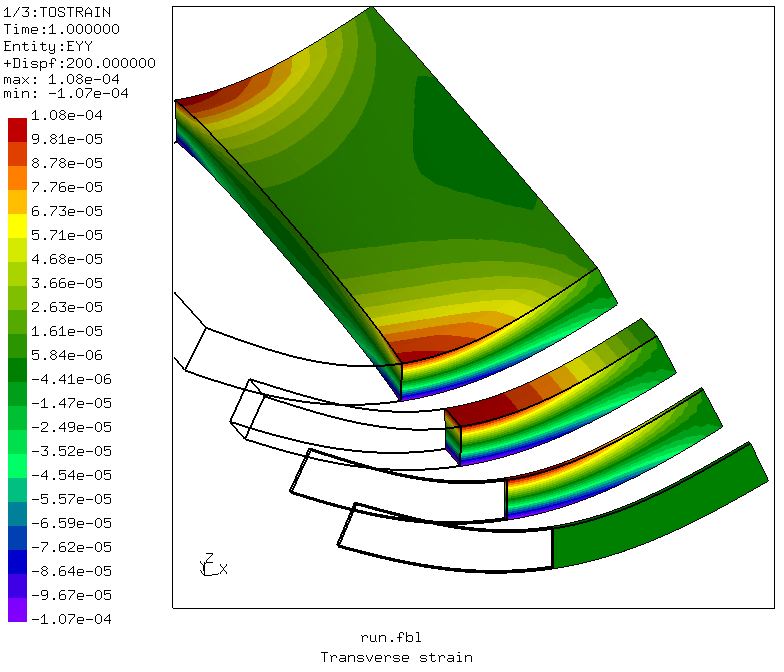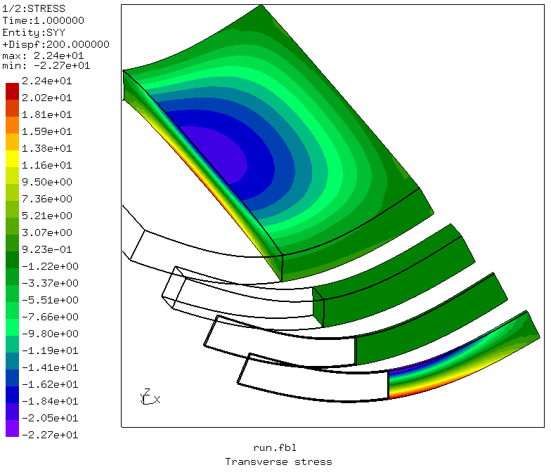

The bending stress is nearly unaffected by the lateral
constraints conditions.

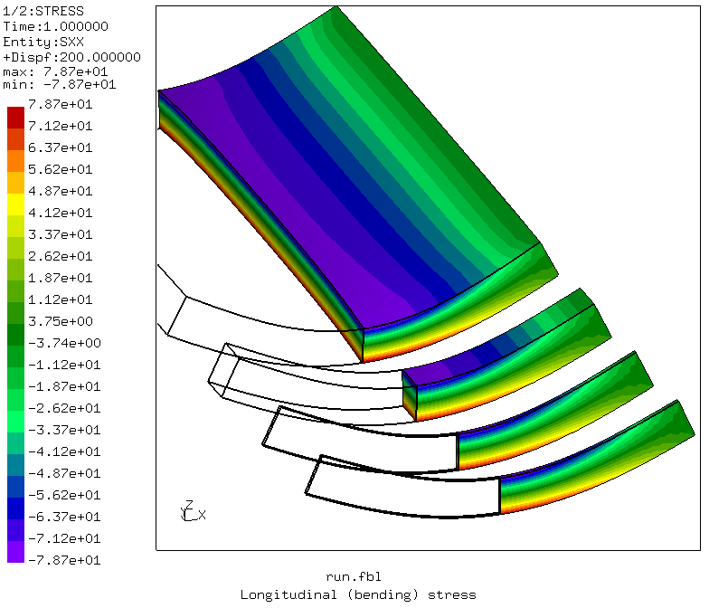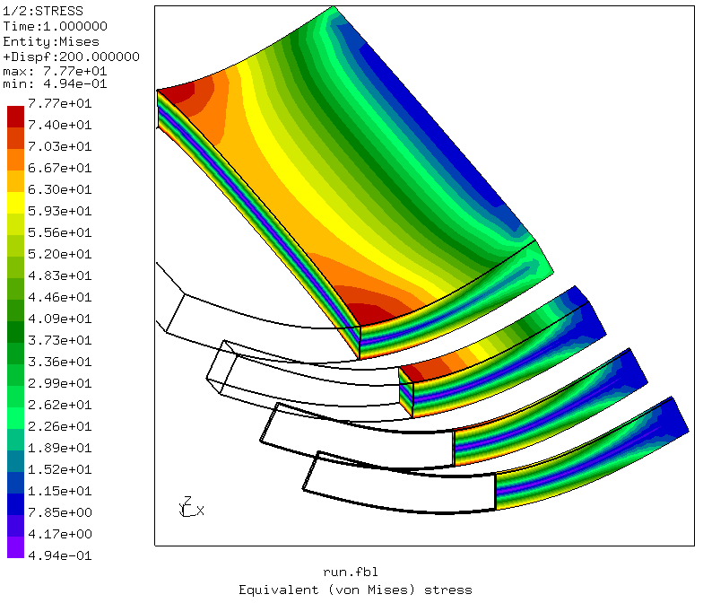
