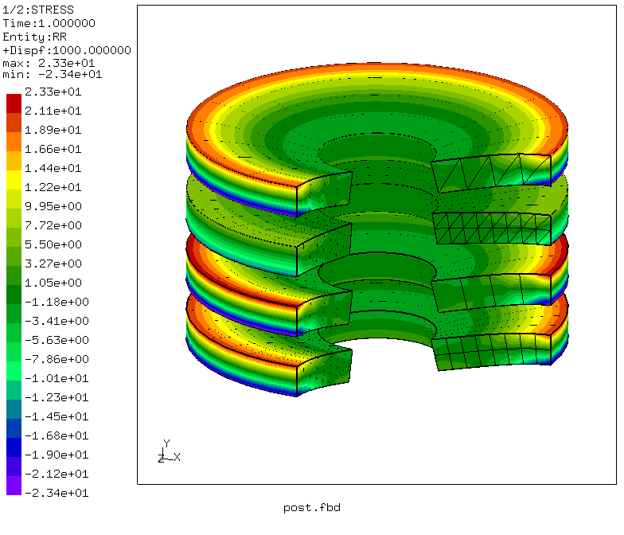
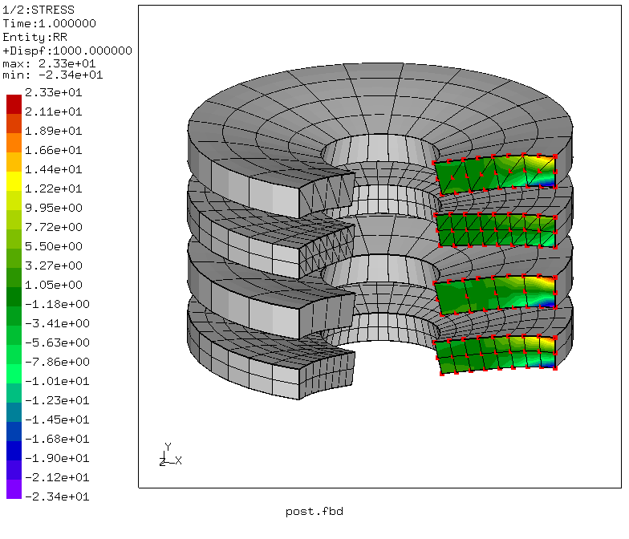

# Axisymmetric Plate With Hole
Tested with CGX 2.16 / CCX 2.15

+ Linear static solution
+ Axisymmetric model
+ Test of expansion sweep in the post-processing for various element types
+ Demonstration of polar co-ordinate system for stress components

File                      | Contents    
:-------------           | :-------------         
[pre.fbd](pre.fbd)       |Pre-processing script for CGX     
[post.fbd](post.fbd)     | Post-processing script for CGX
[plates.inp](plates.inp) | CCX input
[test.py](test.py)       | Python script to run the full simulation

## Preprocessing

| Parameter      | Value   | Description                       |
| :------------- |  :----  | :-------------                    |
| `Ri`           | 20      | inner radius (hole) in mm         |
| `Ra`           | 60      | outer radius (rim) in mm          |
| `thick`        | 10      | thickness of the plates in mm     |
| `pressure`     | 1       | pressure in MPa                   |

```
> cgx -b pre.fbd
```
There are four disks, clamped at the outer perimeter and loaded by a pressure on the top faces. Each disk is meshed with a different element type:

Disk     |CGX  | CCX
:--      |:--  | :--
1 (upper)|tr6c |CAX6
2        |tr3c | CAX3
3        |qu8c | CAX8
4 (lower)|qu4c | CAX4


## Solving
```
> ccx plates
```

## Postprocessing
```
> cgx -b post.fbd
```
Transformation to polar co-ordinates has to be applied after model expansion.


