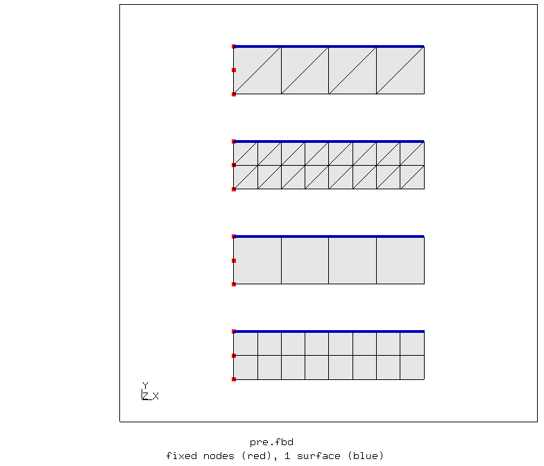
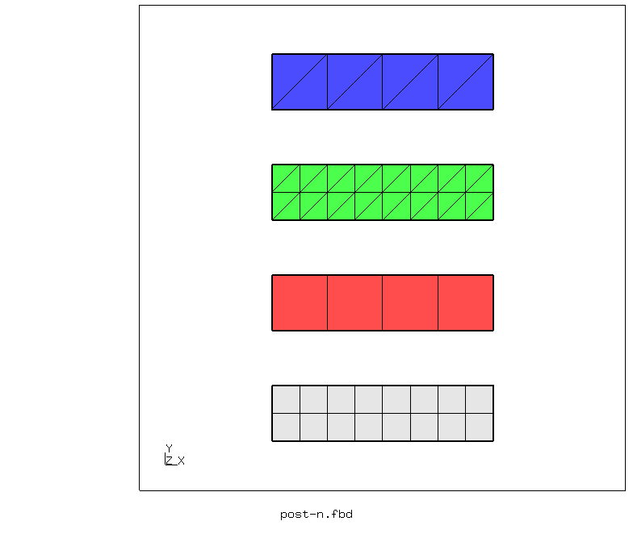
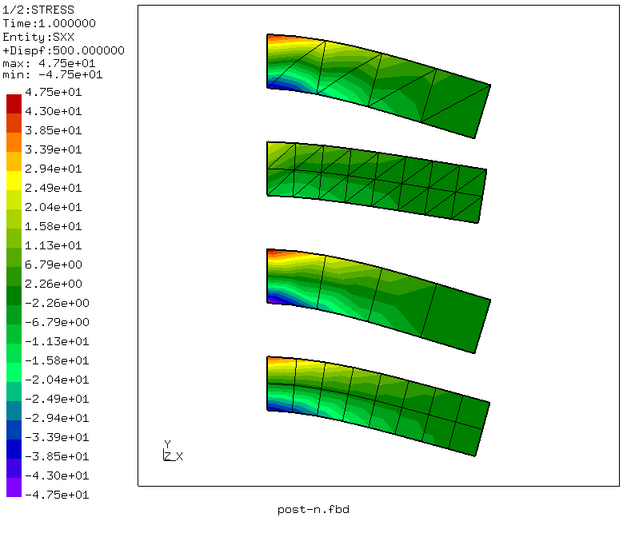
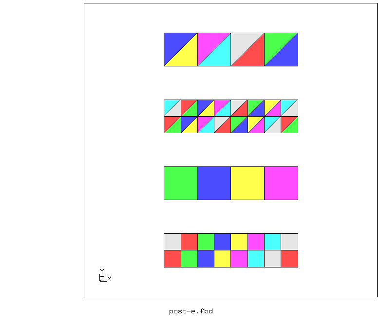
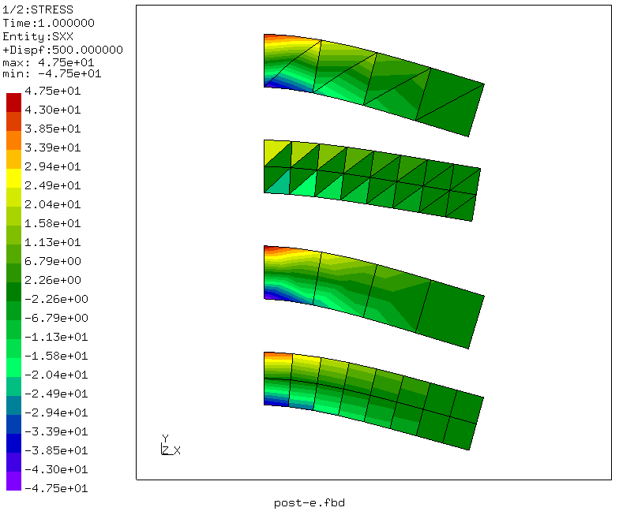

# Plane beams - element solution
Tested with CGX 2.16 / CCX 2.15

+ Linear static solution
+ Plane stress model
+ Test of element separation to avoid nodal averaging of results (AKA element solution in ANSYS)

File                       | Contents    
:-------------             | :-------------
[pre.fbd](pre.fbd)         | Pre-processing script for CGX     
[post-n.fbd](post-n.fbd)   | Post-processing script for CGX, nodal averaging
[post-e.fbd](post-e.fbd)   | Post-processing script for CGX, no nodal averaging
[nodal.inp](nodal.inp)     | CCX input with non-separated mesh (nodal averaging)
[element.inp](element.inp) | CCX input with separated mesh (no nodal averaging)
[test.py](test.py)         | Python script to run the full simulation

## Preprocessing
```
> cgx -b pre.fbd
```
There are four beams, fixed at the left end and loaded by a pressure on the top faces. Each beam is meshed with a different element type:

Disk     | CGX  | CCX
:--      | :--  | :--
1 (upper)| tr6s | CPS6
2        | tr3s | CPS3
3        | qu8sr| CPS8R
4 (lower)| qu4s | CPS4

Parameter | Value | Description
 :--      | :--   | :--
le        | 40    | Length in mm
he        | 10    | Height in mm
pressure  | 1     | Pressure in MPa



The pre-processing script calls `separate.py`, which separates the elements into disjoint meshes to avoid nodal averaging of the element results (stress). See the [Helper Scripts](../../Scripts#separatepy) page for details.

## Solving
Because of the different meshes, both versions with and without nodal averaging require different input input files and therefore, different simulation runs.
```
> ccx nodal
> ccx element
```

## Postprocessing

The difference between connected and disjoint meshes is shown by the CGX function `seta ! all`, which plots disjoint meshes in different colours.

### Nodal averaging (nodal solution)
```
> cgx -b post-n.fbd
```


### No nodal averaging (element solution)
```
> cgx -b post-e.fbd
```

