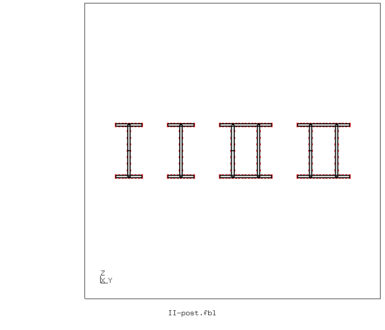
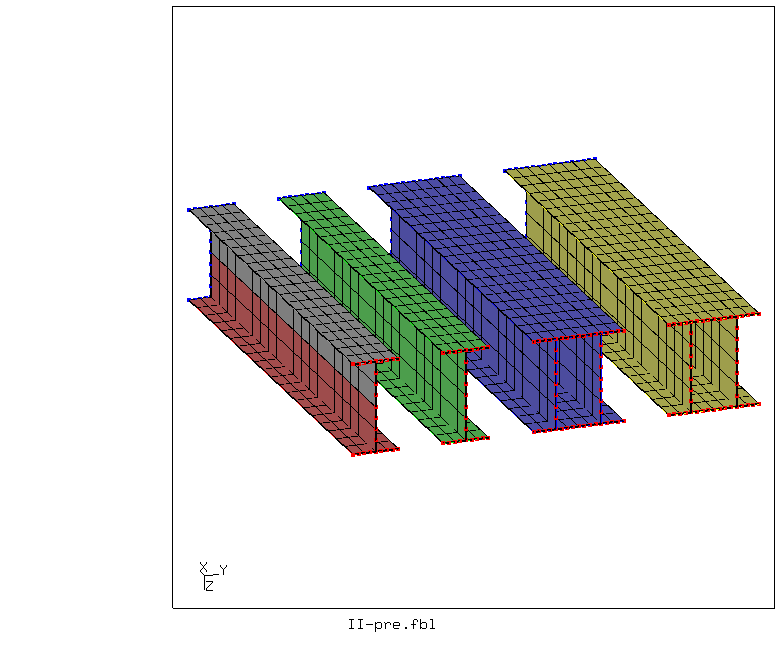
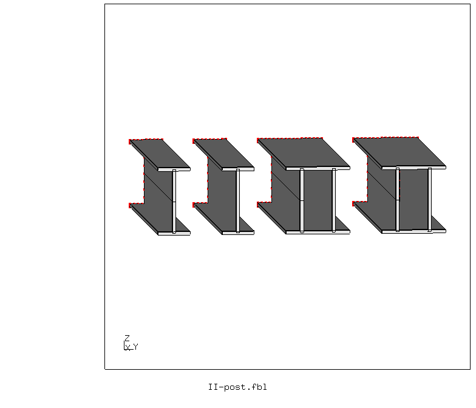
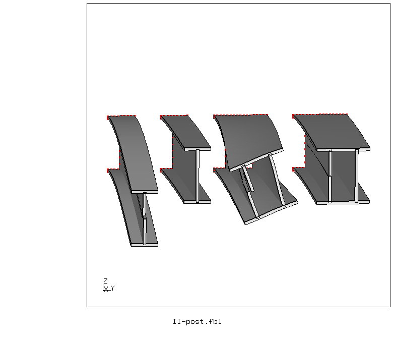
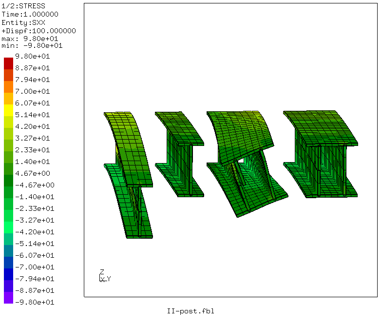
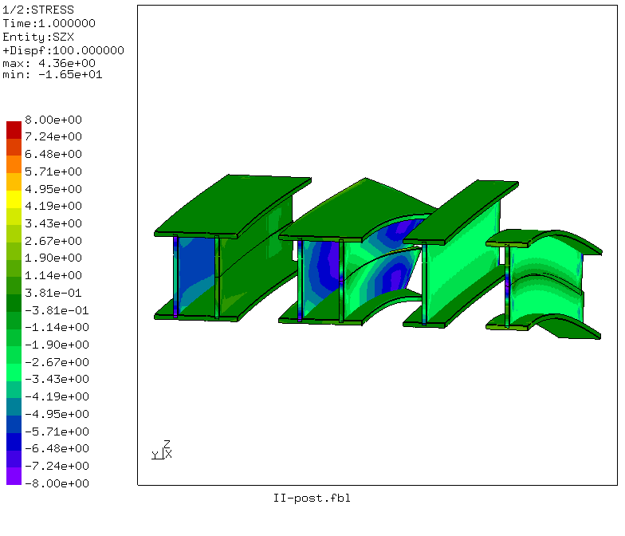

# Shear center
Tested with CGX 2.16 / CCX 2.15

+ Cantilever beams with point load at the free end
+ Parametric thin-walled sections
+ Demonstration of shear-torsion coupling in unsymmetric sections

File                                | Contents    
:-------------                      | :-------------
[par.II-pre.fbl](par.II-pre.fbl)    | CGX script, pre-processing, parametrized with param.py
[II-post.fbl](II-post.fbl)          | CGX script, post-processing
[II.inp](II.inp)                    | CCX input
[test.py](test.py)                  | python script to run the simulation  

The model shows four beams (beam 1 and 2 being the components of beam 3 and 4)

1. I beam, with a cut in the middle of the web (giving two independent T beams), each loaded with F = 100 N
2. I beam, loaded with F = 200 N. This shows the stiffening by shear transfer trough the web
3. Double I beam (with two webs, one of them with a cut), loaded symmetrically with F = 400 N. The left side corresponds
   to the cut I beam, the right one to the uncut I beam. It is to expect that the cut side is more compliant and therefore
   the whole section must rotate (generating torsional deflection)
4. Same as before but with excentric load (through the shear center) as to mitigate the torsion.

All loads are applied as concentrated forces to the web-flange junctions.



## Pre-Processing

The problem is parametrized using [param.py](../../Scripts/param.py).
The four beams are generated using appropriate copy options and node merging.
The load application points are selected using `enq` based on their location.
```
> param.py par.II-pre.fbl
> cgx -b II-pre.fbl
```

## Solving
The simulation is linear.
```
> ccx II
```

## Post-Processing
```
> cgx -b II-post.fbl
```
The script generates plots of the deformed and the undeformed geometry and of
the shear and bending stress.




