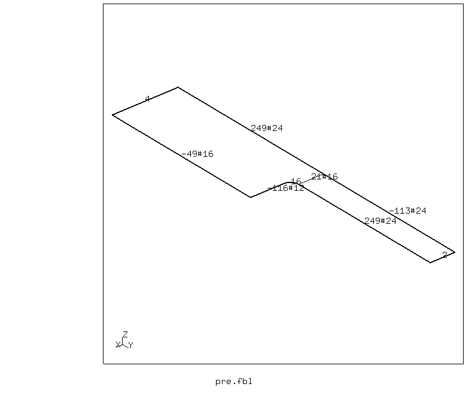
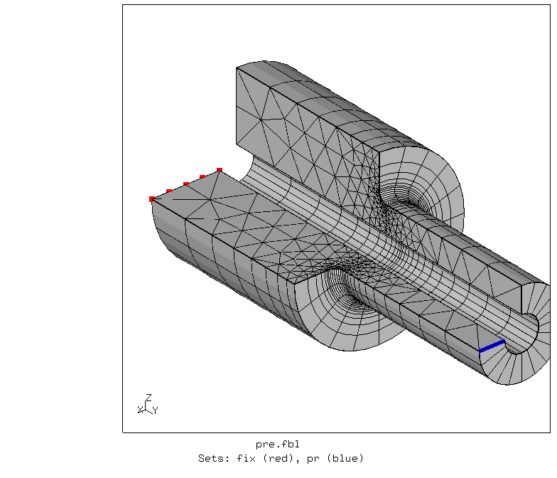
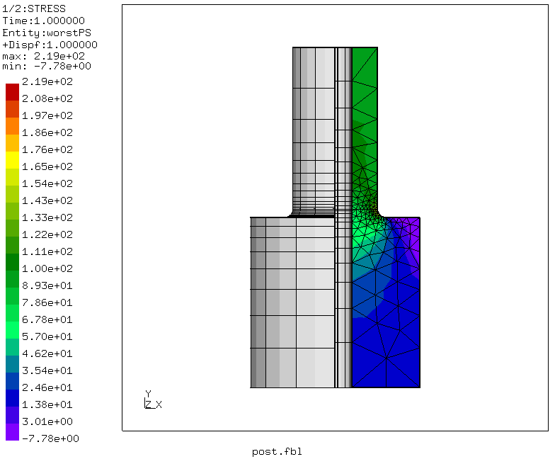
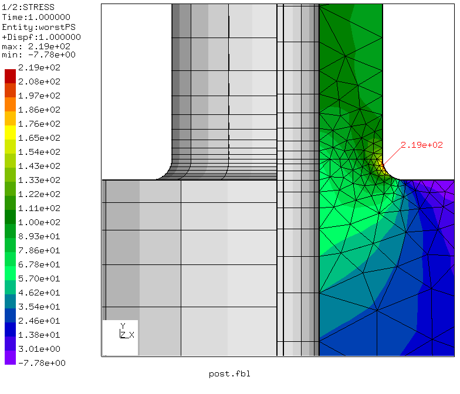

# Stress Concentration
Tested with CGX 2.16 / CCX 2.15

+ Axisymmetric part under tensile load
+ Free meshing with biased line divisions

File                           | Contents    
 :-------------                | :-------------
 [par.pre.fbl](par.pre.fbl)    | CGX script, pre-processing, parametrized with param.py
 [post.fbl](post.fbl)          | CGX script, post-processing,
 [Stress.inp](Stress.inp)      | CCX input
 [test.py](test.py)            | Python script to run the simulation

## Pre-Processing

| Parameter | Value | Meaning                             |
| :-------- |  :--- | :-------------                      |
| `D1`      | 100   | large diameter in mm                |
| `D2`      | 50    | small diameter in mm                |
| `Di`      | 20    | inner diameter in mm                |
| `L1`      | 100   | length of large diameter part in mm |
| `L2`      | 100   | length of small diameter part in mm |
| `R`       | 5     | fillet radius in mm                 |

```
> param.py par.pre.fbl
> cgx -b pre.fbl
```

The problem is parametrized using [param.py](../../Scripts/param.py). The geometry is built bottom-up by first defining points, then lines and then surfaces. The local mesh refinement at the stress concentration is controlled by division and bias of the individual lines.

In order to avoid restrictions to the line divisions, free meshing is used.

The left end at y=0 is fixed in axial direction, at the right end, a uniform tensile stress of 100 (in units of force divided by area) is applied.



## Solving

```
> ccx Stress
```

## Post-Processing

```
> cgx -b post.fbl
```
The stress concentration factor is the maximum stress divided by the applied nominal stress (100 MPa).


