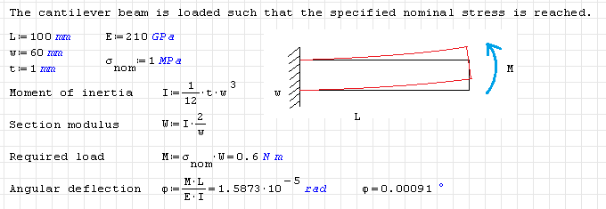
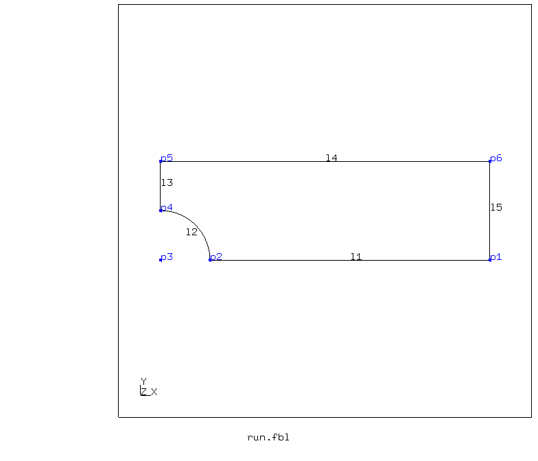
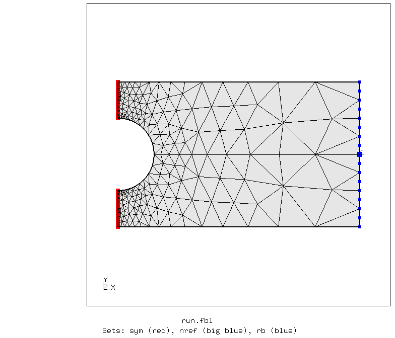
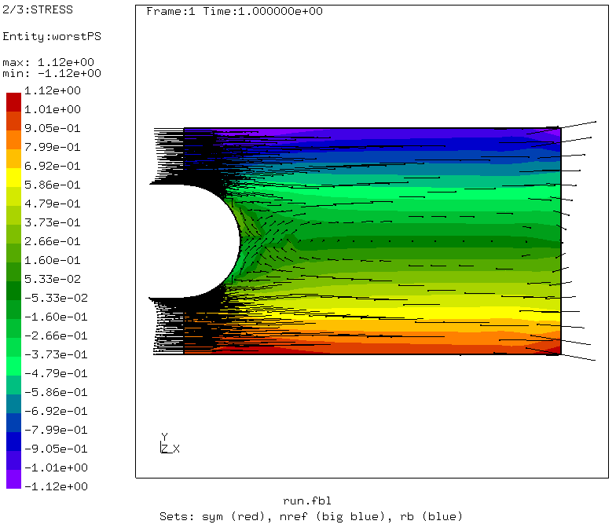
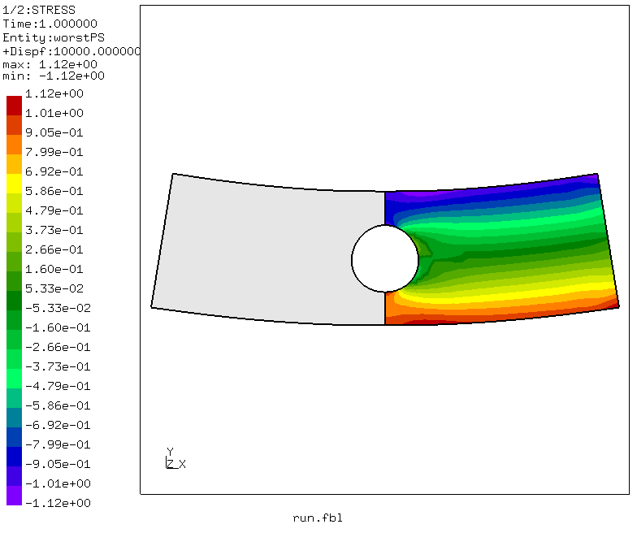
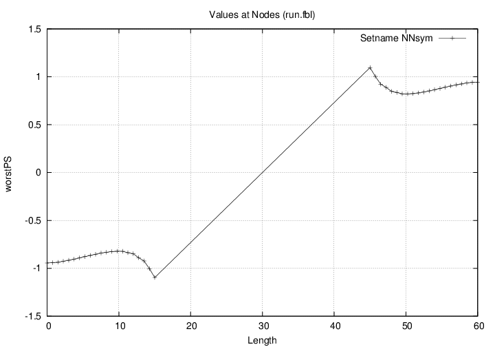
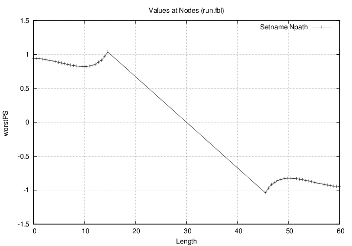
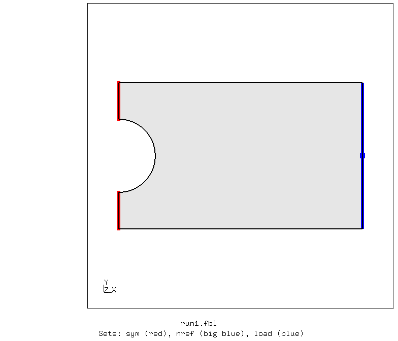
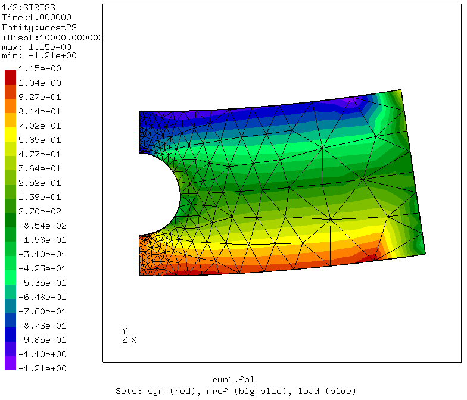
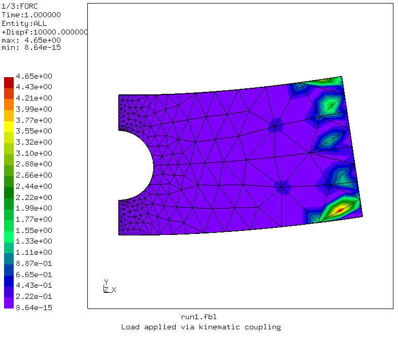

# Stress concentration in a flat strip with hole under bending load
Tested with CGX 2.16 / CCX 2.15

+ Plane stress model
+ Parametric geometry and load
+ Load application via rigid body control nodes
+ Path and vector plots to show the stress distribution

File                           | Contents    
 :-------------                | :-------------
 [par.run.fbl](par.run.fbl)    | CGX script, complete analysis, rigid body version
 [Stress.inp](Stress.inp)      | CCX input, kinematic coupling
 [par.run1.fbl](par.run1.fbl)  | CGX script, complete analysis, kinematic coupling
 [Stress1.inp](Stress1.inp)    | CCX input, kinematic coupling
 [test.py](test.py)            | Python script to run the simulation


## Reference Estimates
Click the image below to open a life SMath worksheet

[](http://smath.info/cloud/worksheet/T2x8HNoS)


## Rigid Body

| Parameter | Value | Meaning                  |
| :---------|  :--- | :-------------           |
| `L`       | 100   | length of one half in mm |
| `W`       | 60    | width in mm              |
| `R`       | 15    | radius in mm             |


To run the complete analysis, edit parameter values in [par.run.fbl](par.run.fbl)
and run
```
> param.py par.run.fbl
> cgx -b run.fbl
```

### Pre-Processing

The problem is parametrized using [param.py](../../Scripts/param.py). The geometry is built bottom-up by first defining points, then lines and then surfaces. The local mesh refinement at the stress concentration is controlled by division and growth rate of the individual lines.

In order to avoid restrictions to the line divisions, free meshing is used.



### Solving

The right edge nodes are coupled by a rigid body constraint. The displacement control node (ref node) is constrained in y and z, the rotation control node (rot node) in x and y. The bending moment is applied about z to the rotation control node. The moment is calibrated such that it creates a nominal bending stress of 1 MPa. Thus, the actual stress level in the solution can immediately be interpreted as stress concentration factor.

### Post-Processing

The stress state is evaluated using the worst principal stress (normal stress hypothesis with compression/tension symmetry). A vector plot shows the concentration in the symmetry plane. At the right edge, some deviations from the longitudinal direction can be seen. These are due to the suppression of y-strain at the rigid boundary. Leaving this aside, the rigid body constraint creates a much smoother load application than e.g. a pair of nodal forces at the vertices.



The stress concentration is illustrated by path plots.

The first one is defined based on a node set (all nodes at x=0), the second is defined based on a line set.
In a node set based definition, the points in the path plot directy correspond to mesh nodes. In a line based definition, new target nodes are created depending on the line division and the results are mapped from the source mesh to the target nodes.




The rotation of the rot node about z is written to `Stress.dat` and displayed in the console window at the end of the postprocessing.

## Kinematic coupling

In this version, the moment is applied to the reference node of a surface (right edge) using kinematic coupling:

```
*coupling, surface=Sload, ref node=1,constraint name=load
*kinematic
1,
```

```
*cload
1,6,600.0
```
Observations:
+ According to the stress values, the applied moment seems to be correct
+ The load application region shows strange RF values
+ `*section print` doesn't show correct values

### Simulation
```
param.py par.run1.fbl
cgx -b run1.fbl
```
Surface and reference node



Stress and RF results indicating strange load distribution



Values printed by `*section print`
Moment about CG should be 600

```
statistics for surface set SLOAD and time  0.1000000E+01

  total surface force (fx,fy,fz) and moment about the origin(mx,my,mz)

   7.815719E-01  6.560960E-01 -8.669194E-14  1.025126E-11  8.659184E-12 -9.624174E+01

  center of gravity and mean normal

   1.000000E+02  0.000000E+00 -2.220446E-17  1.000000E+00 -7.105427E-16  1.065814E-14

  moment about the center of gravity(mx,my,mz)

   1.025124E-11 -9.992000E-15 -1.618513E+02

  area,  normal force (+ = tension) and shear force (size)

   6.000000E+01  7.815719E-01  6.560960E-01
```
