# Three-point bending test of a hollow profile
Tested with CGX 2.15 / CCX 2.15

+ Non-linear static analysis
+ Plasticity
+ Penalty contact
+ Symmetry reduction
+ Parameters propagated to

File                         | Contents    
 :-------------              | :-------------
 [par.pre.fbl](par.pre.fbl)  | CGX script, pre-processing, parametrized with `param.py`
 [post.fbl](post.fbl)        | CGX script, post-processing, plots and force-displacement curve
 [cpost.fbl](cpost.fbl)      | CGX script, post-processing, movie
 [Biegung.inp](Biegung.inp)  | CCX input
 [df.gpl](df.gpl)            | Gnuplot control file for the force-displacement plot
 [test.py](test.py)          | python script to run the simulation  

The model represents a three point bending test on a elasto-plastic beam with a hollow box section.

[](http://smath.info/cloud/worksheet/RgGh4MoK)

## Pre-Processing


| Parameter | Value   | Meaning |
| :-------- |  :----- | :------------- |
| `th`      | 4       | wall thickness in mm |
| `wi`      | 200     | width of the profile in mm|
| `he`      | 50      | height of the profile in mm |
| `le`      | 250     | half span of the supports in mm |
| `l2`      | 40      | extra length beyond the supports in mm |
| `ro`      | 20      | radius of the intenter in mm |
| `ra`      | 6       | outer fillet radius of the profile in mm |
| `cs`      | 10      | dimension of the contact region in mm |
| `Emodul`  | 70000   | Young's modulus of the profile in MPa |
| `Re`      | 160     | yield limit of the profile in MPa |
| `disp`    | 20      | displacement of the indenter in mm |


You may adjust the parameter values in the file [par.pre.fbl](par.pre.fbl) and then run
```
> param.py par.pre.fbl
> cgx -b pre.fbl
```
The model is reduced to one quarter using symmetry.

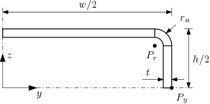

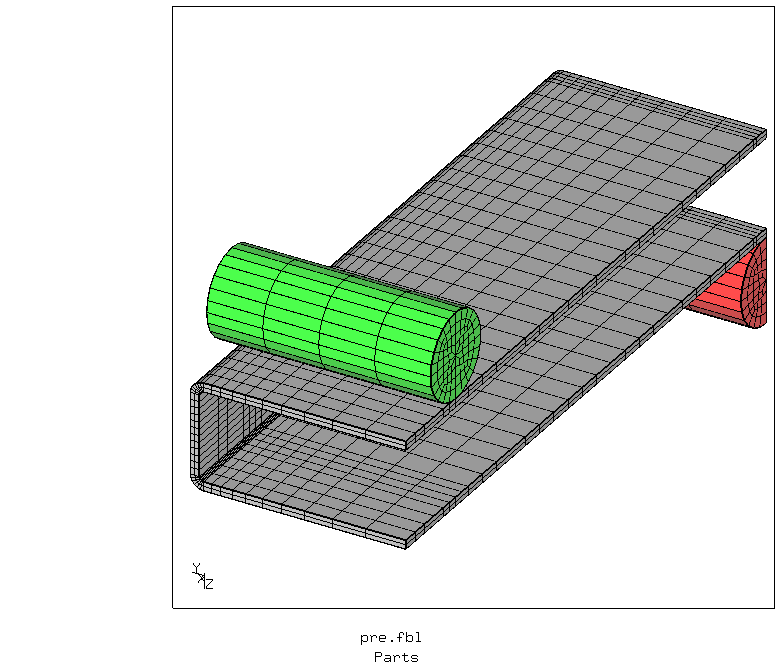

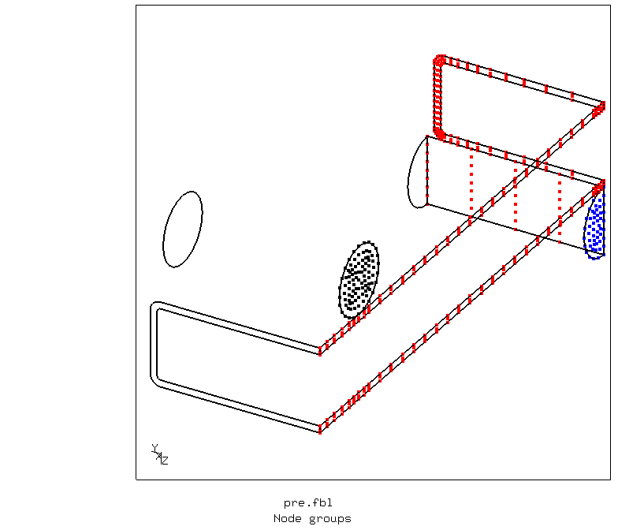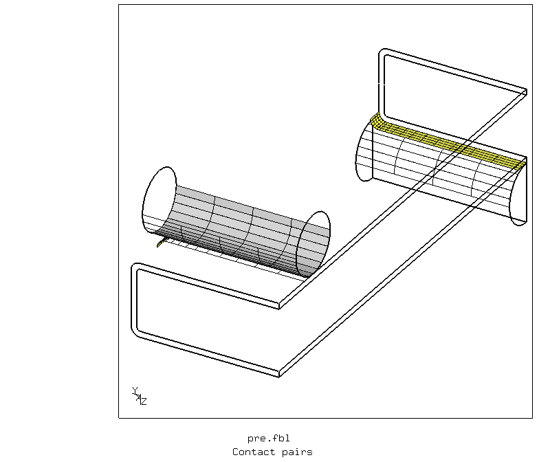

The load application cylinders are controlled by imposed displacements to the nodes in the y=0 plane (plane of symmetry).

## Solving
The time step has to be limited for stable contact. Initially, the number of contact
elements grows with increasing indentation, but then shrinks due to local buckling below the indenter.
```
> ccx Biegung
> monitor.py Biegung
```
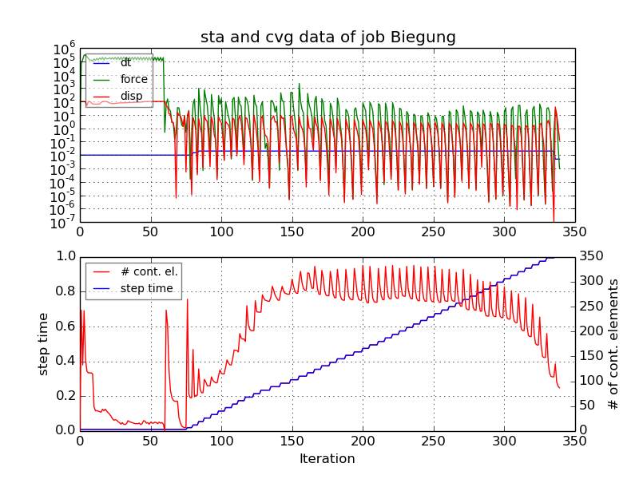

## Post-Processing
A movie showing the contact details:
```
> cgx -b cpost.fbl
```
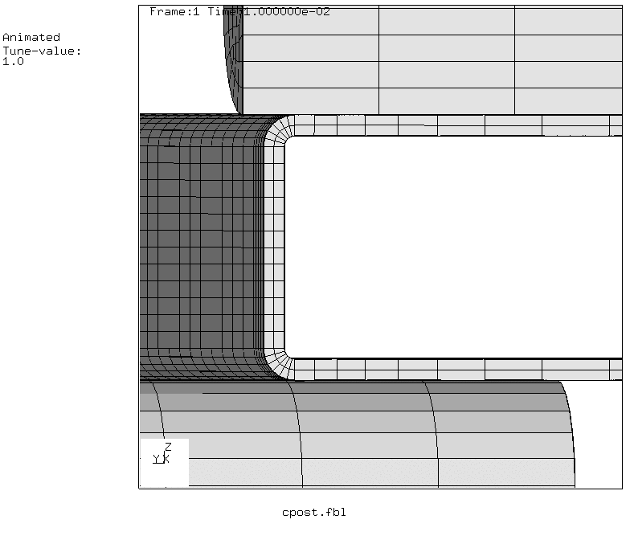

```
> cgx -b post.fbl
```
The plastic strain is displayed, the color bar is restricted to 0...4%.

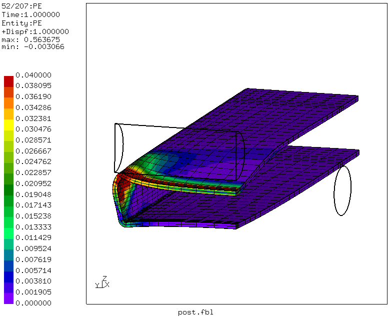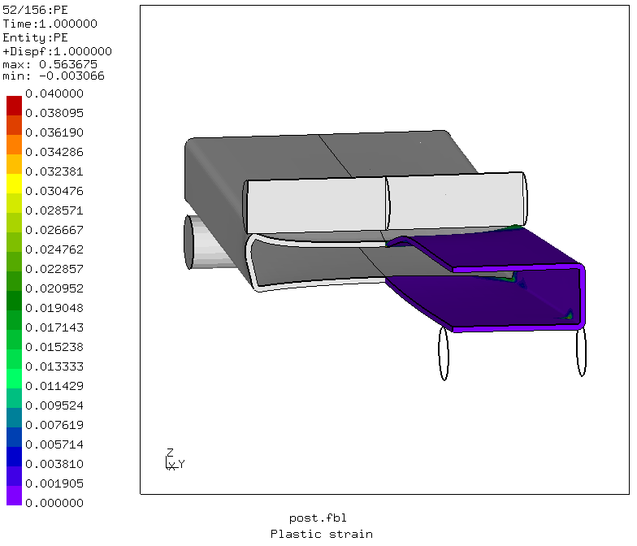

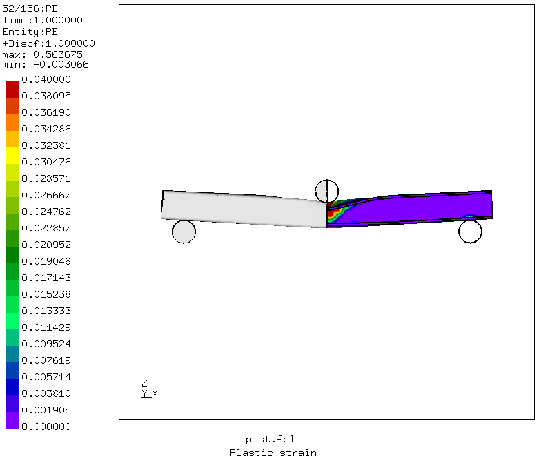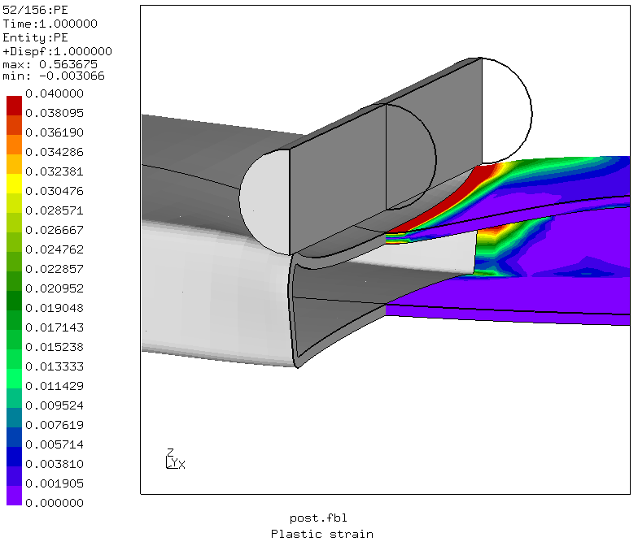

A force-displacement-curve is generated:
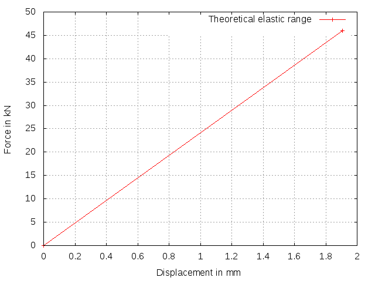
