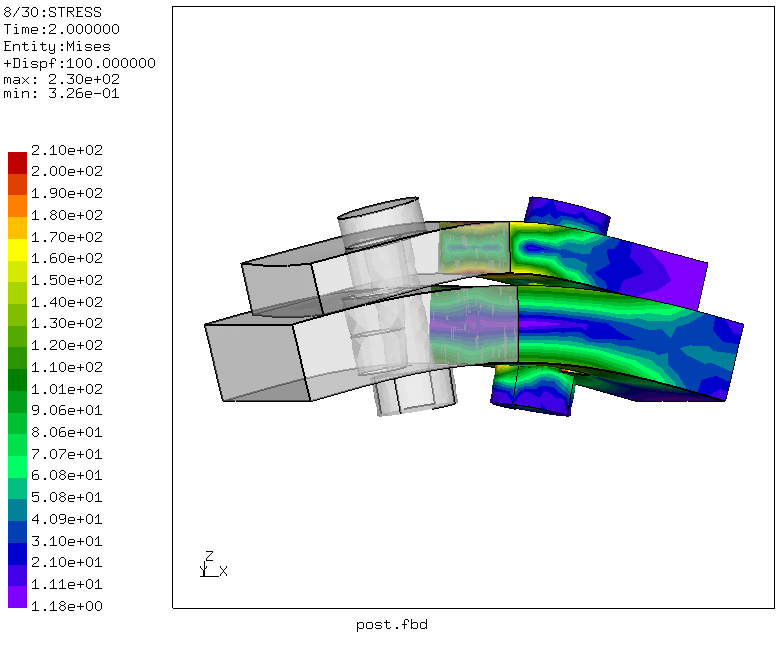
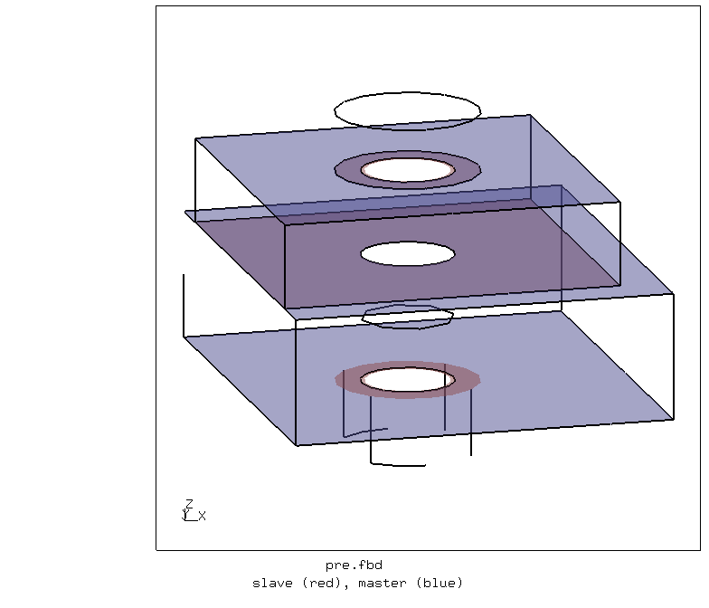
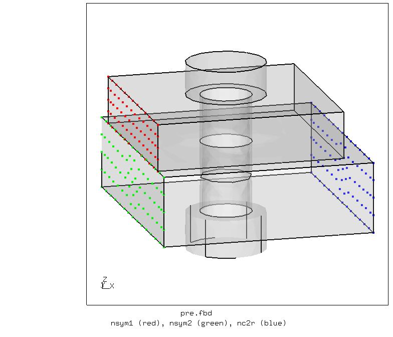
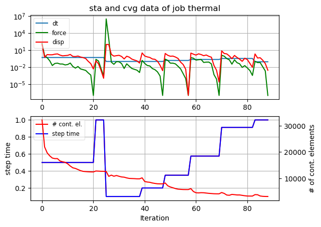
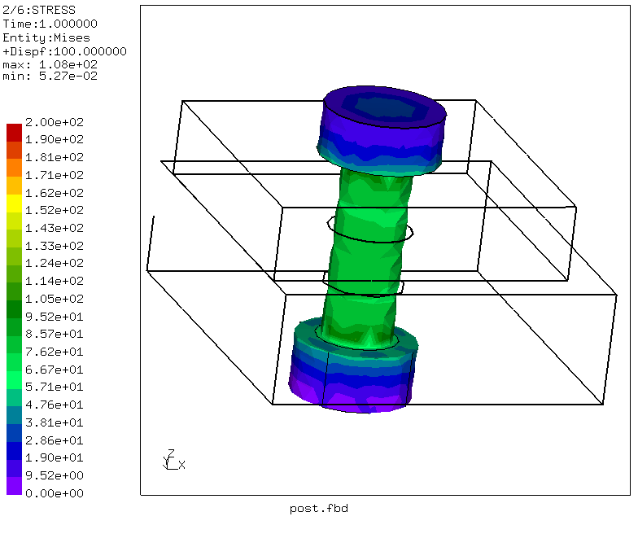
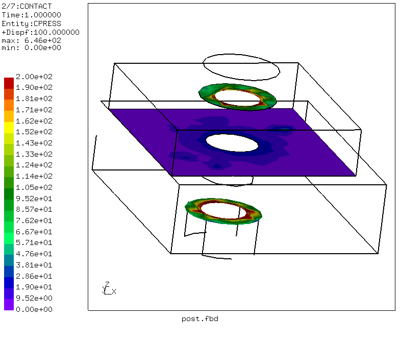

# Bolted Plates
Tested with CGX 2.19 / CCX 2.19

+ Non-linear static analysis
+ Surface-to-surface penalty contact 
+ Thermal shrinkage for bolt pre-tension.


File                         | Contents    
 :-------------              | :-------------
 [Bolt.geo](Bolt.geo)        | Gmsh script for geomentry and meshing
 [pre.fbd](pre.fbd)          | CGX script, pre-processing
 [post.fbd](post.fbd)        | CGX script, post-processing, movie
 [thermal.inp](thermal.inp)  | CCX input
 [test.py](test.py)          | python script to run the simulation  


The model represents one half of two plates and two bolts. The lower plate is fixed at the outer sides, the upper plate is pulled up vertically in the center. The bolt is pre-stressed by thermal shrinkage. 



## Pre-Processing

Contact surfaces and node sets for constraints:

 

- `nsym1` and `nsym2` are set to UX=0 (symmetry)
- `nc2r` is constrained to UY=UZ=0 (support)
- In step 1, the bolt is cooled down to pre-tighten it.
- In step 2, `nsym1` is displaced to UZ=0.001 (displacement-controlled loading)


| Parameter | Value   | Meaning |
| :-------- |  :----- | :------------- |
| `d`       | 10      | nominal bolt diameter in mm |
| `s`       | 17      | key-width of head and nut in mm|
| `k`       | 7       | height of bolt head in mm |
| `db`      | 11      | diameter of holes in mm |
| `t1`      | 10      | thickness of upper plate in mm |
| `b1`      | 40      | width of upper plate in mm |
| `l1`      | 40      | length of upper plate in mm |
| `t2`      | 15      | thickness of lower plate in mm |
| `b2`      | 50      | width of lower plate in mm |
| `l2`      | 45      | length of lower plate in mm |
| `e`       | 20      | distance of bolt axis from plane of symmetry in mm |

You may adjust the parameter values in the file [Bolt.geo](Bolt.geo) and then run
```
> gmsh Bolt.geo
> cgx -b pre.fbd
```

## Solving

```
> ccx thermal
> monitor.py thermal
```


## Post-Processing

```
> cgx -b post.fbl
```
Stress and contact pressure after pre-tensioning



Stress and contact pressure under external load


