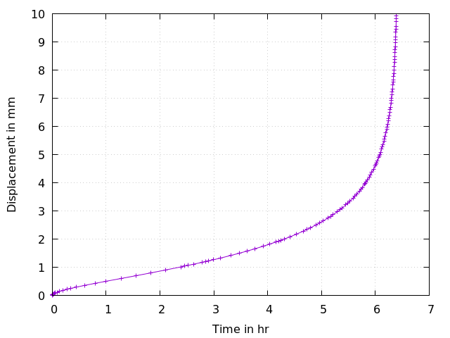

# Creep: Bar under constant load
Tested with CGX 2.19 / CCX 2.19

Model based on the official ccx example `beamcr.inp` but with modified material parameters and load application

+ Large displacements
+ Visco-elastic material
+ load application via `*coupling` with `*distributing`

File                       | Contents    
:-------------             | :-------------
[solve.inp](solve.inp)     | CCX input
[disp.plt](disp.plt)       | Gnuplot script for the creep curve

## Setup

| Parameter | Value   | Meaning |
| :-------- |  :----- | :------------- |
| `width`   | 1       | cross section dimension in mm |
| `length`  | 8       | length in mm|
| `le`      | 1       | node distance

The parameters are defined in `pre.fbd`.The mesh and the sets are generated using
    
    > cgx -b pre.fbd

The model consists of a bar of cross section 1 x 1 mm and 8 mm length (longitudinal direction Z). It is fixed at z = 0 in z-direction while allowing for deformation in x and y directions. The load is applied via surface `Szl` coupled to reference node 1. 

The material parameters are taken from literature and represent magnesium alloy AZ91 at 200°C.

The simulation consists of a `*visco` step of 20 hr duration, yet stops after approximately 23000 seconds due to excessive strain rate.


## Solving

```
> ccx solve
```
The solver history can be documented with
```
> monitor.py solve
```


## Postprocessing

The displacement of a monitor node at the load application surface is written to the .dat file. 

This is converted to a tabular text file suitable for gnuplot.

```
> dat2txt.py 
> gnuplot disp.plt
```
Equivalent plastic strain and deformed shape of the profile:

