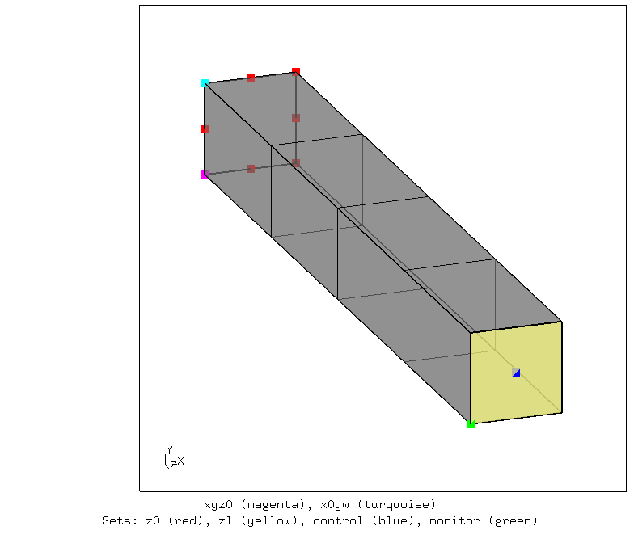
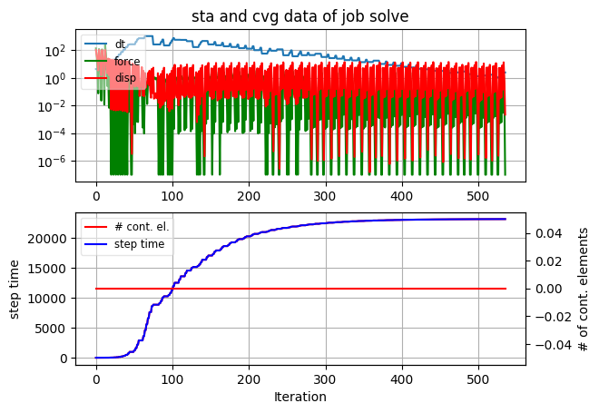
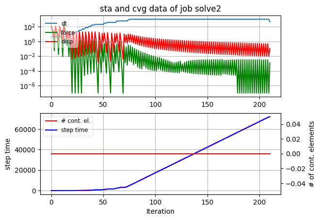
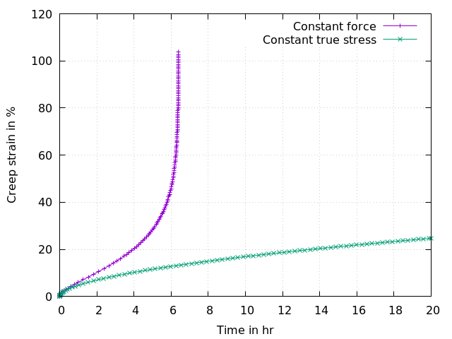

# Creep: Bar under constant load
Tested with CGX 2.19 / CCX 2.19

Model based on the official ccx example `beamcr.inp` but with modified material parameters and load application

+ Large displacements
+ Visco-elastic material
+ load application via `*coupling` with `*distributing`

File                       | Contents    
:-------------             | :-------------
[pre.fbd](pre.fbd)         | CGX input for preprocessing
[solve.inp](solve.inp)     | CCX input (constant force)
[solve2.inp](solve2.inp)   | CCX input (constant true stress)
[peeq.plt](peeq.plt)       | Gnuplot script for the creep curve (strain)
[disp.plt](disp.plt)       | Gnuplot script for the creep curve (displacement)
[test.py](test.py)         | Python script for the complete analysis

## Setup

| Parameter | Value   | Meaning |
| :-------- |  :----- | :------------- |
| `width`   | 1       | cross section dimension in mm |
| `length`  | 8       | length in mm|
| `le`      | 1       | node distance

The parameters are defined in `pre.fbd`. The mesh and the sets are generated using
    
    > cgx -b pre.fbd

The model consists of a bar of cross section 1 x 1 mm and 8 mm length (longitudinal direction Z). It is fixed at z = 0 in z-direction while allowing for deformation in x and y directions. 

There are two versions of load application:

1. [solve.inp](solve.inp) as a constant concentrated force to the control node of surface `Szl` (creating constant total force)
2. [solve2.inp](solve2.inp) as a constant negative pressure to surface `Szl` (creating constant true stress)

Fully integrated 20-node elements are used, because reduced integration would lead to hourglassing with just a single element over the cross section.

The material parameters are taken from literature and represent magnesium alloy AZ91 at 200°C.

The simulation consists of a `*visco` step of 6.7 hr (constant total force) or 20  hr (constant true stress) duration.



## Solving

### Constant total force

```
> ccx solve
```
The simulation doesn't reach the designated total time because of excessive creep rate when the cross section becomes too small.
```
> monitor.py solve
```



### Constant true stress

```
> ccx solve2
```
The solver history can be documented with
```
> monitor.py solve2
```



## Postprocessing

The equivalent creep strain is written to the .dat file. 

This is converted to a tabular text file suitable for gnuplot.

```
> dat2txt.py solve
> dat2txt.py solve2
> gnuplot peeq.plt
```
Equivalent plastic strain and deformed shape of the profile:

