# Cut Operation: Plasticity and Contact
Tested with CGX 2.16 / CCX 2.15

Simplified model of a cut operation, where a continuously strip-formed C-shaped profile is sheared between two cutting tools in order to produce separate parts of given length. Both tools (knives) are of identical shape. One of them is fixed (entry side) and one moves (exit side).

Only the onset of the process can be represented with the static solution procedure. This, however, is sufficient to derive the load distribution for the tools.

+ Large displacements
+ Plasticity
+ Parametrization using `param.py`
+ Surface-to-surface contact
+ Use of `last iterations` output parameter to show unconverged iterations

File                       | Contents    
:-------------             | :-------------
[par.pre.fbd](par.pre.fbd) | Pre-processing script for CGX (parametrized with `param.py`)      
[post.fbd](post.fbd)       | Post-processing script for CGX
[iter.fbd](iter.fbd)     | CGX script for inspection of unconverged iterations during the solution process
[solve.inp](solve.inp)  | CCX input
[test.py](test.py)         | Python script to run the full simulation


## Preprocessing


Parameter | Value | Description
:--       | :--   | :---
`he`      | 130.  | height of the tool in mm
`wi`      | 180.  | width of the tool in mm
`th`      | 40.   | thickness of the tool in mm
`ra`      | 4.    | end radius of the slot in mm
`phe`     | 125.  | height of the profile in mm
`pwi`     | 70.   | width of the profile in mm
`pgap`    | 50.   | gap (opening) of the C-profile in mm
`pra`     | 10.   | outer radius of the profile corners in mm
`ss`      | 2.    | gap between tools in mm

Edit the parameters in `par.pre.fbd` and run the commands

```
> param.py par.pre.fbd
> cgx -b pre.fbd
```
The outer contour and the slot of the tools are generated bottom up using points and lines.
The radii are generated using the `fil` command.


Boundary conditions of the tools
 + The red boundaries have prescribed displacement in y-direction (vertical).
 + The black boundaries have prescribed displacement in x-direction.
 + The green edge is fixed in z-direction (longitudinal).

 The profile is constrained in longitudinal direction at x=0.

 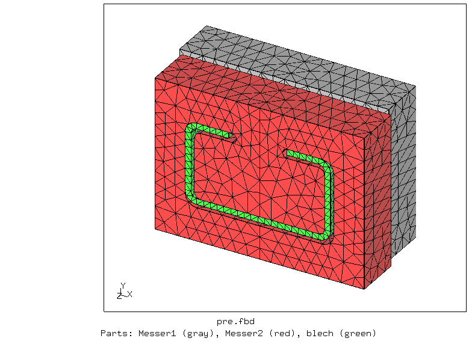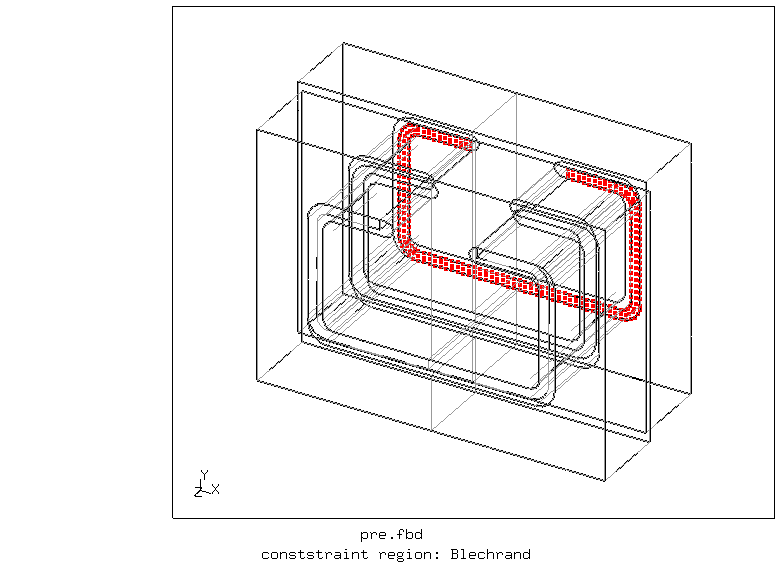
 

 Four contact pairs are defined:
 + outer slot perimeter of tool 1 (MA1) and outer contour of the profile (BlechAussen)
 + outer slot perimeter of tool 2 (MA2) and outer contour of the profile
 + inner slot perimeter of tool 1 (MI1) and inner contour of the profile (BlechInnen)
 + inner slot perimeter of tool 2 (MI2) and inner contour of the profile

 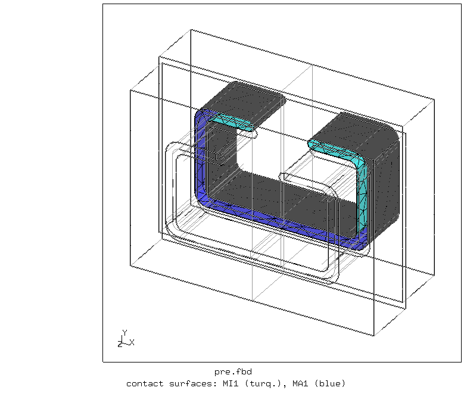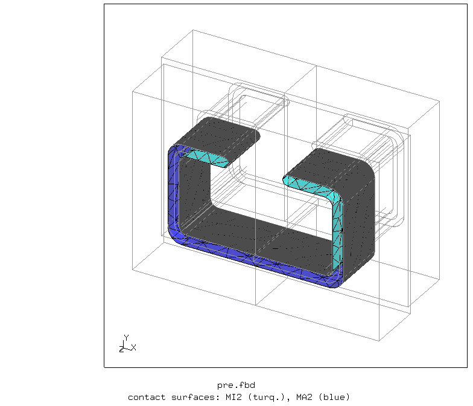
 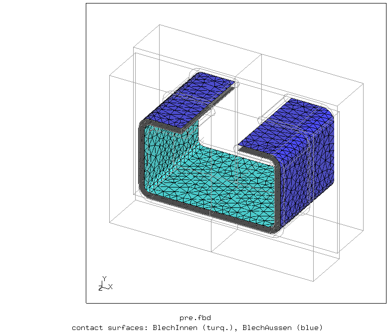

## Solving

```
> ccx solve
```
While the solution is running (takes a while), you can inspect the progress with the CVG and STA file monitor
```
> monitor.py solve
```
If you change parameters and experience heavy convergence problems then inspecting the intermediate unconverged iterations can help a lot:
```
> cgx -b iter.fbd
```
For the default parameters in the example, convergence isn't really an issue. For such stability to reach, it was essential to
+ place the parts such that they initially touch,
+ deliberately reduce the contact stiffness


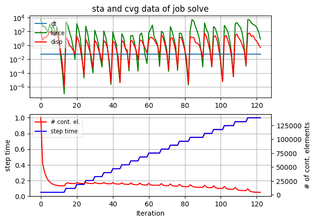

## Postprocessing

```
> cgx -b post.fbd
```
Equivalent plastic strain and deformed shape of the profile:

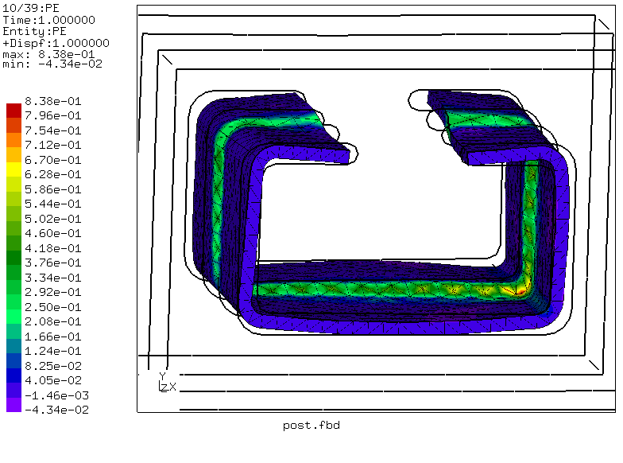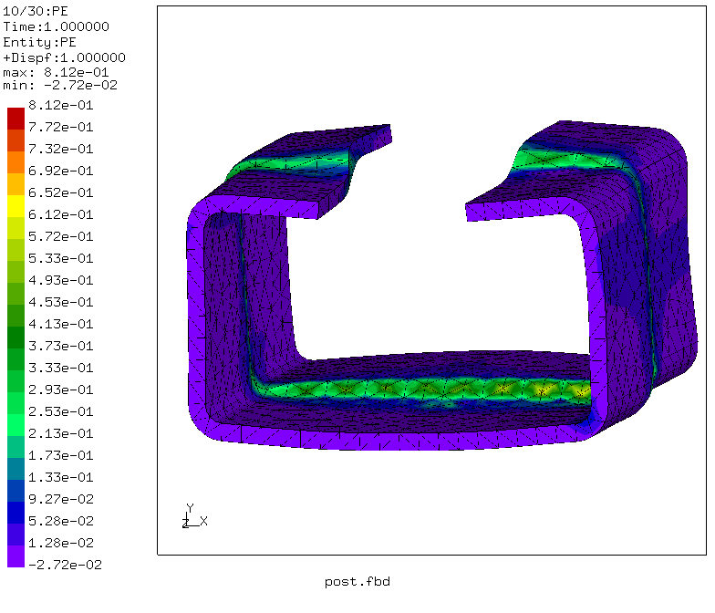

Fixed tool: Equivalent stress and maximum principal stress

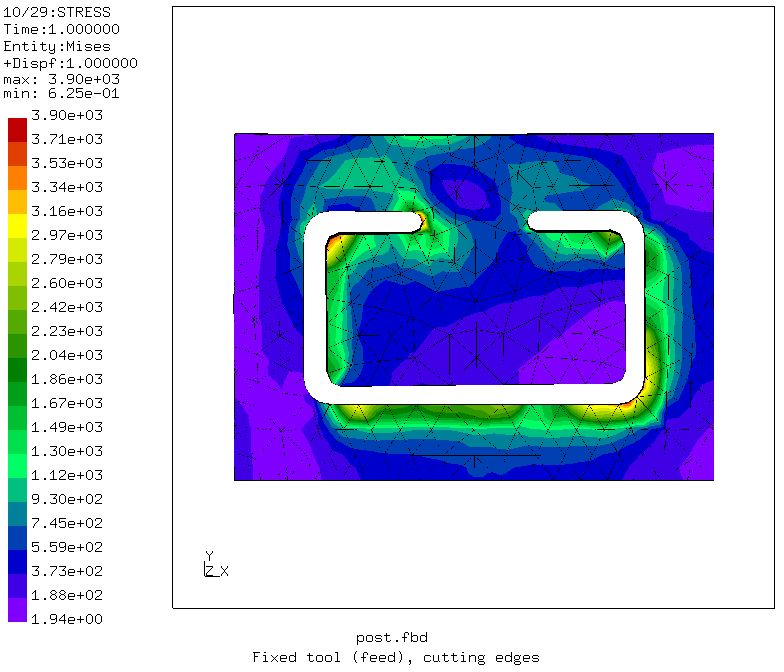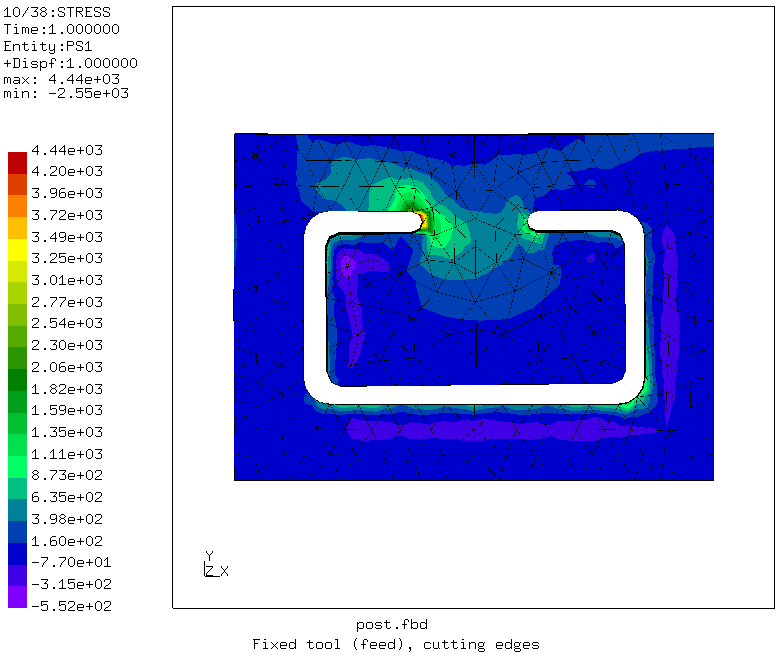

Moving tool: Equivalent stress and maximum principal stress

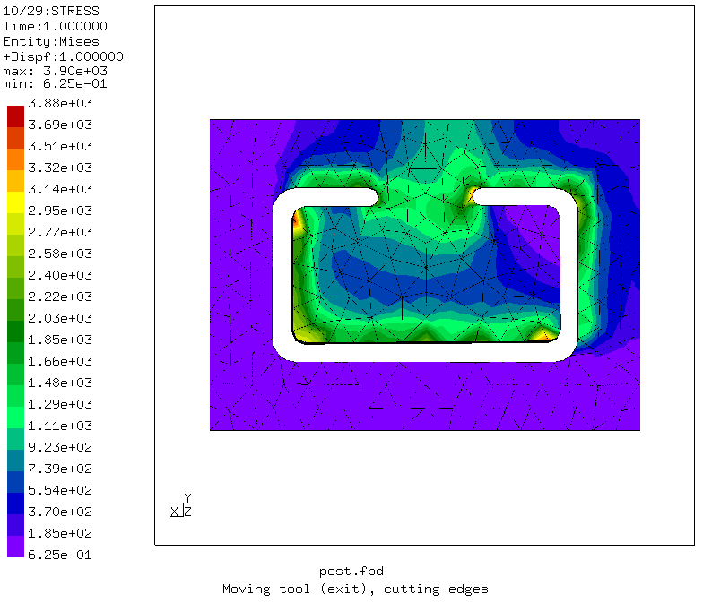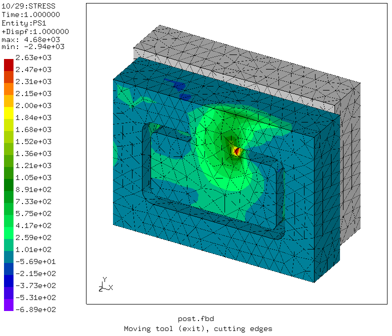
