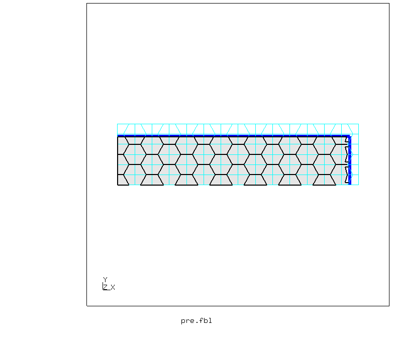
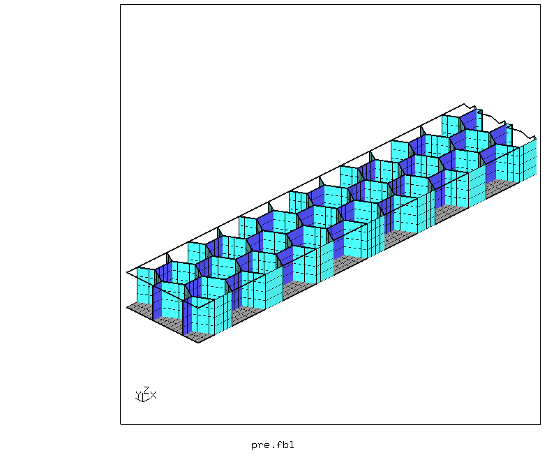
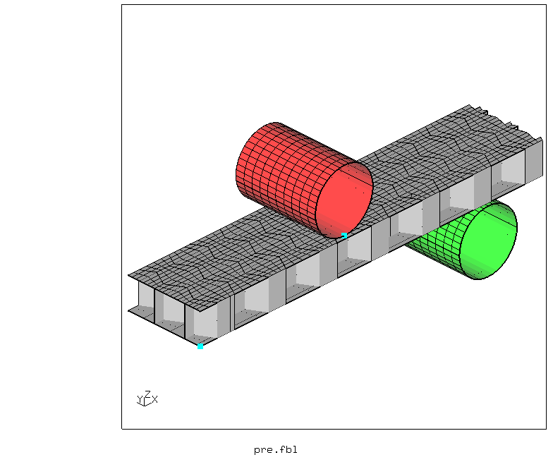
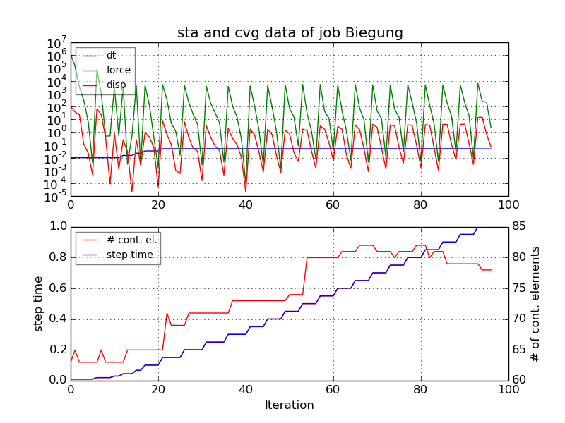
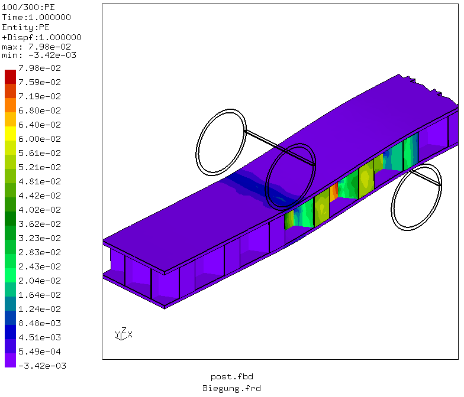
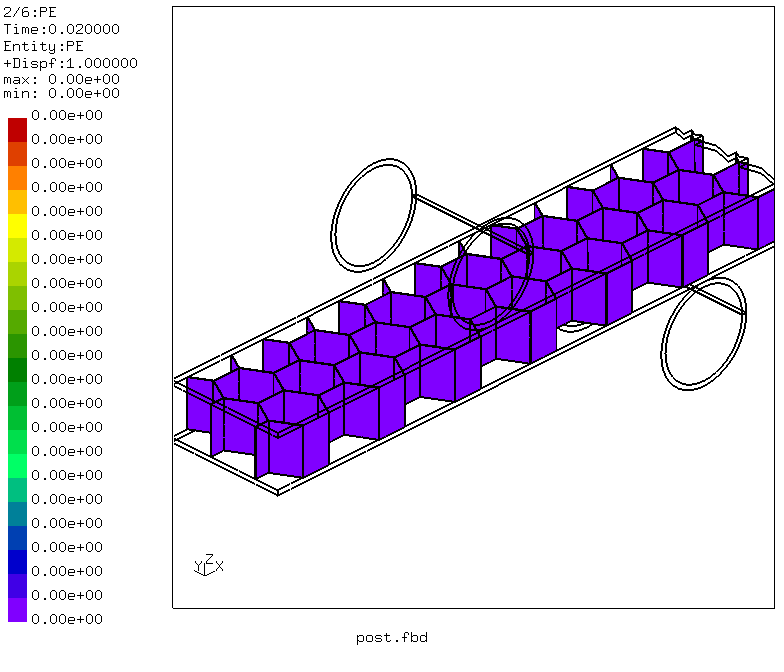
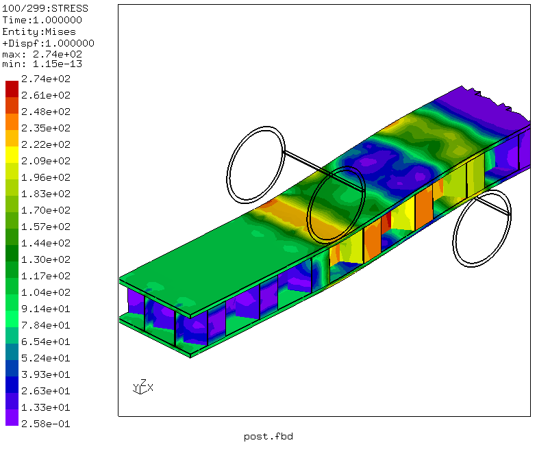
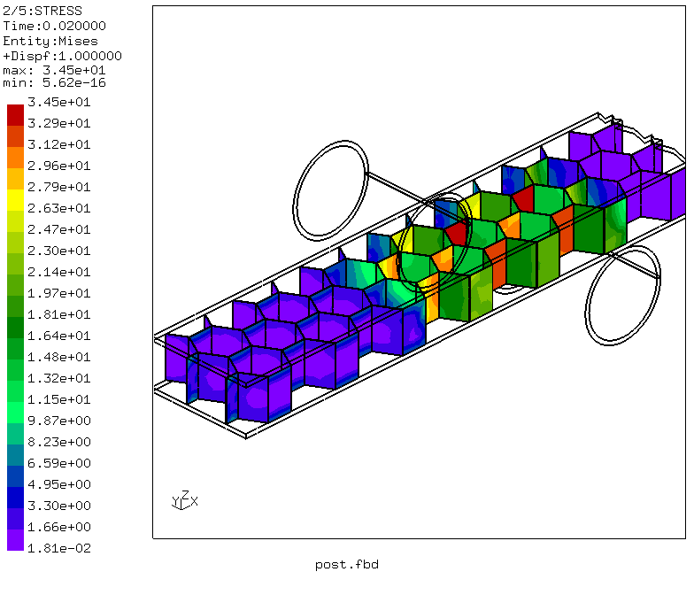
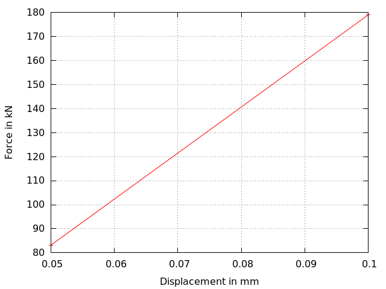

# Honeycomb Sandwich
Tested with CGX 2.16 / CCX 2.15

+ Non-linear static analysis
+ Plasticity
+ Penalty contact
+ Symmetry reduction
+ Parametric model
+ Shell elements

File                        | Contents    
:-------------              | :-------------
[par.pre.fbl](par.pre.fbl)  | CGX script, pre-processing, parametrized with `param.py`
[pre.fbl](pre.fbl)          | CGX script, pre-processing, already processed with `param.py`
[post.fbd](post.fbd)        | CGX script, post-processing
[Biegung.inp](Biegung.inp)  | CCX input
[df.gnu](df.gnu)            | Gnuplot script
[test.py](test.py)          | Python script to run the full simulation

The model represents a four point bending test on an elasto-plastic aluminium honeycomb sandwich plate. The honeycombs are of expanded type, i.e. 1/3 of the walls has double thickness.

Parameter | Value   | Description
:---      | :-----  | :---
`le`      | 6       | Length of double-thickness walls in mm
`wb`      | 10.5    | Cell width in expansion direction in mm
`hw`      | 10      | Heigth of the core in mm
`lx`      | 120     | Half sample target length in mm
`ly`      | 25      | Half sample target width in mm
`x1`      | 50      | Distance from center to upper cylinder (indenter) in mm
`x2`      | 100     | Distance from center to lower cylinder (support) in mm
`radius`  | 10      | Radius of the cylinders
`tupper`  | 1       | Thickness of the upper face sheet in mm
`tlower`  | 1       | Thickness of the lower face sheet in mm
`tsingle` | 0.1     | Thickness of the core material in mm
`divx`    | 2       | Division of the (half) walls in x direction
`divy`    | 4       | Division of the angled walls in y direction
`divz`    | 4       | Division of the walls in z direction

## Pre-Processing

You may edit the file [par.pre.fbl](par.pre.fbl) and then run
```
> param.py par.pre.fbl
> cgx -b pre.fbl
```
First, a unit cell is generated and then copied in x- and y-direction as many
times as is required to fit the target dimensions.

Then, all elements off the target area are cut away.



The cylinders for load application and support are completely displacement controlled, they have
no degrees of freedom.



Shell elements expanded to a single layer of volume elements are not really appropriate for plastic deformations, because they have just two cross thickness integration points.

The model is stabilized by coupling the sandwich to ground via a weak spring.

## Solving
The rate of convergence is affected by the plastic material, the mesh density, the contact stiffness and the time incrementation controls. Heavy relaxation of the convergence criteria is required to get the model solved.

```
> ccx Biegung
> monitor.py Biegung
```


## Post-Processing
```
> cgx -b post.fbd
```


The force-displacement plot is generated in `post.fbd` using the `dat2txt.py` script (see [../../Scripts/dat2txt.py](../../Scripts/dat2txt.py)).

```
> dat2txt.py Biegung
> mv "total force fx,fy,fz_NCYL1.txt" f.txt
> mv "displacements vx,vy,vz_NMON1.txt" d.txt
> join f.txt d.txt > df.txt
> gnuplot df.gnu
```

