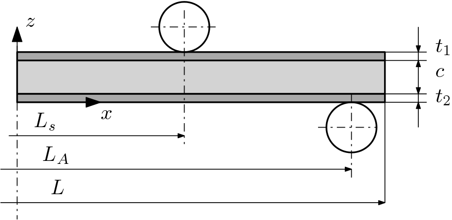
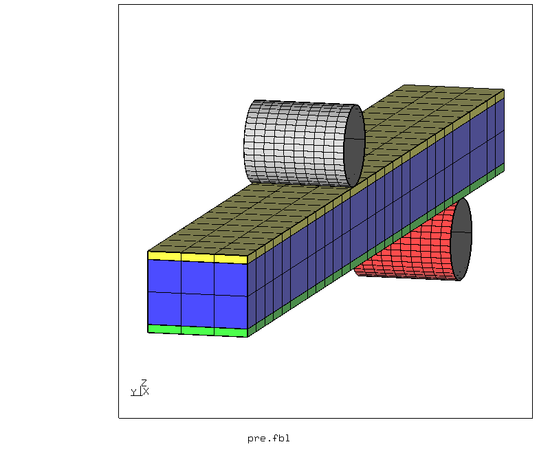
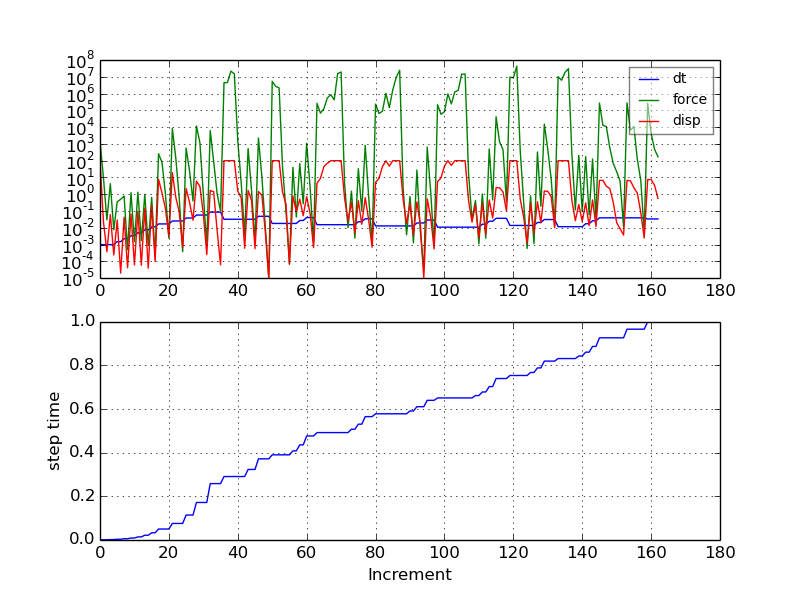
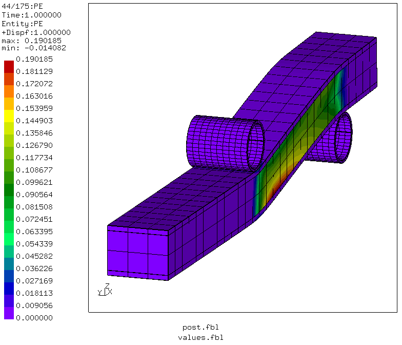
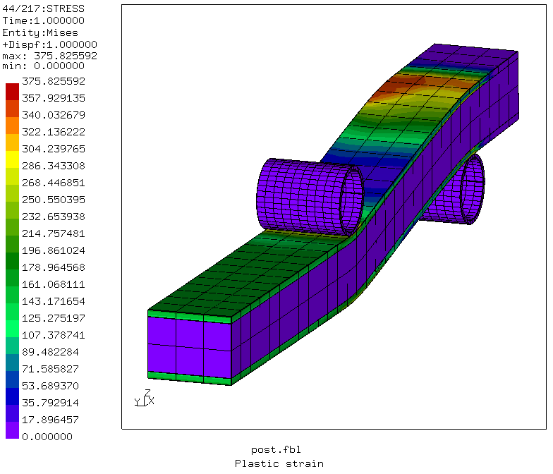
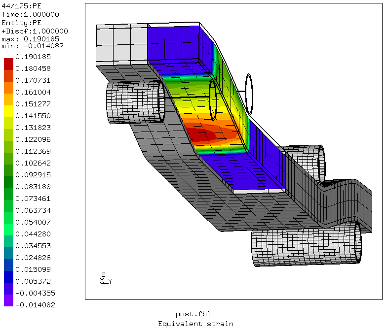

# Four-Point Bending Test With Sandwich Material
Tested with CGX 2.16 / CCX 2.15

+ Non-linear static analysis
+ Plasticity
+ Penalty contact
+ Symmetry reduction

File                        | Contents    
:-------------             | :-------------
[values.fbl](values.fbl)   | CGX script, parameter values
[pre.fbl](pre.fbl)         | CGX script, pre-processing
[post.fbl](post.fbl)       | CGX script, post-processing
[Biegung.inp](Biegung.inp) | CCX input
[test.py](test.py)         | Python script to run the full simulation

The model represents a four point bending test of an elasto-plastic sandwich plate. The face material is mild steel, the core material is aluminum foam.



## Pre-Processing

| Parameter | Value | Meaning |
| :------------- |  :------------- | :------------- |
| `t1` | 2 | thickness of upper face sheet in mm |
| `t2` | 2 | thickness of lower face sheet in mm|
| `tc` | 16 | core thickenss in mm |
| `br` | 50 | width of the specimen in mm |
| `lges` | 480 | total length of the specimen in mm |
| `lext` | 400 | center distance of the support cylinders in mm |
| `ls` | 200 | distance of the loading cylinders in mm |
| `radius` | 10 | radius of the cylinders in mm |
| `divl` | 60 | mesh division in longitudinal direction) |
| `divf` | 2 | cross thickness mesh division in the face sheets |
| `divc` | 4 | cross thickness mesh division in the core |
| `divb` | 6 | mesh division in lateral direction |

You may edit the file [values.fbl](values.fbl) and then run
```
> cgx -b pre.fbl
```


In order to avoid stress averaging between core and face sheets, they are meshed separately and connected via equations. The equations are generated in CGX using
```
send <dep> <indep> abq areampc 123
```
Care must be taken to not further constrain the (eliminated) dependent nodes. They are explicitly removed from the node sets for the symmetry constraints.

The cylinders interact with the specimen via penalty contact with the cylinders being the dependent surfaces.

The lower outer cylinder is fixed, the inner upper cylinder is moved down 20 mm.

## Solving
The rate of convergence is affected by the plastic material, the mesh density in the contact region, the contact stiffness and the time incrementation controls.
```
> ccx Biegung
> monitor.py Biegung
```


## Post-Processing
```
> cgx -b post.fbl
```
The yield stress of the face sheets is much higher than that of the core. The specimen fails by core shear, the center zone with pure bending load remains in the elastic range.



