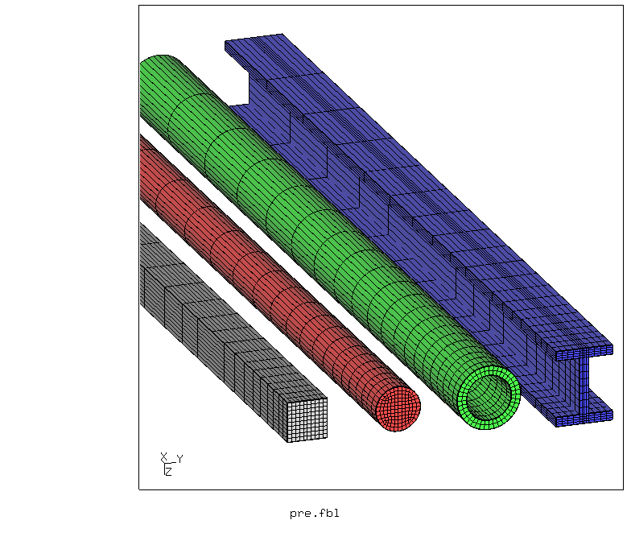
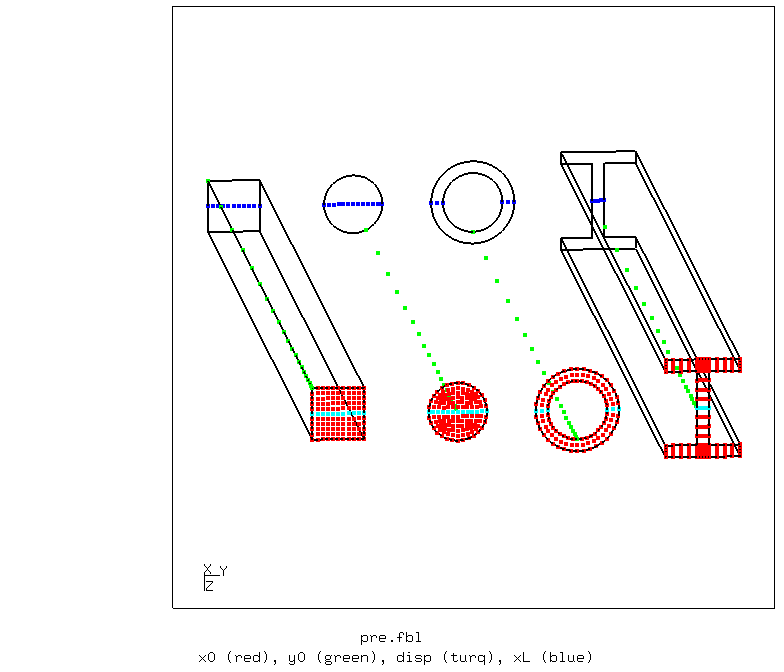
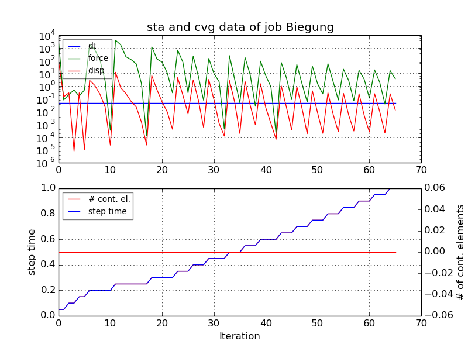
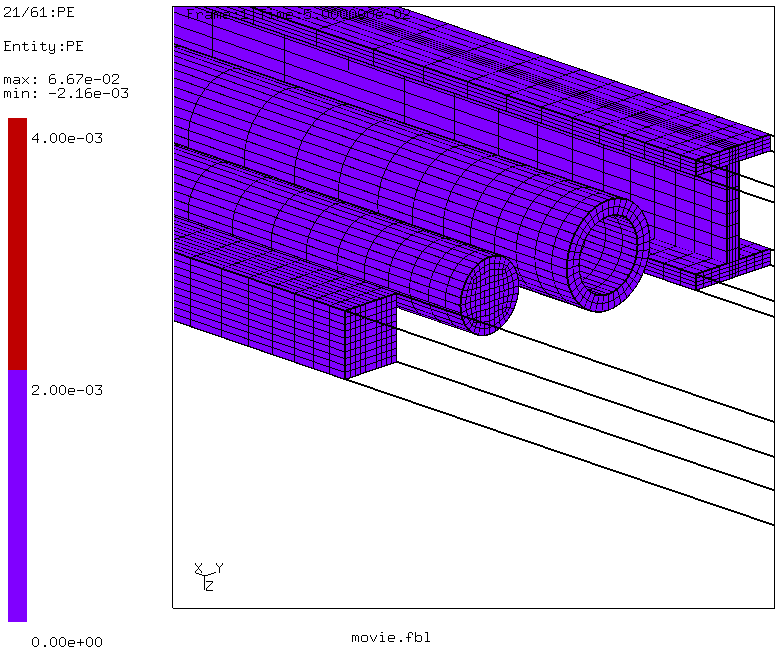
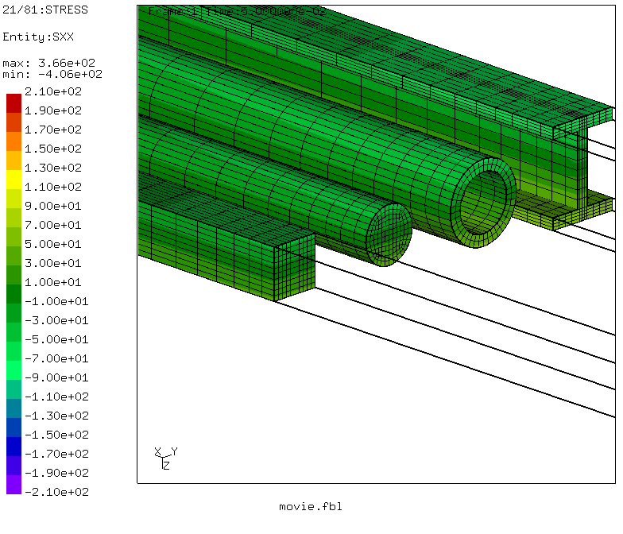
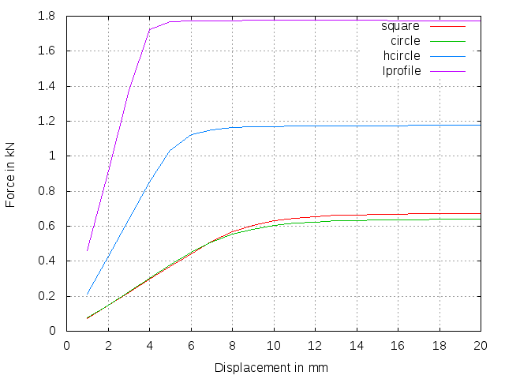

# Properties of Cross Sections (elasto-plastic)
Tested with CGX 2.16 / CCX 2.15

+ Simply supported beam with a prescribed displacement in the center
+ Parametric section shapes of identical area
+ Symmetry reduction
+ Elasto-plastic material without hardening (ideal plastic)
+ Objective:
  + Evolution of the plastic zone
  + Force-displacement curves
  + Ultimate bending load - plastic section modulus (TBD)


File                           | Contents    
 :-------------                | :-------------
 [par.pre.fbl](par.pre.fbl)    | CGX script, pre-processing, parametrized with param.py
 [movie.fbl](movie.fbl)        | CGX script, movie generation
 [chart.fbl](chart.fbl)        | CGX script, chart generation
 [Biegung.inp](Biegung.inp)    | CCX input
 [df.gpl](df.gpl)              | Gnuplot script for the force-displacement-plot
 [test.py](test.py)            | Python script to run the full simulation

## Pre-Processing

The problem is parametrized using [param.py](../../../Scripts/param.py).

Parameters in `par.pre.fbl`

| Parameter   | Value | Meaning |
| :---------  |  :--- | :------------- |
| `area`      | 300   | Cross section area in mm² |
| `length`    | 400   | Distance from support to center (half span) in mm |
| `thickness` | 4     | Wall thickness of tube and I profile |
| `divx`      | 20    | Longitudinal mesh division |
| `disp`      | 20    | Prescribed displacement (at mid-span) in mm |


The model contains several simply supported beams of equal section area but different section shape.

Objective is to visualize the evolution of the plastic zone and to determine the relative ultimate strength (full plastic section) with respect to the square section.

Starting from a given cross section area, the half span of the beam and a thickness, four section shapes of identical cross section area are generated.

The beams are supported vertically at all nodes at x=`length` and z=0 and have a symmetry boundary at x=0.

One row of nodes per beam is fixed in y-direction. This is a bit over-constrained, but prevents lateral bending, which might happen due to the developing plastic hinges if just a single node per beam is constrained in y-direction.

The load is applied as a prescribed displacement of the nodes at x=0 (center between the supports) and at z=0 (through the section centroid).
```
> param.py par.pre.fbl
> cgx -b pre.fbl
```


## Solving
The ideal-plastic material can create convergence problems. These are mitigated by load application via prescribed displacement. A maximum increment size of 5% of the step is set for smooth force-displacement curves and movies.
```
> ccx Biegung
> monitor.py Biegung
```


## Post-Processing
```
> cgx -b movie.fbl
```
The plastic zone is marked using a two-step color scheme with the plastic proof strain of 0.2% marking the limit between the two colors. The right movie shows the longitudinal (bending) stress with color bar limits 5% above the yield limit.



To create a force-displacement-plot, type
```
> cgx -b -bg chart.fbl
```
The displayed force is valid for the full model (twice the support reactions).


