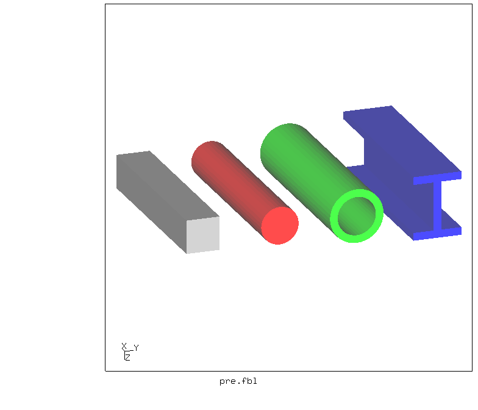
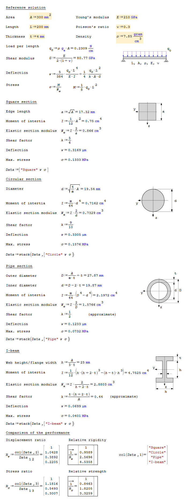
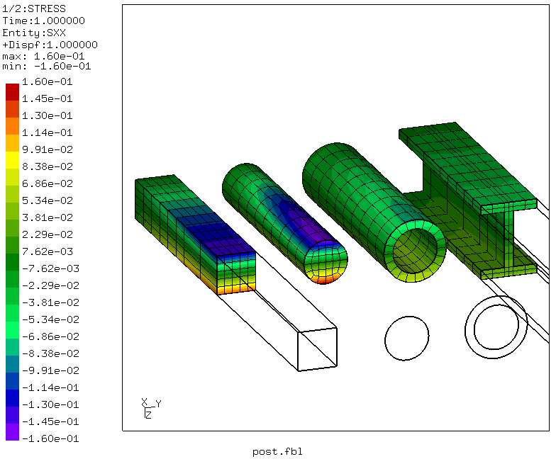
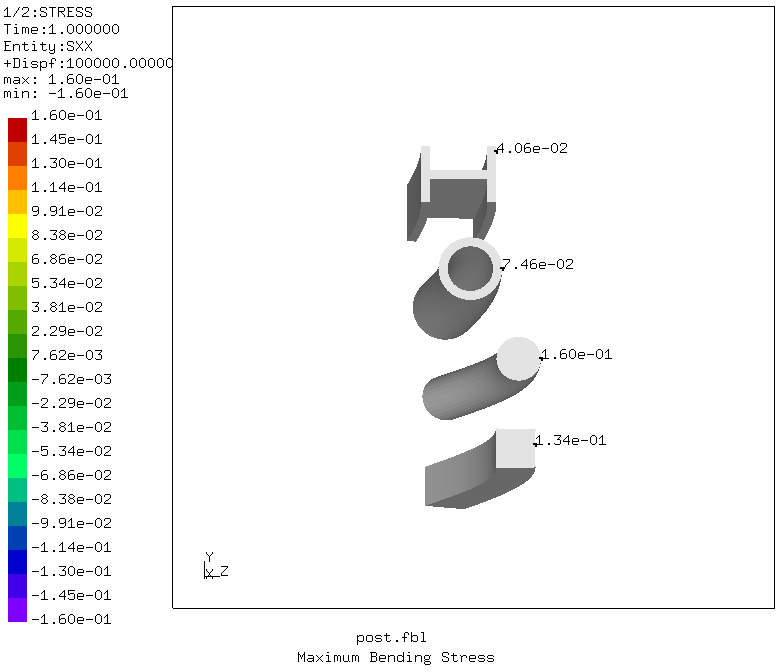
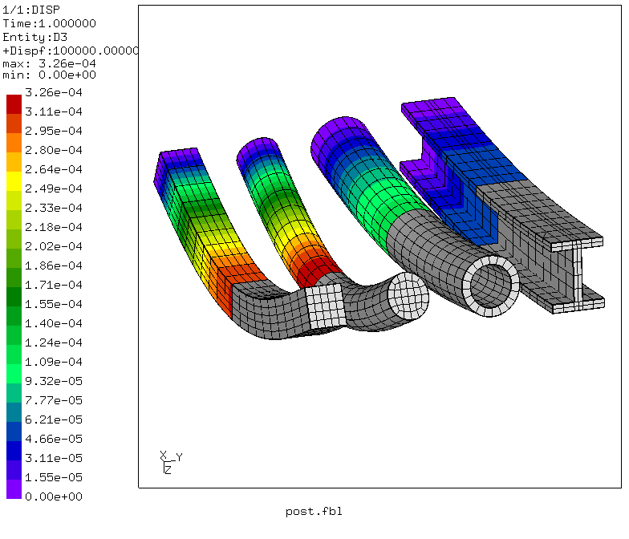
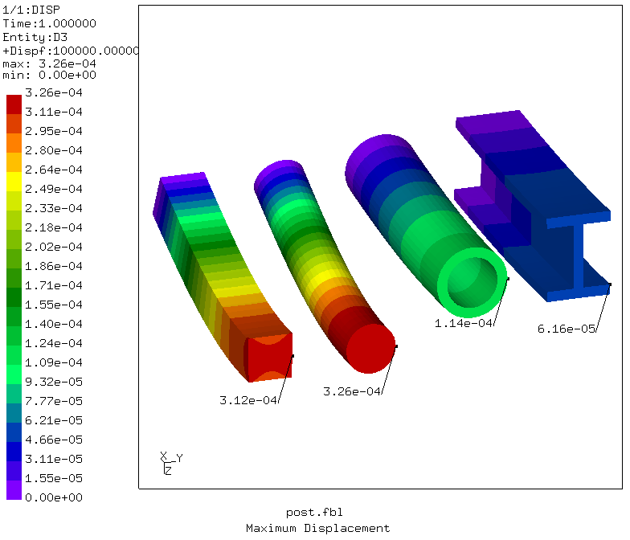
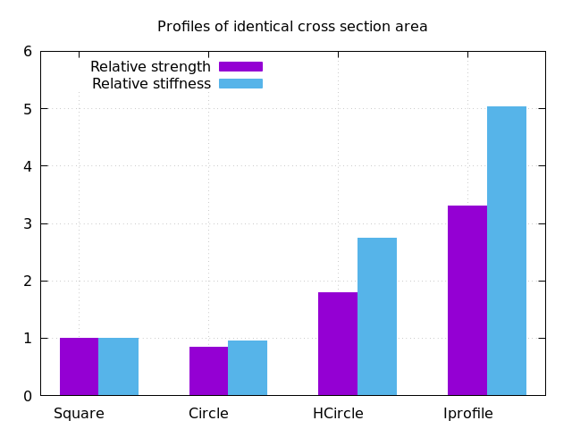

# Properties of Cross Sections
Tested with CGX 2.16 / CCX 2.15

The model contains several simply supported beams under gravity load of equal section area but different section shape.
Objective is to determine the relative stiffness and strength (yield limit) with respect to the square section.

File                           | Contents    
 :-------------                | :-------------
 [par.pre.fbl](par.pre.fbl)    | CGX script, pre-processing, parametrized with param.py
 [post.fbl](post.fbl)          | CGX script, post-processing,
 [Biegung.inp](Biegung.inp)    | CCX input
 [barchart.gpl](barchart.gpl)  | Gnuplot script for bar chart
 [test.py](test.py)            | Python script to run the simulation




## Reference solution

For the given mesh, the reference solution and the FEA results match within 2% error for the maximum bending stress and the displacements. For the pipe and I beam, the displacements differ by approx. 10% between reference and FEA. Note that their reference shear factor is only approximate.

Click the image below to open a life worksheet:
[](https://en.smath.info/cloud/worksheet/uXbMYr5w)

## Pre-Processing

The problem is parametrized using [param.py](../../Scripts/param.py). Starting from a given cross section area, the half span of the beam and a thickness, four section shapes of identical cross section area are generated.

The beams are supported vertically at all nodes at x=Length and have a symmetry boundary at x=0. One node per beam is fixed in y-direction.

The beams are loaded by their own weight, properies of steel are assumed.

| Parameter | Value | Meaning |
| :------------- |  :------------- | :------------- |
| `area` | 300 | cross section area in mm^2 |
| `length` | 100 | length (end to center) in mm|
| `thickness` | 4 | wall thickness (where applicable) in mm |
| `dist` | 40 | spacing between the beams in mm |

```
> param.py par.pre.fbl
> cgx -b pre.fbl
```

## Solving
The simulation is essentially linear. The iterative procedure is used because of the presence of plastic material. Due to the low stresses, this does not affect the solution.
```
> ccx Biegung
```

## Post-Processing
```
> cgx -b post.fbl
```
The strength of a section shape is characterized by the section modulus, i.e. the ratio of applied bending moment divided by the maximum stress in the section. As all beams in the model carry the same load, they share the same bending moment.
The relative strength, therefore can be measured by the ratio of the inverse maximum stress values. As a reference, the square section is used (relative strength = 1).

The stiffness is the ratio of applied load to resulting deflection. Again, the relative stiffness is the deflection of a section divided by the value for the square section.

The post-processing extracts the maximum stress and deflection values for each section.





The maximum values of stress and displacement are written to file `s-w.txt`.
The relative values (reference: square section) are written to file `dat.txt`. The bar chart is generated based on the relative values.


