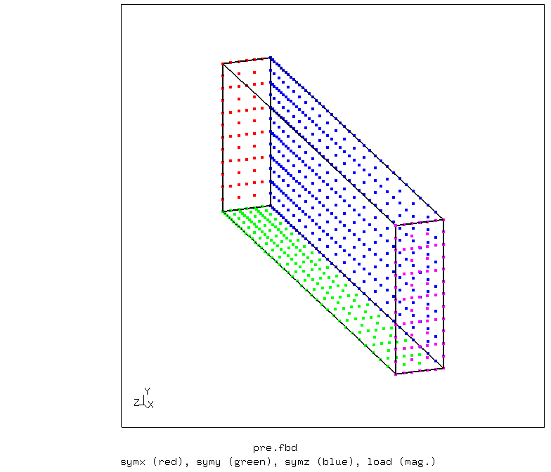
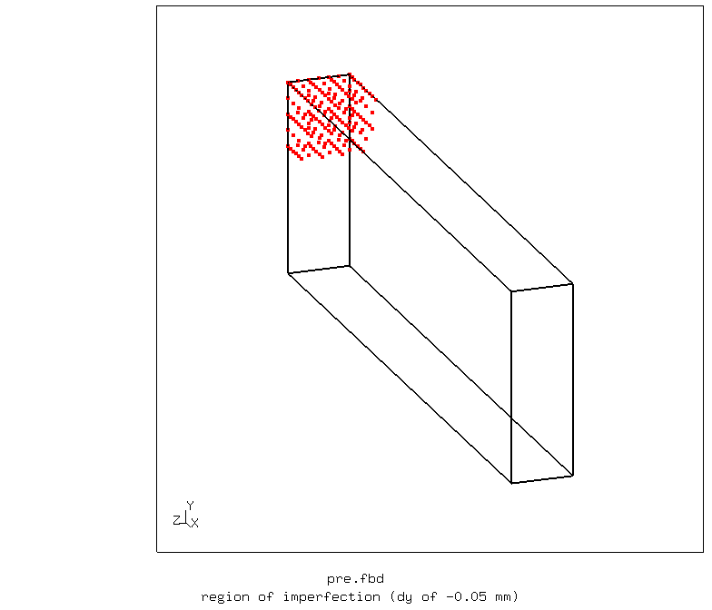
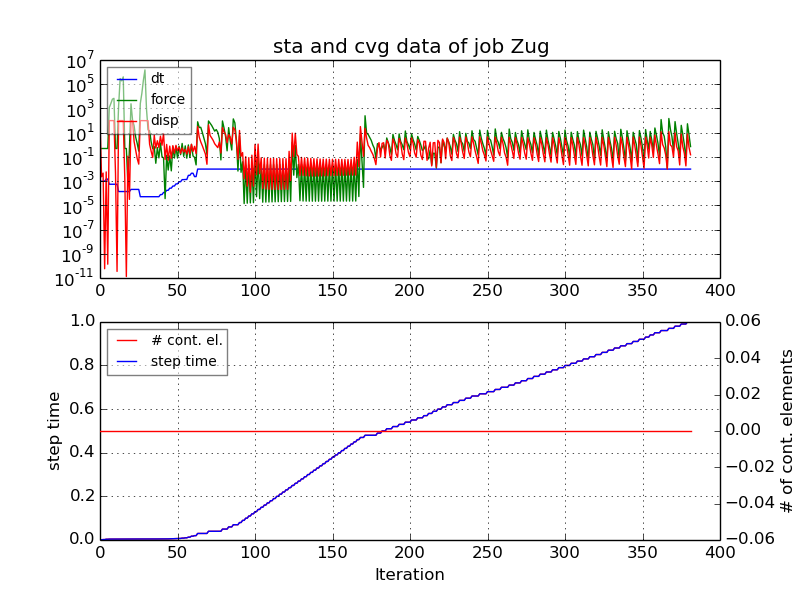
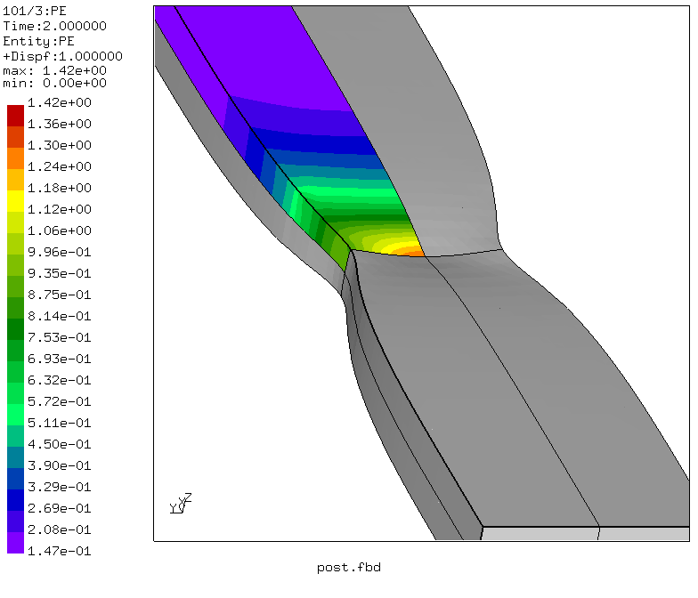
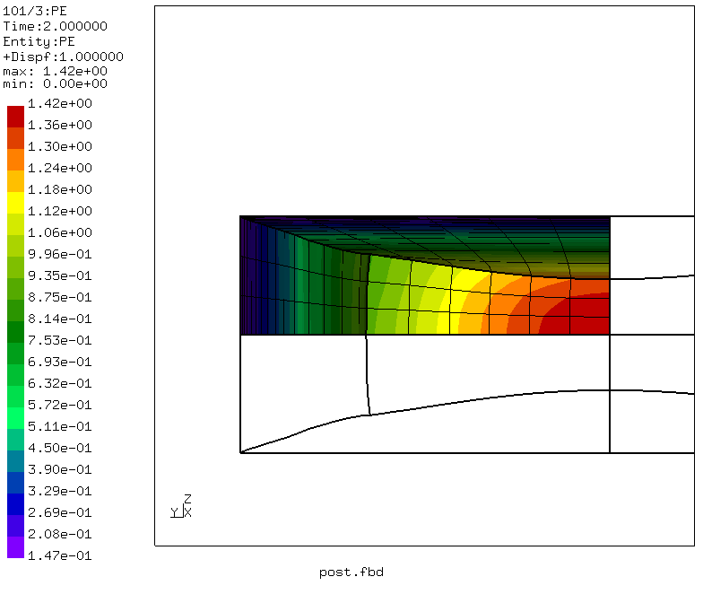
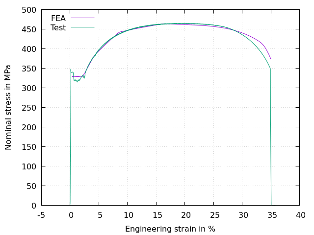

# Tensile Test
Tested with CGX 2.16 / CCX 2.15

Tensile test of a 8x25mm steel bar. The yield curve is obtained from real test data and the simulated stress-strain curve is compared to the experimental one.

Using symmetry, the structure is reduced to one eight of the original one.


+ Large displacements
+ Plasticity
+ The structure is parametrized using CGX valu due to it's simplicity
+ Handover of load parameters to the CCX file
+ Handover of parameters to the gnuplot file


File                     | Contents    
:-------------           | :-------------
[pre.fbd](pre.fbd)       | Pre-processing script for CGX (parametrized with valu commands)      
[post.fbd](post.fbd)     | Post-processing script for CGX (stress-strain curve and deformed plot)
[sigeps.gnu](sigeps.gnu) | Gnuplot control script
[Zug.inp](Zug.inp)       | CCX input
[test.py](test.py)       | Python script to run the full simulation


## Preprocessing

```
> cgx -b pre.fbd
```

The geometry consists of a simple brick, representing an eighth of the total specimen. In order to induce necking in the symmetry plane, a small imperfection (Width reduction) is introduced.

The mesh is biased as to account for the localized deformation.

| Parameter | Value | Meaning |
| :---------|  :--- | :------------- |
| `lx`      | 40    | half of sample length in mm |
| `ly`      | 12.5  | half of sample width in mm |
| `lz`      | 4     | half of sample thickmess in mm |
| `divx`    | 40    | mesh divisions in x-direction |
| `divy`    | 12    | mesh divisions in y-direction |
| `divz`    | 6     | mesh divisions in z-direction |
| `biax`    | 4     | mesh bias in x-direction |
| `maxeps`  | 40    | max engineering strain in % |
| `imp`     | -0.05 | imperfection (half of width change at the center in mm)|
| `rimp`    | 5     | radius of influence of the imperfection in mm|

Boundary conditions:
* ux = 0 at x = 0 (symmetry boundary)
* ux = maxeps/100*lx at x = lx (prescribed displacement)
* uy = 0 at y = 0 (symmetry boundary)
* uz = 0 at z = 0 (symmetry boundary)




## Solving

```
> ccx Zug
> monitor.py Zug
```
The second command generates a convergence history plot of the solution.


## Postprocessing

```
> cgx -b post.fbd
```
This creates a stress-strain curve and an expanded plot of the equivalent plastic strain.





You can generate the stress-strain curve separately using the commands:

```
> dat2txt.py Zug
> gnuplot sigeps.gnu
```
