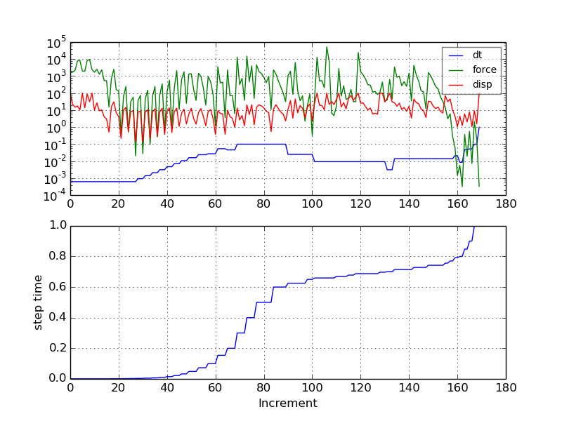
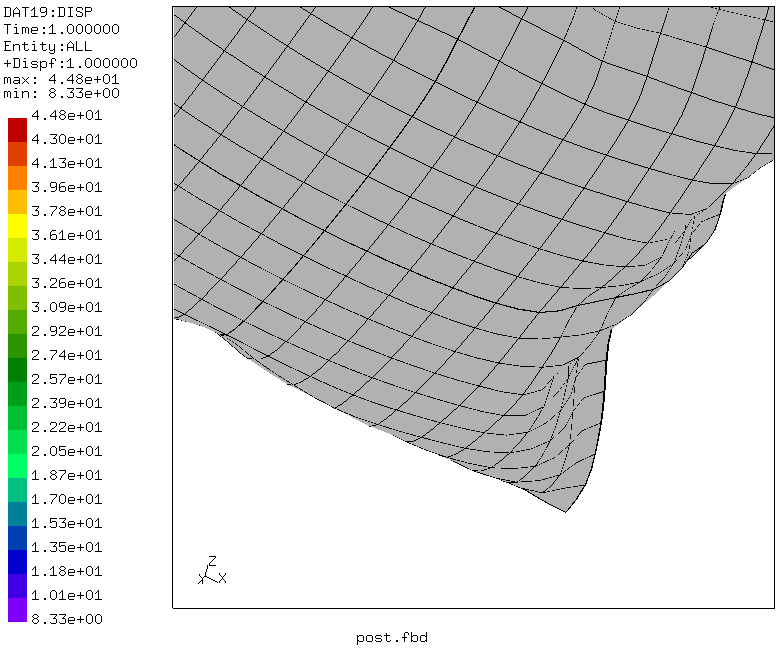
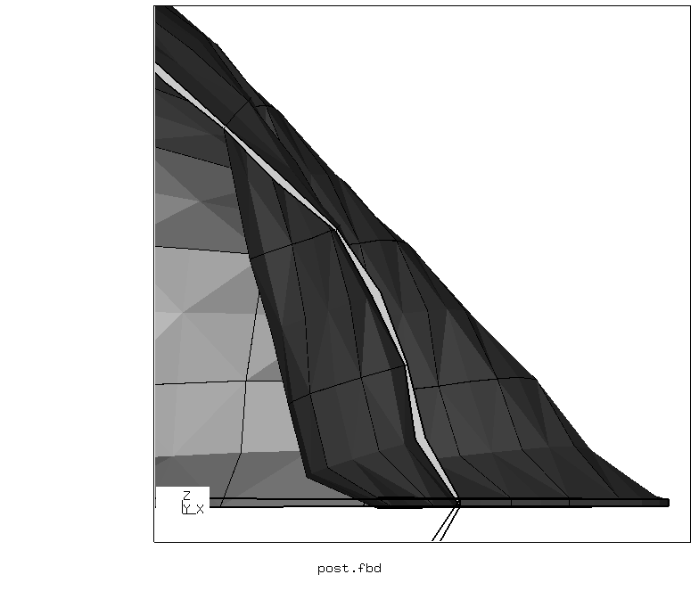

# Inflating a Pillow
+ Non-linear static solution
+ Shell elements
+ Symmetry expansion in the post-processing

File                    | Contents    
 :-------------         | :-------------
 [pre.fbd](pre.fbd)     | Pre-processing script for CGX     
 [post.fbd](post.fbd)   | Post-processing script for CGX
 [static.inp](static.inp) | CCX input

## Preprocessing
```
cgx -b pre.fbd
```


## Solving
The problem involves heavy buckling and challenges the non-linear solver. In order to obtain a solution, the convergence criteria are relaxed in the first step. In the second step, the default values are restored. For the given parameters in the stored example, this is not relevant, as the solution at the end of step 1 already meets the default criteria.
```
ccx static
python ../../Scripts/monitor.py static
```


## Postprocessing
```
cgx -b post.fbd
```
Note that you have to create the screenshot in the interactive mode of CGX. The batch command `hcpy png` at the end of the script produces the right image below.

 

The single layer of C3D20R-Elements, which is generated by CCX to represent the shell elements, exhibits hourglassing. This severely affects the bending stiffness and adds instabilities to the model.


