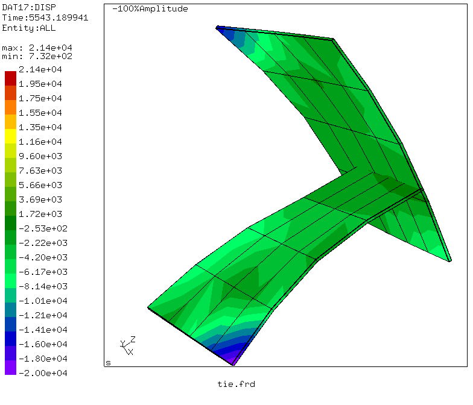
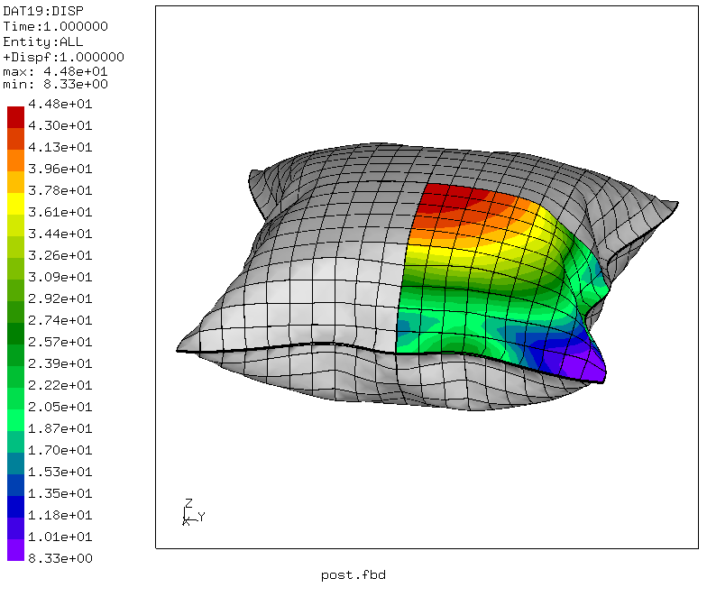
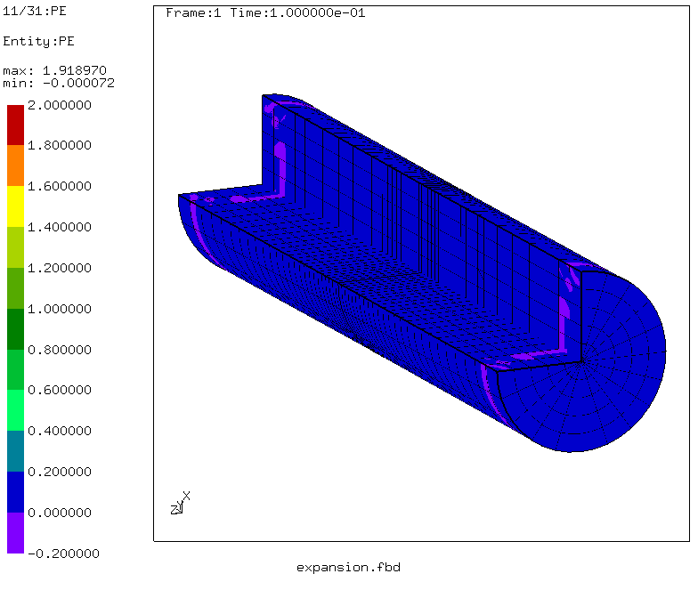
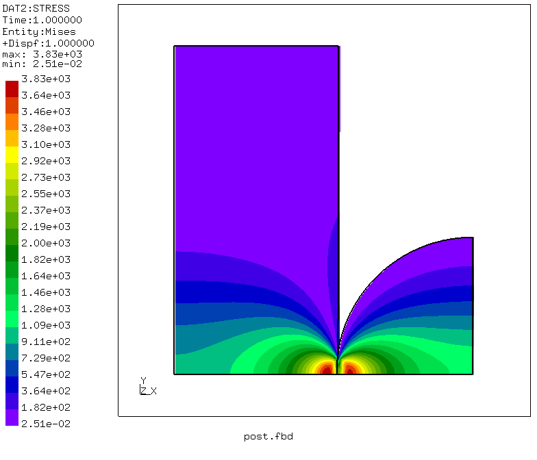
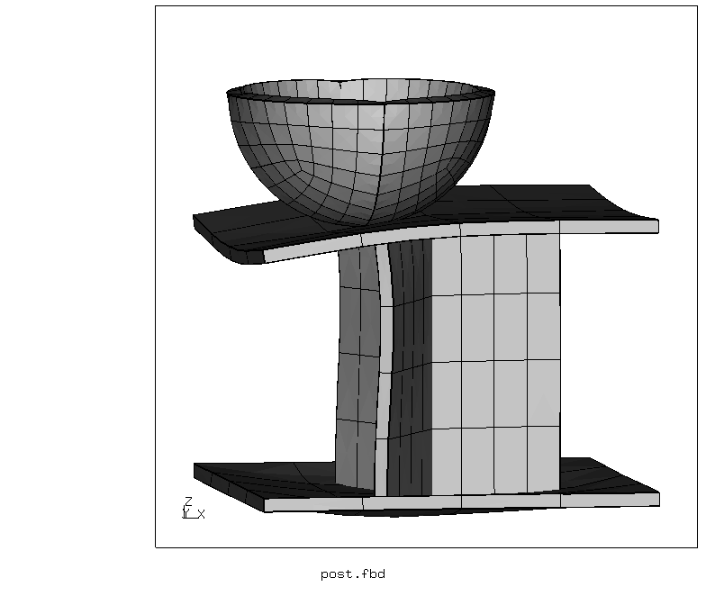
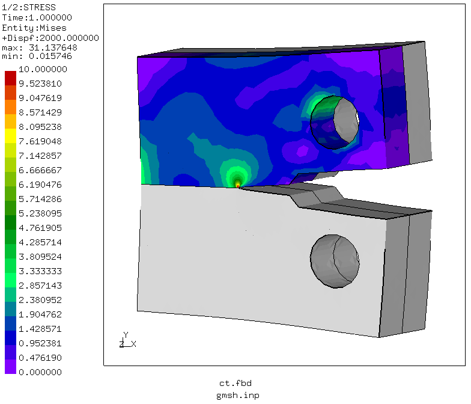

# CalculiX-Examples
Created by Martin Kraska, Brandenburg University of Applied Sciences

These examples demonstrate the use of [CalculiX](http://www.dhondt.de/) for various analysis types.

Also, there are some helper python scripts. See [Scripts page](Scripts/) for usage hints.

The [Setup](Setup.md) page provides instructions on how to setup the working environment under Windows and Linux.

Click the preview images to view the examples.

This page uses animated gifs. In Firefox, you might want to install the plugin [Toggle Animated Gifs](https://addons.mozilla.org/en-US/firefox/addon/toggle-animated-gifs/) to add replay controls.

