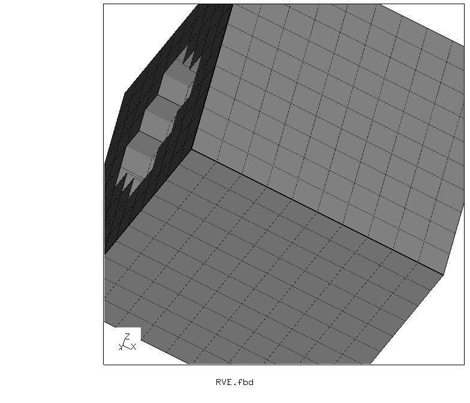
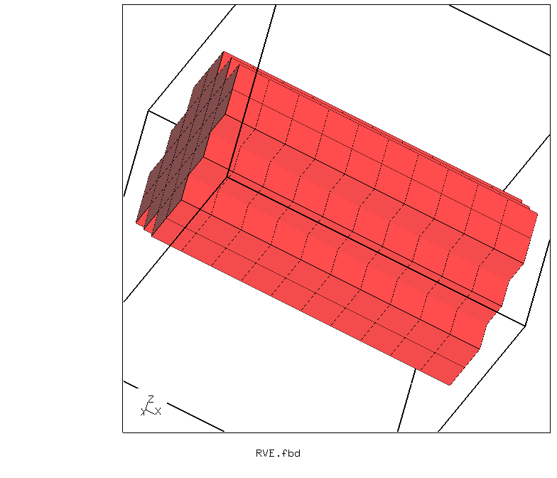
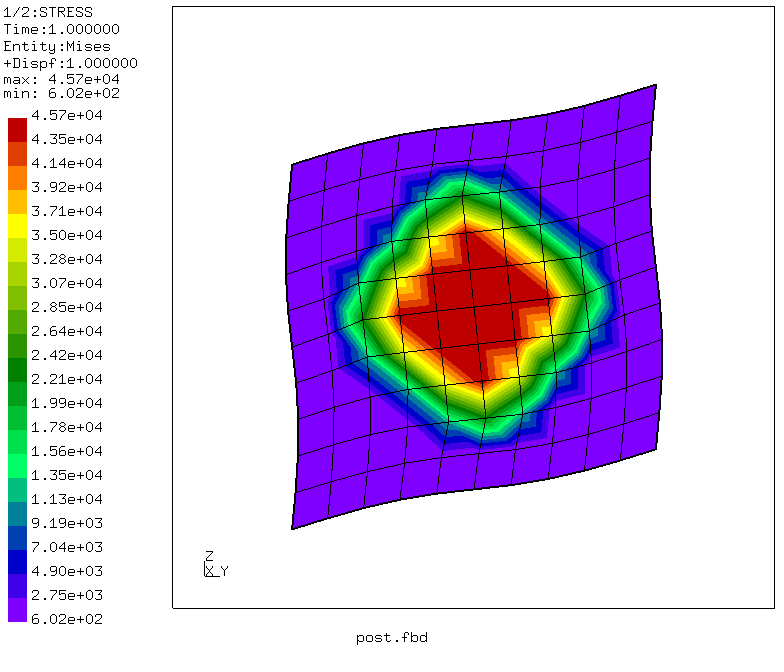
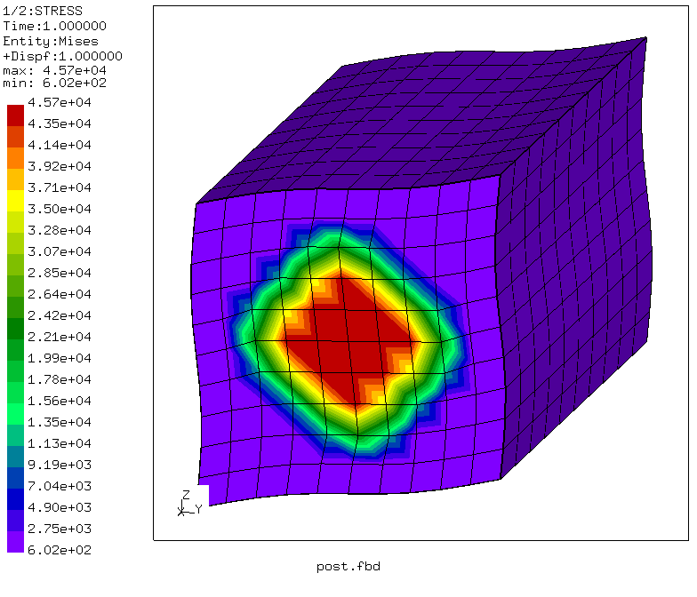

# RVE with periodic boundary conditions
Tested with CGX 2.13 / CCX 2.13

This is a generic RVE of a fiber-matrix compound.

+ Brick-shaped unit cell
+ Structured mesh
+ Location based assignment of material to elements
+ Periodic boundary conditions applied via helper script `periodic.py`

Todo:
+ Output of the average nominal stress
+ Comfortable specification of load histories


File                   | Contents    
:-------------         | :-------------
[RVE.fbd](RVE.fbd)     | Pre-processing script for CGX (parametrized with valu commands)     
[post.fbd](post.fbd)   | Post-processing script for CGX (stress-strain curve and deformed plot)
[Solve.inp](Solve.inp) | CCX input 
[test.py](test.py)     | Python script to run the full simulation

## Preprocessing

```
> cgx -b RVE.fbd
> periodic.py all.msh
```

The RVE represents a matrix material with unidirectional fibers arranged at a rectangular grid. Dimension  `lx` is irrelevant, as the material is uniform
in x direction. Dimensions `ly` and `lz` represent the fiber grid lengths.

The mesh consists of C3D8I elements and is controlled by a global node distance.

| Parameter | Value | Meaning |
| :------------- |  :------------- | :------------- |
| `lx` | 1 | length in x in mm |
| `ly` | 1 | length in y in mm |
| `lz` | 1 | length in z in mm |
| `rad` | 0.2 | fiber radius |
| `le` | 0.1 | node distance |

Constraints:

* `periodic.py` produces set definitions for control nodes and the equations for periodicity.
* Components of the average deformation gradient or of the average nominal stress (first Piola-Kirchhoff stress) can be specified as displacements or forces at the control nodes.



## Solving
```
> ccx Solve
```

## Postprocessing

Plots of the equivalent stress, the periodicity of the deformation is visible.
```
> cgx -b post.fbd
```



