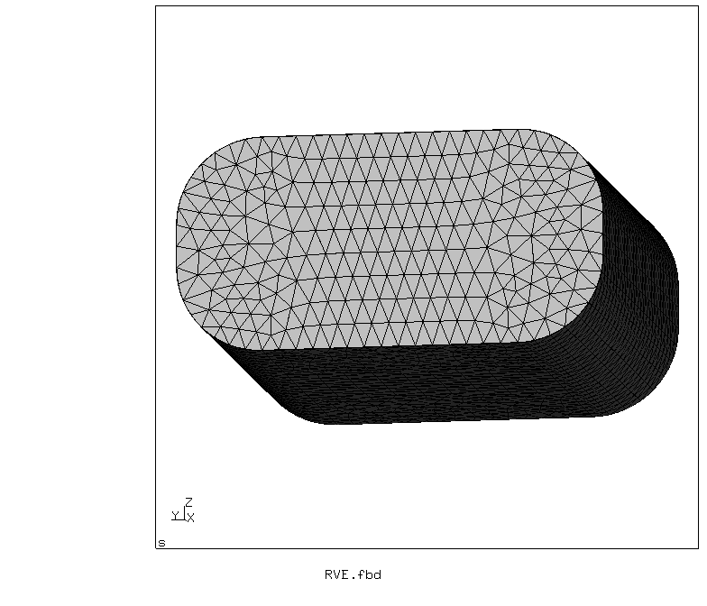
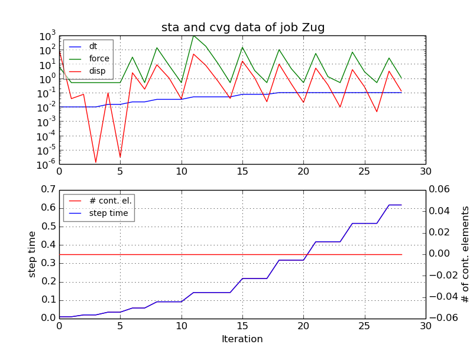
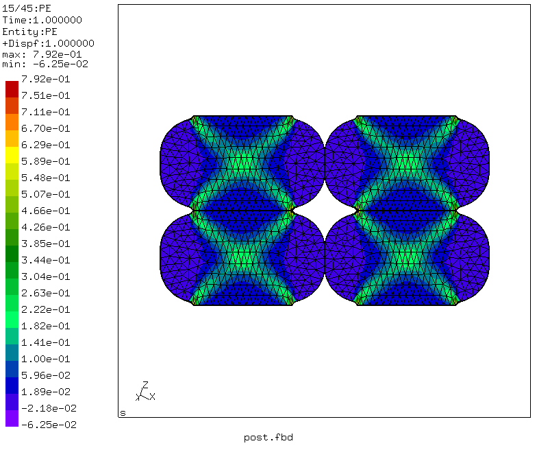
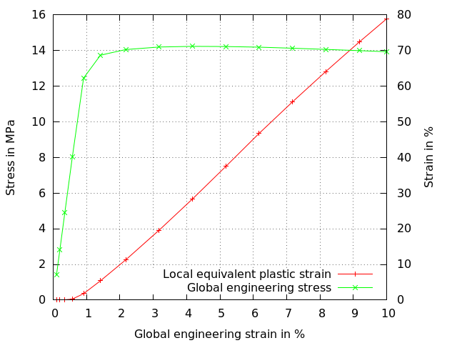

# Tensile Test of FDM layers
Tested with CGX 2.16 / CCX 2.15

+ Issue: mesh image is too dark (hcpy problem)

Tensile test of unidirectional FDM (3D printed) layers with load application perpendicular to the printing plane. The layed roads only partially bond between each other and to the layer below. The localized strains at the resulting notches lead to material failure at global strains much below the maximum elongation of the base material (embrittlement).

The test specimen is a stack of layers with 2 roads wide and two times lx long.

Most appropriate (efficient) would be to model a representative volume element with periodic boundary conditions.

+ Large displacements
+ Plasticity
+ The structure is parametrized using CGX valu due to it's simplicity
+ Handover of load parameters to the CCX file
+ Handover of parameters to the gnuplot file


File                 | Contents    
:-------------       | :-------------
[RVE.fbd](RVE.fbd)   | Pre-processing script for CGX (parametrized with valu commands)     
[post.fbd](post.fbd) | Post-processing script for CGX (stress-strain curve and deformed plot)
[pe.gnu](pe.gnu)     | Gnuplot control script
[Zug.inp](Zug.inp)   | CCX input
[test.py](test.py)   | Python script to run the full simulation

## Preprocessing

```
> cgx -b RVE.fbd
```

The geometry consists of a simple brick with fillets, representing a single half road (quarter of a layer).

The mesh is controlled by a global node distance.

| Parameter | Value | Meaning |
| :------------- |  :------------- | :------------- |
| `lx` | 0.5 | half road length in mm |
| `ly` | 0.5 | road width in mm |
| `lz` | 0.25 | layer thickness in mm |
| `rad` | 0.1 | fillet radius |
| `le` | 0.01 | node distance on edges |
| `ez` | 0.1 | global engineering strain in z direction |


Boundary conditions:
* ux = 0 at x = 0 (symmetry boundary)
* uy = 0 at y = 0 (symmetry boundary)
* uz = 0 at z = 0 (symmetry boundary)
* uz = ez/100*lz at z = lz (prescribed displacement)



## Solving

```
> ccx Zug
> monitor.py Zug
```
The second command generates a convergence history plot of the solution.


## Postprocessing

```
> cgx -b post.fbd
```
This creates a stress-strain curve and an expanded plot of the equivalent plastic strain.




You can generate the curves separately using the commands:

```
> dat2txt.py Zug
> gnuplot pe.gnu
```
